## 版本控制分类

**1、本地版本控制**

记录文件每次的更新，可以对每个版本做一个快照，或是记录补丁文件，适合个人用，如RCS。


所有的版本数据都存在服务器上，用户的本地只有自己以前所同步的版本，如果不连网的话，用户就看不到历史版本，也无法切换版本验证问题，或在不同分支工作。而且，所有数据都保存在单一的服务器上，有很大的风险这个服务器会损坏，这样就会丢失所有的数据，当然可以定期备份。代表产品：SVN、CVS、VSS

**3、分布式版本控制 	Git**

每个人都拥有全部的代码！安全隐患！

所有版本信息仓库全部同步到本地的每个用户，这样就可以在本地查看所有版本历史，可以离线在本地提交，只需在连网时push到相应的服务器或其他用户那里。由于每个用户那里保存的都是所有的版本数据，只要有一个用户的设备没有问题就可以恢复所有的数据，但这增加了本地存储空间的占用。

不会因为服务器损坏或者网络问题，造成不能工作的情况！


## Git与SVN的主要区别

SVN是集中式版本控制系统，版本库是集中放在中央服务器的，而工作的时候，用的都是自己的电脑，所以首先要从中央服务器得到最新的版本，然后工作，完成工作后，需要把自己做完的活推送到中央服务器。集中式版本控制系统是必须联网才能工作，对网络带宽要求较高。

Git是分布式版本控制系统，没有中央服务器，每个人的电脑就是一个完整的版本库，工作的时候不需要联网了，因为版本都在自己电脑上。协同的方法是这样的：比如说自己在电脑上改了文件A，其他人也在电脑上改了文件A，这时，你们两之间只需把各自的修改推送给对方，就可以互相看到对方的修改了。Git可以直接看到更新了哪些代码和文件！

**Git是目前世界上最先进的分布式版本控制系统。**


# Git环境配置

## 软件下载

打开 [git官网] https://git-scm.com/，下载git对应操作系统的版本。

所有东西下载慢的话就可以去找镜像！

官网下载太慢，我们可以使用淘宝镜像下载：http://npm.taobao.org/mirrors/git-for-windows/

## 启动Git

安装成功后在开始菜单中会有Git项，菜单下有3个程序：任意文件夹下右键也可以看到对应的程序！

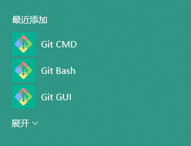

**Git Bash：**Unix与Linux风格的命令行，使用最多，推荐最多

**Git CMD：**Windows风格的命令行

**Git GUI**：图形界面的Git，不建议初学者使用，尽量先熟悉常用命令

## 常用命令

```shell
#平时一定要多使用这些基础的命令！

cd : 改变目录。
cd . . 回退到上一个目录，直接cd进入默认目录
pwd : 显示当前所在的目录路径。
ls(ll):  都是列出当前目录中的所有文件，只不过ll(两个ll)列出的内容更为详细。
touch : 新建一个文件 如 touch index.js 就会在当前目录下新建一个index.js文件。
rm:  删除一个文件, rm index.js 就会把index.js文件删除。
mkdir:  新建一个目录,就是新建一个文件夹。
rm -r :  删除一个文件夹, rm -r src 删除src目录
rm -rf / 切勿在Linux中尝试！删除电脑中全部文件！
mv 移动文件, mv index.html src index.html 是我们要移动的文件, src 是目标文件夹,当然, 这样写,必须保证文件和目标文件夹在同一目录下。
reset 重新初始化终端/清屏。
clear 清屏。
history 查看命令历史。
help 帮助。
exit 退出。
```

## Git配置

所有的配置文件，其实都保存在本地！

查看配置 git config -l

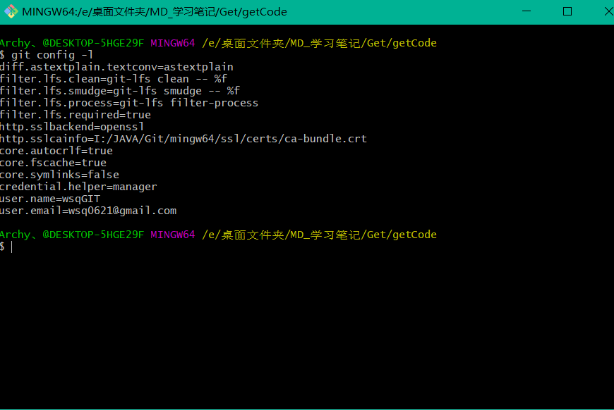


查看不同级别的配置文件：

```
#查看系统
configgit config --system --list　　

#查看当前用户（global）配置
git config --global  --list
```

**Git相关的配置文件：**

1）、Git\etc\gitconfig  ：Git 安装目录下的 gitconfig   --system 系统级

2）、C:\Users\Administrator\ .gitconfig   只适用于当前登录用户的配置  --global 全局

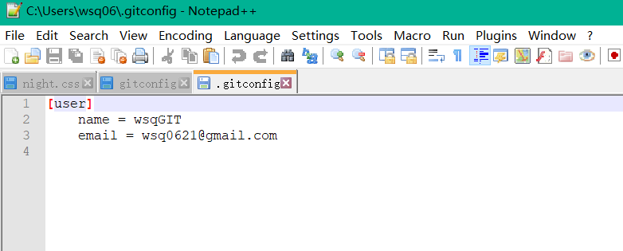

这里可以直接编辑配置文件，通过命令设置后会响应到这里。

## 设置用户名与邮箱（用户标识，必要）

当你安装Git后首先要做的事情是设置你的用户名称和e-mail地址。这是非常重要的，因为每次Git提交都会使用该信息。它被永远的嵌入到了你的提交中：

```
git config --global user.name "kuangshen"  #名称
git config --global user.email 24736743@qq.com   #邮箱
```

只需要做一次这个设置，如果你传递了--global 选项，因为Git将总是会使用该信息来处理你在系统中所做的一切操作。如果你希望在一个特定的项目中使用不同的名称或e-mail地址，你可以在该项目中运行该命令而不要--global选项。总之--global为全局配置，不加为某个项目的特定配置。

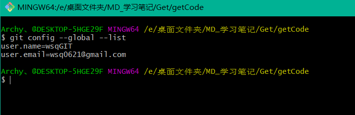


# Git基本理论（重要）

> 三个区域

Git本地有三个工作区域：工作目录（Working Directory）、暂存区(Stage/Index)、资源库(Repository或Git Directory)。如果在加上远程的git仓库(Remote Directory)就可以分为四个工作区域。文件在这四个区域之间的转换关系如下：


- Workspace：工作区，就是你平时存放项目代码的地方
- Index / Stage：暂存区，用于临时存放你的改动，事实上它只是一个文件，保存即将提交到文件列表信息
- Repository：仓库区（或本地仓库），就是安全存放数据的位置，这里面有你提交到所有版本的数据。其中HEAD指向最新放入仓库的版本
- Remote：远程仓库，托管代码的服务器，可以简单的认为是你项目组中的一台电脑用于远程数据交换

本地的三个区域确切的说应该是git仓库中HEAD指向的版本：


- Directory：使用Git管理的一个目录，也就是一个仓库，包含我们的工作空间和Git的管理空间。
- WorkSpace：需要通过Git进行版本控制的目录和文件，这些目录和文件组成了工作空间。
- .git：存放Git管理信息的目录，初始化仓库的时候自动创建。
- Index/Stage：暂存区，或者叫待提交更新区，在提交进入repo之前，我们可以把所有的更新放在暂存区。
- Local Repo：本地仓库，一个存放在本地的版本库；HEAD会只是当前的开发分支（branch）。
- Stash：隐藏，是一个工作状态保存栈，用于保存/恢复WorkSpace中的临时状态。


## 工作流程

git的工作流程一般是这样的：

１、在工作目录中添加、修改文件；

２、将需要进行版本管理的文件放入暂存区域；

３、将暂存区域的文件提交到git仓库。

因此，git管理的文件有三种状态：已修改（modified）,已暂存（staged）,已提交(committed)


# Git项目搭建

## 创建工作目录与常用指令

工作目录（WorkSpace)一般就是你希望Git帮助你管理的文件夹，可以是你项目的目录，也可以是一个空目录，建议不要有中文。

日常使用只要记住下图6个命令：


## 本地仓库搭建

创建本地仓库的方法有两种：一种是创建全新的仓库，另一种是克隆远程仓库。

1、创建全新的仓库，需要用GIT管理的项目的根目录执行：

```
在当前目录新建一个Git代码库
$ git init
```

2、执行后可以看到，仅仅在项目目录多出了一个.git目录，关于版本等的所有信息都在这个目录里面。

## 克隆远程仓库

1、另一种方式是克隆远程目录，由于是将远程服务器上的仓库完全镜像一份至本地！

```
# 克隆一个项目和它的整个代码历史(版本信息)
$ git clone [url]  # https://gitee.com/cokecoke/demo1.git
```

2、去 gitee 或者 github 上克隆一个测试！

# Git文件操作

## 文件的四种状态

版本控制就是对文件的版本控制，要对文件进行修改、提交等操作，首先要知道文件当前在什么状态，不然可能会提交了现在还不想提交的文件，或者要提交的文件没提交上。

- Untracked: 未跟踪, 此文件在文件夹中, 但并没有加入到git库, 不参与版本控制. 通过git add 状态变为Staged.
- Unmodify: 文件已经入库, 未修改, 即版本库中的文件快照内容与文件夹中完全一致. 这种类型的文件有两种去处, 如果它被修改, 而变为Modified. 如果使用git rm移出版本库, 则成为Untracked文件
- Modified: 文件已修改, 仅仅是修改, 并没有进行其他的操作. 这个文件也有两个去处, 通过git add可进入暂存staged状态, 使用git checkout 则丢弃修改过, 返回到unmodify状态, 这个git checkout即从库中取出文件, 覆盖当前修改 !
- Staged: 暂存状态. 执行git commit则将修改同步到库中, 这时库中的文件和本地文件又变为一致, 文件为Unmodify状态. 执行git reset HEAD filename取消暂存, 文件状态为Modified

## 查看文件状态

上面说文件有4种状态，通过如下命令可以查看到文件的状态：

```
#查看指定文件状态
git status [filename]
#查看所有文件状态
git status

# 添加所有文件到暂存区
git add .                  
#提交暂存区中的内容到本地仓库 -m 提交信息
git commit -m "消息内容" 
#提交暂存区中的内容到本地仓库  不需要提交信息
git commit --amend --no-edit

```


## 忽略文件

有些时候我们不想把某些文件纳入版本控制中，比如数据库文件，临时文件，设计文件等

在主目录下建立".gitignore"文件，此文件有如下规则：

1. 忽略文件中的空行或以井号（#）开始的行将会被忽略。
2. 可以使用Linux通配符。例如：星号（*）代表任意多个字符，问号（？）代表一个字符，方括号（[abc]）代表可选字符范围，大括号（{string1,string2,...}）代表可选的字符串等。
3. 如果名称的最前面有一个感叹号（!），表示例外规则，将不被忽略。
4. 如果名称的最前面是一个路径分隔符（/），表示要忽略的文件在此目录下，而子目录中的文件不忽略。
5. 如果名称的最后面是一个路径分隔符（/），表示要忽略的是此目录下该名称的子目录，而非文件（默认文件或目录都忽略）。

```
#为注释
*.txt        #忽略所有 .txt结尾的文件,这样的话上传就不会被选中！
!lib.txt     #但lib.txt除外
/temp        #仅忽略项目根目录下的TODO文件,不包括其它目录
tempbuild/       #忽略build/目录下的所有文件
doc/*.txt    #会忽略 doc/notes.txt 但不包括 doc/server/arch.txt
```

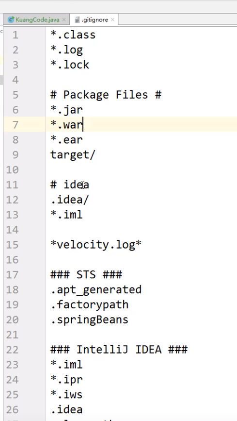

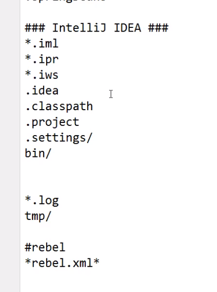


# 使用码云

## github 是有墙的，比较慢，在国内的话，我们一般使用 gitee ，公司中有时候会搭建自己的gitlab服务器

这个其实可以作为大家未来找工作的一个重要信息！

1、注册登录码云，完善个人信息

2、设置本机绑定SSH公钥，实现免密码登录！（免密码登录，这一步挺重要的，码云是远程仓库，我们是平时工作在本地仓库！)

```
# 进入 
C:\Users\Administrator\.ssh 目录
# 生成公钥
ssh-keygen -t rsa
```

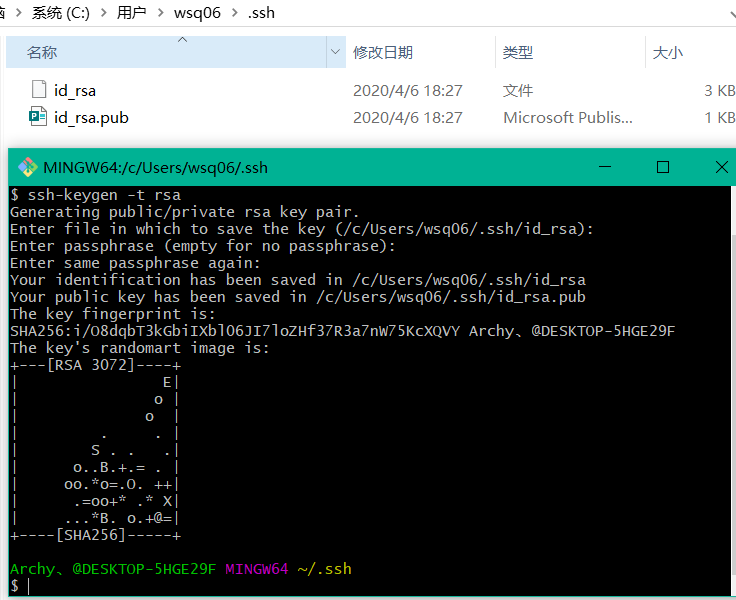

3、将公钥信息public key 添加到码云账户中即可！

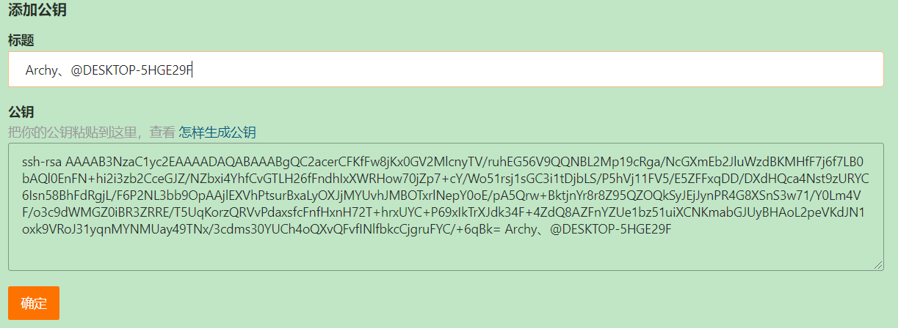

4、使用码云创建一个自己的仓库！

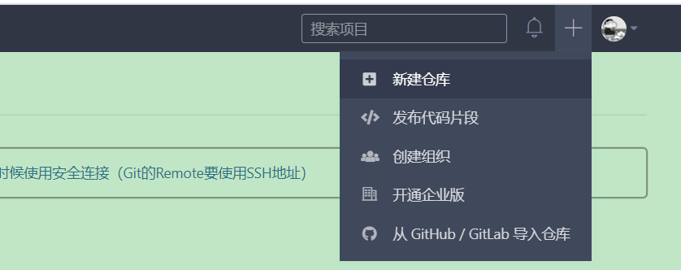

许可证：开源是否可以随意转载，开源但是不能商业使用，不能转载，...  限制！

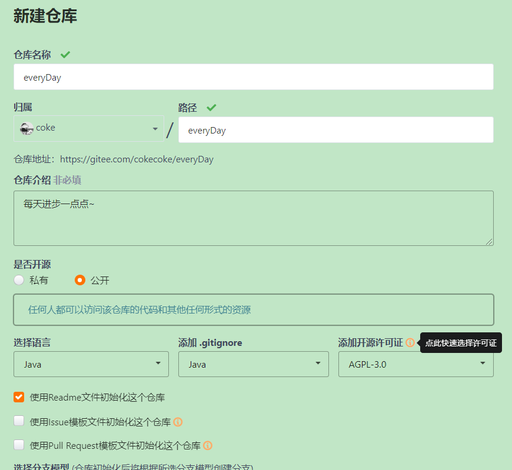

克隆到本地！

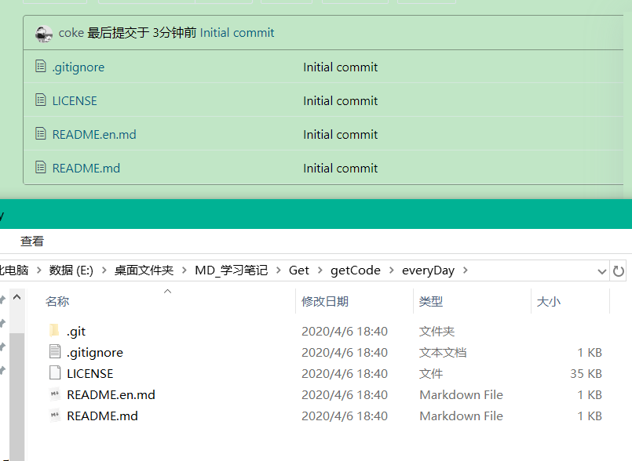


# IDEA中集成Git

1、新建项目，绑定git。

- 将远程的git文件目录拷贝到项目目录即可

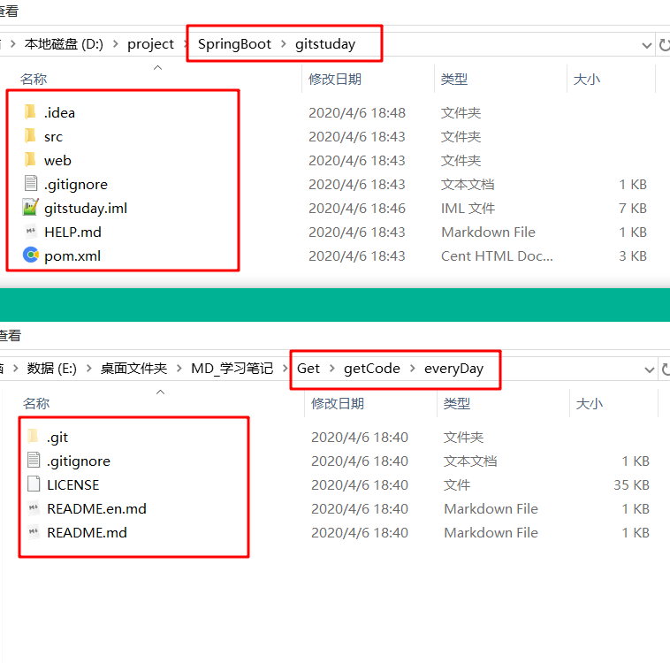

2、修改文件，使用IDEA操作git。

- 添加到暂存区
- commit 提交
- push到远程仓库

3、提交测试

## GIT分支

分支在GIT中相对较难，分支就是科幻电影里面的平行宇宙，如果两个平行宇宙互不干扰，那对现在的你也没啥影响。不过，在某个时间点，两个平行宇宙合并了，我们就需要处理一些问题了！


```
# 列出所有本地分支
git branch

# 列出所有远程分支
git branch -r

# 新建一个分支，但依然停留在当前分支
git branch [branch-name]

# 新建一个分支，并切换到该分支
git checkout -b [branch]

# 合并指定分支到当前分支
$ git merge [branch]

# 删除分支
$ git branch -d [branch-name]

# 删除远程分支
$ git push origin --delete [branch-name]
$ git branch -dr [remote/branch]

```

如果同一个文件在合并分支时都被修改了则会引起冲突：解决的办法是我们可以修改冲突文件后重新提交！选择要保留他的代码还是你的代码！

master主分支应该非常稳定，用来发布新版本，一般情况下不允许在上面工作，工作一般情况下在新建的dev分支上工作，工作完后，比如上要发布，或者说dev分支代码稳定后可以合并到主分支master上来。


# 远程连接发布项目：

1、ssh root@116.62.171.185

2、安装git：yum install git

3、在跟目下创建App目录：mkdir App

4、进入App目录克隆项目：git clone https://gitee.com/cokecoke/community.git

5、安装Maven：yum install maven

6、打包项目：mvn clean apackage

7、进入项目配置文件修改配置信息：more src/main/resources/application.properties

8、复制一份application.properties为上线production项目配置：

cp src/main/resources/application.properties src/main/resources/application-production.properties

9、编辑application-production.properties配置信息：vim src/main/resources/application-production.properties

10、生成数据库：mvn flyway:migrate

11、修改配置文件后从新打包：mvn package

12、启动上线项目：

后台启动：nohup

nohup java -jar -Dspring.profiles.active=production target/community-0.0.1-SNAPSHOT.jar &


# 问题：

本地仓库与远端仓库不一致导致不能提交信息：

1、可以使用强制更新提交本地数据

- git push -u origin master -f  强制更新

2、拉去远端数据到本地，再提交数据

- git pull 拉去
- git push 提交


```
error: Your local changes to the following files would be overwritten by merge:  
    xxx/xxx/xxx.php  
Please, commit your changes or stash them before you can merge.  
Aborting
```

出现这个问题的原因是其他人修改了xxx.php并提交到版本库中去了，而你本地也修改了xxx.php，这时候你进行git pull操作就好出现冲突了，解决方法，在上面的提示中也说的很明确了。

### 1、保留本地的修改 的改法

1）直接commit本地的修改

2）通过git stash

> ```
> git stash
> git pull
> git stash pop
> ```

通过git stash将工作区恢复到上次提交的内容，同时备份本地所做的修改，之后就可以正常git pull了，git pull完成后，执行git stash pop将之前本地做的修改应用到当前工作区。

git stash: 备份当前的工作区的内容，从最近的一次提交中读取相关内容，让工作区保证和上次提交的内容一致。同时，将当前的工作区内容保存到Git栈中。

git stash pop: 从Git栈中读取最近一次保存的内容，恢复工作区的相关内容。由于可能存在多个Stash的内容，所以用栈来管理，pop会从最近的一个stash中读取内容并恢复。

git stash list: 显示Git栈内的所有备份，可以利用这个列表来决定从那个地方恢复。

git stash clear: 清空Git栈。此时使用gitg等图形化工具会发现，原来stash的哪些节点都消失了。

2、放弃本地修改 的改法

> ```
> git reset --hard
> git pull
> ```


# 远程连接关闭，项目就停止的解决办法

展开

springboot项目打成jar包，在服务器启动项目
远程连接服务器开启项目 才可以进， 要是把远程连接服务器的窗口关了，项目就停了 。
这是本地启动，要使用脱机启动命令

脱机启动命令：

```
java -jar XXX.jar &
1
```

※ 命令结尾没有 “&” ，则变成 “java -jar XXX.jar ” ，表示在当前ssh窗口，可按CTRL + C打断程序运行，或者直接关闭窗口，则程序直接退出
※ 命令结尾添加 “&” ，则变成 “java -jar XXX.jar &” ，表示在当窗口关闭时，程序才会中止运行。&代表让该命令在后台执行。

```
  nohup java -jar XXX.jar > Log.log & 
    或者
  nohup java -jar XXX.jar >> Log.log & 
123
```

※ 命令 “nohup java -jar XXX.jar &” 部分，表示不挂断运行命令,当账户退出或终端关闭时,程序仍然运行。注意，该作业的所有输出被重定向到nohup.out的文件中。
※ 命令 “nohup java -jar XXX.jar > Log.log &” 部分，表示不挂断运行命令,当账户退出或终端关闭时,程序仍然运行，并且该作业的所有输出被重定向到Log.log的文件中。“ > Log.log ” 该命令就是指定日志输出的文件。
※ ">>"表示将输出以追加的方式重定向到Log.log中。

```
nohup java -jar XXX.jar > Log.log 2>&1 & 
或者
nohup java -jar XXX.jar >> Log.log 2>&1 & 
或者
nohup java -jar XXX.jar > /dev/null 2>&1 & 
12345
```

※ 标准输入文件(stdin)：stdin的文件描述符为0，Unix程序默认从stdin读取数据。
※ 标准输出文件(stdout)：stdout 的文件描述符为1，Unix程序默认向stdout输出数据。
※ 标准错误文件(stderr)：stderr的文件描述符为2，Unix程序会向stderr流中写入错误信息。
※ 屏蔽输出，起到禁止输出作用：/dev/null 是一个特殊的文件，写入到它的内容都会被丢弃；如果尝试从该文件读取内容，那么什么也读不到。但是 /dev/null 文件非常有用，将命令的输出重定向到它，会起到"禁止输出"的效果。
※ “> Log.log 2>&1” ：表示将 stdout 和 stderr 合并后重定向到 Log.log

可以使用==jobs==查看一下后台运行的任务。
查看项目启动的端口

```
ps -ef| grep java
```

关闭nohup启动的进程

```
kill -9 pid（pid为每一行的第二个id编码，表示的是该进程的父进程）
```


