##  1、操作数据库

### 1.1、操作数据库（了解）

1、创建数据库

```mysql
CREATE DATABASE [IF NOT EXISTS] school
```

2、删除数据库

```mysql
DROP DATABASE [IF EXISTS] school
```

3、使用数据库

```mysql
USE `school`
```

4、查看数据库

```mysql
SHOW DATABASES --查看所有数据库
```


### 1.2、数据库的列类型

> 数值

- tinyint         十分小的数据        1个字节
- smallint       较小的数据           2个字节
- mediumint   中等大小的数据   3个字节
- int                 标准的整数            4个字节   常用的 int
- bigint            较大的数据           8个字节
- float              浮点数                   4个字节
- double          浮点数                  4个字节
- decimal        字符串形式的浮点数   


> 字符串

- char          字符串固定大小的   0~255
- **varchar   可变字符串     0~65535**    常用的变量  String
- thinytext  微型文本         2^8-1
- **text          文本串             2^16-1**    保存大文本


> 时间日期

 java.util.Date


- date      YYYY-MM-DD,日期格式
- time      HH:mm:ss   时间格式
- **datetime     YYYY-MM-DD  HH:mm:ss  最常用的时间格式**
- **timestamp   时间戳，  1970.1.1到现在的毫秒数！**   也较为常用
- year  年份表示


> null

- 没有值，未知
- ==注意，不要使用NULL进行运算，结果为NULL==


### 1.3、数据库的字段属性（重点）

==Unsigned：==

- 无符号的整数
- 声明了该列不能声明为负数


==zerofill：==

- 0填充的
- 不足的位数，使用0来填充，int（3），5---005


==自增：==

- 通常理解为自增，自动在上一条记录的基础上+1（默认）
- 通常用来设计唯一的主键~index，必须是整数类型
- 可以自定义设计主键自增的起始值和步长


==非空：==NULL  not null

- 假设 not null  ，如果不给他赋值就会报错
- NULL，如果不填值，默认就是null！

==默认：==

- 设置默认的值！
- sex，默认值为男，如果不指定该列的值，则会有默认的值！


### 1.4、创建数据库表（重点）

```sql
-- 目标：创建一个school数据表
--  创建学生表（列，字段）使用sql创建
--  学号int 登录密码varchar(20) 姓名，性别varchar（2），出生日期（datetime），家庭住址，email

--  注意点：使用英文（），表的名称和字段使用 `` 括起来
--  AUTO_INCREMENT 自增
--  字符串使用单引号括起来
--  所有的语句后面加 ， （英文的）,最后一个不用加

create table if not exists `school`(
	`id` int(4) NOT NULL AUTO_INCREMENT COMMENT '学号',
	`name` varchar(30) not null default '匿名' comment '姓名',
	`gender` varchar(2) not null default '女' comment '性别',
	`password` varchar(20) not null default '123456' comment '密码',
	`birthday` datetime default null  comment '出生日期',
	`address` varchar(100) default null comment '家庭住址',
	`email` varchar(30) default null comment '邮箱',
	primary key (`id`)
)engine=innodb default charset=utf8
```

格式

```sql
CREATE TABLE [IF NOT EXISTS] `表名`（
`字段名` 列类型 [属性] [索引] [注释]，
`字段名` 列类型 [属性] [索引] [注释]，
 ......
`字段名` 列类型 [属性] [索引] [注释]
）[表类型] [字符集设置] [注释]
```

常用命令

```sql
show create database school -- 查看创建数据库的语句
show create table school -- 查看school数据表的定义语句
desc school -- 显示表的结构
```


### 1.5、数据表的类型

```
-- 关于数据库引擎
/*
INNODB 默认使用
MYISAM
*/

```

|              | MYISAM | INNODB        |
| ------------ | ------ | ------------- |
| 事务支持     | 不支持 | 支持          |
| 数据行锁定   | 不支持 | 支持          |
| 外键约束     | 不支持 | 支持          |
| 全文索引     | 支持   | 不支持        |
| 表空间的大小 | 较小   | 较大，约为2倍 |

常规使用操作：

- MYISAM 节约空间
- INNODB 安全性高，事务的处理，多表多用户操作


> 在物理空间存在的位置

所有的数据库文件都存在data目录下，一个文件夹就对应一个数据库本质还是文件的存储！


MYSQL引擎在物理文件上的区别

- InnoDB 在数据库表中只有一个*.frm文件，以及上级目录下的ibdata1文件
- MYISAM对应文件
  - *.frm    表结构的定义文件
  - *.MYD  数据文件  (data)
  - *.MYI    索引文件(index)


> 设置数据库表的字符集编码

```
CHARSET=utf8
```

不设置的话，会是mysql默认的字符集编码~（不支持中文）

MySQL的默认编码是Latin1，不支持中文

在My.ini 中配置默认的编码

```java
character-set-server=utf8
```


### 1.6、修改删除表


> 修改

```sql
-- 修改表名 alert table 旧表名 rename as 新表名
alter table teacher rename as teacher1

-- 增加表的字段 alter table 表名 add 字段名 列属性
alter table teacher add age int(2)

-- 修改表的字段 （重命名，修改约束！）
-- alter table 表名 modify 字段名 属性[]
alter table teacher modify age varchar(2)  -- 修改约束

-- alter table 表名 change 旧表名  新表名 列属性[]
alter table teacher change age age1 int (2)  -- 重命名

-- 删除表的字段 alter table 表名 drop 字段名
alter table teacher drop age1
```


> 删除

```sql
-- 删除表(如果表存在再删除)
drop table if exists teacher1
```


## 2、MySQL的数据管理


### 2.1、外键（了解）

 ```sql
-- 学生表的gradeID字段要引用年级表的gradeID
-- 定义外键key
-- 给这个外键添加约束（执行引用）references 引用

create table `grade`(
	`gradeid` int(10) not null auto_increment comment '年级id',
	`gradename` varchar(50) not null comment '年级名称',
	primary key(`gradeid`)
)engine=innodb default charset=utf8

create table if not exists `student`(
	`id` int(4) NOT NULL AUTO_INCREMENT COMMENT '学号',
	`name` varchar(30) not null default '匿名' comment '姓名',
	`gender` varchar(2) not null default '女' comment '性别',
	`password` varchar(20) not null default '123456' comment '密码',
	`birthday` datetime default null  comment '出生日期',
	`gradeid` int(10) not null comment '学生年级',
	`address` varchar(100) default null comment '家庭住址',
	`email` varchar(30) default null comment '邮箱',
	primary key (`id`),
	key `fk_gradeid`(`gradeid`),
	constraint `fk_gradeid` foreign key (`gradeid`) references `grade`(`gradeid`)
)engine=innodb default charset=utf8
 ```

**删除有外键关系的表的时候，必须要先删除引用别人的表（从表），再删除被引用的表**


> 方式二：创建标成功后，添加外键约束

```sql
-- 创建表的时候没有外键约束
alter table `student`
add constraint `fl_fradeid` foreign key(`gradeid`) references `grade`(`gradeid`);
-- alter table 表 add constraint 约束名 fireign key(作为外键约束的列) references 那个表(那个字段)
```

**以上操作都是物理外键，数据库级别的外键，不建议使用！（避免数据库过多造成困扰）**

==最佳实践==

- 数据库就是单纯的表，只用来存数据，只有行（数据）和列（字段）
- 我们想使用多张表的数据，想使用外键（程序去实现）


2.2、DML语言（掌握）

**数据库意义**：数据存储，数据管理

DML语言：数据操作语言

- insert
- update
- delete


### 2.3、添加

> insert into

```sql
-- 插入语句（添加）
-- insert into 表名([字段名]，[字段2,[字段3]) values ('值1','值2','值3')
insert into `student`(`name`) values ('李四');

-- 主键自增可以省略，（如果不写表的字段，他就会一一匹配）
-- 插入多个字段
insert into `student`(`name`) values('啦啦'),('啦啦'),('啦啦');

insert into `student`(`name`,`gender`,`password`) values('啦啦','男','123456');

```

语法： **insert into 表名([字段名]，[字段2,[字段3]) values ('值1','值2','值3',...)**

注意事项：

1. 字段和字段之间使用英文逗号隔开
2. 字段是可以省略的，但是后面的值必须要一一对应，不能少
3. 可以同时插入多条数据，values后面的值，需要使用，隔开即可values(),() ......


### 2.4、修改

> update  修改谁 （条件） set原来的值=新值

```sql
-- 修改语句
update `student` set `name`='花花' where id = 1;


-- 不指定条件的情况下，会改掉所有数据
update `student` set `name`='尼古拉斯';

-- 修改多个属性
update `student` set `name`='二狗子',`email`='359100378@qq.com' where id =1;
```

语法：**update  表名 set colnum_name = value,[colnum_name = value,......] where [条件]**


| 操作符   | 含义         | 范围       | 结果  |
| -------- | ------------ | ---------- | ----- |
| =        | 等于         | 5=6        | false |
| <> 或 != | 不等于       | 5<>6       | true  |
| >        |              |            |       |
| <        |              |            |       |
| <=       |              |            |       |
| >=       |              |            |       |
| BETWEEN  | 在某个范围内 | [2,5]      |       |
| AND      | 我和你&&     | 5>1&       | false |
| OR       | 我或你\|\|   | 5>2 or 1>2 | true  |

```sql
-- 通过多个条件定位数据
update `student` set `name`='花花',`email`='359100378@qq.com' where id =1

update `student` set `name`='花花',`email`='359100378@qq.com' where `name`='花花' and `sex`='女'
```

语法：**update 表名 set colnum_name = value,[colnum_name = value,......] where [条件]**

注意：

- colnum_name 是数据库的列，尽量带上``
- 条件，筛选的条件，如果没有指定，则会在修改所有的列
- value，是一个具体的值，也可以是一个变量
- 多个设置的属性之间，使用英文逗号隔开


### 2.5、删除

> delete 命令

语法：delete from 表名 [where 条件]

```sql
-- 删除数据（避免这样写，会全部错误）
delete from `student`;


-- 删除指定数据
delete from `student` where id =1;
```


> TRUNCATE 命令

作用：完全清空一个数据表，表的结构和索引约束不会变


> delete 和 TRUNCATE 区别

- 相同点：都能删除数据，都不会删除表结构
- 不同：
  - TRUNCATE  重新设置自增列  计数器会归零
  - TRUNCATE  不会影响事务

了解即可：**delete删除的问题，重启数据库现象**

- InnoDB  自增列会重1开始 （存在内存当中，断电即逝）
- MyISAM  继续从上一个自增量开始 （存在文件中的，不会丢失）


## 3、DQL查询数据(重点)

### 3.1、DQL

(Date Query Language:数据查询语言)

- 所有的查询操作都用它 Select
- 简单的查询，最复杂的查询都能做
- **数据库中最核心的语言，最重要的语言**
- 使用频率最高的语言


> **select 完整语法**

```sql
select [all | distinct]
{* | table.* | [table.field1[as alias1][,table.field2][as alias2]][,......]}
from table_name [as table_alias]
	[left | right | inner join table_name2] -- 联合查询
	[where ...] -- 指定结果满足的条件
	[group by] -- 指定结果按照哪几个字段来分组
	[having] -- 过滤分组的记录必须满足的次要条件
	[order by ...] -- 指定查询记录按一个或多个条件排序
	[limit {[offset,]row_count | row_countOFFSET offset}];
	-- 指定查询的记录从哪条至哪条
```

注意：[ ]括号代表可选的，{ }括号代表必选的


### 3.2、指定查询字段

```sql
-- 查询全部学生
select * from student

-- 查询指定字段
select `name`,`gender` from student 

-- 别名，给结果起一个别名
select `name` as '名称',`gender` as '性别' from student;

-- 函数 Concat (a,b)
select concat('姓名：'studentName) as 新名字 from student;
```

语法：**select 字段 ... from 表**

> 有的时候列名字不是那么见名知意，我们起别名  as  字段名  as  别名   表名  as  别名


> 去重复 distinct

作用：**取出select查询出来的结果中重复的数据，重复的数据只显示一条**

```sql
--查询一下有哪些同学参加了考试成绩
select * from result -- 查询全部的考试成绩
select `StudentNo` from result -- 查询有哪些同学参加了考试
select distinct `studentNo` from result -- 发现重复数据
```


> 数据库的列（表达式）

```sql
select version() -- 查询系统版本（函数）
select 100*5/3 as 计算结果  -- 用来计算 （表达式）
select @@auto_increment_increment -- 查询自增的步长 （变量）

-- 学员考试成绩+1
select `StudentNo`,`StudentResult` +1 as '提分后' from result;
```

**数据库中的表达式：文本值，列，Null，函数，计算表达式，系统变量。。。**


### 3.3、where条件子句

作用：检索数据中**符合条件**的值

搜索的条件由一个或多个表达式组成！结果 布尔值

> 逻辑运算符

| 运算符   | 语法                | 描述                           |
| -------- | ------------------- | ------------------------------ |
| and  &&  | a and b      a && b | 逻辑与，两个都为真，结果为真   |
| or  \|\| | a or b   a \|\| b   | 逻辑或，其中一个为真，结果为真 |
| Not  ！  | not a    ! a        | 逻辑非，真为假，假为真！       |

```sql
-- ======== where ========
-- 查询成绩在95到100之间的学生
select `StudentNo`,`StudentResult` from result where `StudentResult`>=95 and `StudentResult`<=100 ;

-- and && 
select `StudentNo`,`StudentResult` from result 
where `StudentResult`>=95 && `StudentResult`<=100 ;

-- 模糊查询
select studentNo,`StudentResult` from result 
where `StudentResult` between 95 and 100;


-- 除了1号学生之外的学生的成绩
select studentNo,`StudentResult` from result
where studentNo!=0001;

-- !=   not
select studentNo,`StudentResult` from result
where not studentNo=0001;
```


> 模糊查询：比较运算符

| 运算符      | 语法               | 描述                                         |
| ----------- | ------------------ | -------------------------------------------- |
| IS NULL     | a is null          | 如果操作符为null，结果为真                   |
| IS NOT NULL | a is not null      | 如果操作符不为null，结果为真                 |
| BETWEEN     | a between b and c  | 若a在b和c之间，则结果为真                    |
| **LIKE**    | a like b           | sql 匹配，如果a匹配b，则结果为真             |
| **in**      | a in (a1,a2,a3...) | 假设a在a1，或者a2...其中某一个值中，结果为真 |

 ```sql
-- =============模糊查询================
-- 查询姓刘的同学
-- like结合 % (代表0到任意个字符)  _(一个字符)

-- 查询姓刘的同学，名字后面一个字的
select `id`,`name` from `student` where 
 `name` LIKE '刘_';

-- 查询姓刘的同学，名字后面两个字的
select `id`,`name` from `student` where
`name` like '刘__';

-- 查询名字中间有嘉字的同学  %嘉%
select `id`,`name` from `student` where
`name` like '%嘉%';

--  ============== in ================

--查询 1,2,3,4 号学员
select `id`,`name` from `student` where
`id` in (1,2,3,4);

-- 查询在北京的学生
select `id`,`name` from `student` where
`address` in ('北京','上海');

-- =========== null  not null =============
-- 查询地址为空的学生 null  ''
select `id`,`name` from `student` where
`address`='' or `address` is null

-- 查询有出生日期的同学   不为空 ''
select `id`,`name` from `student` where
`birthday` is not null;


 ```


### 3.4、连表查询

> JOIN 对比


| 操作       | 描述                                       |
| ---------- | ------------------------------------------ |
| inner join | 如果表中至少有一个匹配，则返回行           |
| left join  | 会从左表中返回所有的值，即使右表中没有匹配 |
| right join | 会从右表中返回所有的值，即使左表中没有匹配 |


```sql
-- ==================连表查询 join===================

-- 查询参加了考试同学（学号，姓名，科目编号，分数）
/*
思路：
1.分析需求，分析查询的字段来自哪些表，（连接查询）
2.确定使用哪种连接？7种
确定交叉点（这两个表中那个数据是相同的）
判断的条件：学生表中 studentNo = 成绩表 studentNo
*/

-- join （连接的表）  on （判断的条件） 连接查询
-- where  等值查询

-- right join
select s.`StudentNo`,`StudentName`,`SubjectNo`,`StudentResult` 
from `student` as s
right join `result` as r
on s.StudentNo = r.StudentNo

-- left join
select s.`StudentNo`,`StudentName`,`SubjectNo`,`StudentResult` 
from `student` as s
left join `result` as r
on s.StudentNo = r.StudentNo

-- inner join
select s.`StudentNo`,`StudentName`,`SubjectNo`,`StudentResult` 
from `student` as s
inner join `result` as r
on s.StudentNo = r.StudentNo


-- 查询参加了考试同学（学号，姓名，科目编号，分数）
-- 需要用到三张表：student、result、subject
select s.`studentNo`,`studentName`,`subjectName`,`studentResult` 
from `student` s
right join `result` r
on s.studentNo = r.studentNo
inner join `subject` sj
on r.subjectNO = sj.subjectNo


-- 我要查询哪些数据 select...
-- 从那几个表中from 表 xxx join 连接的表 on 交叉条件
-- 假设存在一种多张表查询，慢慢来，先查询两张然后在慢慢增加

-- from  a left join b
-- fron  a right join b
```


> 自连接

自己的表和自己的表连接，核心：一张表拆为两张一样的表即可

父类

| categoryid | categoryName |
| ---------- | ------------ |
| 2          | 信息技术     |
| 3          | 软件开发     |
| 5          | 美术设计     |

子类

| pid  | categoryid | categoryName |
| ---- | ---------- | ------------ |
| 3    | 4          | 数据库       |
| 3    | 6          | web开发      |
| 5    | 7          | ps技术       |
| 2    | 8          | 办公信息     |

操作：查询父类对应的子类关系

| 父类     | 子类     |
| -------- | -------- |
| 信息技术 | 办公信息 |
| 软件开发 | 数据库   |
| 软件开发 | web开发  |
| 美术设计 | ps技术   |

```sql
-- 查询父子信息：把一张表看为两张一模一样的表
select a.`categoryName` as '父类目',b.`categoryName` as '子栏目'
from `category` as a,`category` as b
where a.`categoryid` = b.`pid`;

```

```sql
-- 练习查询

-- 查询学员所属的年级（学号，姓名，年级名称）
select studentNo,studentName,GradeName
from `student` s
inner join `grade` g
on s.Gradeid = g.gradeid


-- 查询科目所属的年级（科目名称，年级名称）
select `subjectName`,`gradeName`
from `subject` s
left join `grade` g
on s.Gradeid = g.Gradeid;


-- 查询参加了 数据库 考试的同学信息：学号、姓名、科目、分数
select s.StudentNo,StudentName,subjectName,StudentResult
from student s 
inner join `result` r
on s.StudentNO = r.StudentNo
inner join `subject` sj
on r.subjectNo = sj.subjectNo
where subjectName = '数据库';
```


### 3.5、分页和排序

> 排序

```sql
-- ================= 分页limit 和 排序 order by ===================
-- 排序： 升序 ASC  降序 DESC
-- ORDER BY 通过哪个字段排序，怎么排
-- 查询的结果根据，成绩降序 排序

select s.StudentNo,StudentName,subjectName,StudentResult
from student s 
inner join `result` r
on s.StudentNO = r.StudentNo
inner join `subject` sj
on r.subjectNo = sj.subjectNo
where subjectName = '英语'
order by StudentResult asc;

-- 第一页 limit 0,5  (1-1)*5
-- 第二页 limit 5,5  (2-1)*5
-- 第三页 limit 10,5  (3-1)*5
-- 第n页  limit n,5  (n-1)*pageSize
-- [pageSize：页面大小]
-- [(n-1)*pageSize:起始值]
-- [n:当前页]
-- [数据总数/页面大小 = 总页数]
```

语法：limit(查询起始下标，pageSize)

```sql
-- 练习
-- 查询java 课程成绩排名前十的学生，并且分数要大于80分的学生信息（学号，姓名，课程名称，分数）
select s.studentNo,studentName,subjectName,studentResult
from student s
inner join result r
on s.studentNO = r.studentNo
inner join `subject` sj
on r.subjectNo = sj.subjectNo
where subjectName = 'java' and studentResult >= 80
group by studentResult desc
limit 0,10
```


### 3.6、子查询

where（这个值是计算出来的）

```sql
-- ================== where ====================
-- 查询参加数据库 的所有考试结果（学号，科目编号，成绩），降序排序

-- 方式一：连接查询
select studentNO,s.subjectNo,studentResult
from `result` r
inner join `subject` s
on r.studentNo = s.subjectNo
where subjectName = '数据库'
order by StudentResult desc

-- 方式二：子查询
select studentNO,subjectNo,studentResult
from `result`
where subjectNO = (
		select subjectNo from `subject` 
		where subjectName = '数据库'
)
order by studentResult desc

-- 查询分数不小于80分的学生的学号和姓名  distinct：去重
select s.studentNo,studentName 
from student s
inner join result r
on s.studentNo = r.studentNo
where studentResult >=80

-- 添加条件，增加英语科目
-- 子查询
select s.studentNo,studentName 
from student s
inner join result r
on s.studentNo = r.studentNo
where studentResult >=80
and subjectNo = (select subjectNo from `subject` where subjectName = '英语')

```


### 3.7、分组和过滤

```sql
-- 查询不同课程的平均分，最高分，最低分，平均分大于80
-- 核心：（根据不同的课程分组）
select subjectName,avg(studentResult) as 平均分,max(studentResult) as 最高分,min(studentResult) as 最低分
from `result` r
inner join `subject` s
on r.subjectNO = s.subjectNO
group by subjectName
having 平均分 > 80
```


## 4、MySQL函数

### 4.1、常用函数

```sql
-- =============== 常用函数 ================
select ABS(-8) -- 绝对值
select ceiling(9.4) -- 向上取整
select floor(9.4) -- 向下取整
select rand() -- 返回一个 0~1 之间的随机数
select sign(10) -- 判断一个数的符号 0-0 负数返回-1，正数返回1

-- 字符串函数
select char_length('哈哈哈哈哈哈哈哈哈') -- 字符串长度
select concat('我','爱','你') -- 拼接字符串
select insert('你好，Helloworld',1,2,'不好') -- 在指定位置插入字符串
select lower('NiHaoYa') -- 小写字母
select upper('NiHaoYa') -- 大写字母
select instr('nihaoma','o') -- 返回第一次出现的字符串的索引位置
select replace('你猜我是谁？','我','她') -- 替换出现的指定字符串
select substr('这是一个没有尽头的阳光大道','3','6') -- 截取指定的子字符串
select reverse('青青草原远处来') -- 反转


-- 查询姓周的同学，把姓替换为 邹
select replace(studentName,'周','邹') from student
where studentName like '周%'

-- 时间和日期函数（记住）
select current_date() -- 获取当前日期
select curdate() -- 获取当前日期
select now() -- 获取当前的时间
select localtime() -- 本地时间
select sysdate() -- 系统时间

select year(now()) -- 当前年份
select month(now()) -- 当前月份
select day(now()) -- 当前在哪一天
select hour(now()) -- 当前小时
select minute(now()) -- 当前分钟
select second(now()) -- 当前秒钟

-- 系统
select system_user() -- 当前系统用户
select user() -- 当前用户
select version() -- 当前系统版本

```


### 4.2、聚合函数（常用）

| 函数名称 | 描述   |
| -------- | ------ |
| count()  | 计数   |
| sum()    | 求和   |
| avg()    | 平均值 |
| max()    | 最大值 |
| min()    | 最小值 |

```sql
-- ================= 聚合函数 ===================
select count(studentName) from student; -- count(字段)，会忽略所有的null值
select count(*) from student; -- count(*)，不会忽略null值
select count(1) from student; -- count(1)，不会忽略null值

select sum(`studentResult`) as 总和 from result;
select avg(`studentResult`) as 平均分 from result;
select max(`studentResult`) as 最高分 from result;
select min(`studentResult`) as 最低分 from result;
```


### 4.3、数据库级别的MD5加密（扩展）

什么是MD5?

主要是增强算法复杂度的不可逆性。

MD5不可逆，具体的值的MD5是一样的。

MD5破解原理，背后有一个字典，MD5加密后的值，返回加密前的值

```sql
-- ================= 测试MD5 加密=================

create table `testMd5`(
	`id` int(4) not null,
	`name` varchar(50) not null,
	`pwd` varchar(50) not null,
	primary key(`id`)
)engine=innodb default charset=utf8


insert into `testMd5` values(1,'张三','123456'),(2,'李四','123456'),(3,'王五','123456');

-- 加密
update `testMd5` set pwd=md5(pwd) where id = 1;
update `testMd5` set pwd=md5(pwd) where id != 1;

-- 插入的时候加密
insert into `testMd5` values(4,'陈傻子',md5('123456'));

-- 如何校验：将用户传递进来的密码，进行md5加密，然后比对加密后的值
select * from `testMd5` where `name`= '张三' and pwd=md5('123456');

```


## 5、事务

### 5.1、什么是事务

> 事务原则：ACID原则，原子性，一致性，隔离性，持久性

**原子性（Atomicity）**

是指事务是一个不可分割的工作单位，要么都成功，要么都失败

**一致性（Consistency）**

事务前后的数据完整性保证一致，1000

**持久性（Durability）** -- 事务提交

事务一旦提交则不可逆，被持久化到数据库中

**隔离性（lsolation）**

事务的隔离性是多个用户并发访问数据库时，数据库为每一个用户开启的事务，不能被其他事务的操作所干扰事务之间要相互隔离

> 隔离所导致的一些问题

**脏读：**

指一个事务读取了另外一个事务未提交的数据。

**不可重复读：**

在一个事务内读取表中的某一行数据，多次读取结果不同。（这个不一定是错误，只是某些场合不对）

**虚读（幻读）：**

是指在一个事务内读取到了别人的事务插入的数据，导致前后读取不一致。

```sql
-- ==================== 事务 ========================
-- mysql 是默认开启事务自动提交的

set autocommit = 0;  -- 关闭
set autocommit = 1;  -- 开启（默认）

-- 手动处理事务
set autocommit = 0; -- 关闭自动提交

-- 事务开启
start transaction  -- 标记一个事务的开始，从这个以后的sql都在同一个事务内

insert into ...
update ...

-- 提交：持久化（成功！）
comment

-- 回滚：回到原来的样子（失败！）
rollback

-- 事务结束
set autocommit = 1 -- 开启自动提交

-- 了解
savepoint 保存点名 -- 设置一个事务的保存点
rollback to savepoint 保存点名 -- 回滚到保存点
release savepoint 保存点名 -- 撤销保存点


```

> 模拟场景

```sql
-- 转账
create database shop character set utf8 collate utf8_general_ci
use shop

create table `account`(
	`id` int(4) not null AUTO_INCREMENT,
	`name` varchar(30) not null,
	`money` decimal(9,2) not null,
	primary key(`id`)
)engine=innodb default charset=utf8


insert into `account`(`name`,`money`) values('A','2000.00'),('B','10000.00');

-- 模拟转账：事务
set autocommit = 0; -- 关闭自动提交
start transaction -- 开启一个事务

update `account` set money=money-500 where `name`='A'  -- A减500
update `account` set money=money+500 where `name`='B'  -- B加500

commit -- 提交事务
rollback -- 回滚事务

set autocommit = 1; -- 恢复默认值（开启自动提交）

```


## 6、索引

### 6.1、索引分类

> 在一个表中，主键索引只能有一个，唯一索引可以有多个

- 主键索引（PRIMARY KEY）
  - 唯一的标识，主键不可重复，只能有一个列作为主键

- 唯一索引（UNIQUE KEY）
  - 避免重复列出现，唯一索引可以重复，多个列都可以标识唯一索引
- 常规索引（KEY / INDEX）
  - 默认的，index； key 关键字来设置
- 全文索引（FullText）
  - 在特定的数据库引擎下才有，MyISAM
  - 快速定位数据

基础语法：

```sql
-- 索引的使用
-- 1、在创建表的时候给字段增加索引
-- 2、创建完毕后，增加索引

-- 显示所有的索引信息
show index from student

-- 显示所有的索引信息
show index from student

-- 增加一个全文索引（索引名）列名
alter table student add fulltext index `StudentName`(`StudentName`);

-- explain 分析sql执行的状况
explain select * from student; -- 非全文索引

explain select * from student where match(studentName) against('王');
```


### 6.2、测试索引

```sql
create table `app_user`(
	`id` bigint(20) unsigned not null AUTO_INCREMENT,
	`name` varchar(50) default '' comment '用户姓名',
	`email` varchar(50) not null comment '用户邮箱',
	`phone` varchar(20) default '' comment '手机号',
	`gender` tinyint(4) unsigned default '0' comment '性别（0 男，1 女）',
	`password` varchar(100) not null comment '密码',
	`age` tinyint(4) default '0' comment '年龄',
	`create_time` datetime default current_timestamp,
	`update_time` timestamp null default current_timestamp on update current_timestamp,
	primary key (`id`)
)engine=innodb default charset=utf8mb4 comment='app用户表'

-- 模拟插入100万条数据

delimiter $$  -- 写在函数之前，标志
create function mock_data()
returns int
begin
		declare num int default 1000000;
		declare i int default 0;
		while i<num do
			insert into app_user(`name`,`email`,`phone`,`gender`,`password`,`age`)
			values(concat('用户',i),'359100378@qq.com',concat('18',floor(rand()*((999999999-100000000)+100000000))),floor(rand()*2),uuid(),floor(rand()*100));	
			set i = i+1;
		end while;
		return i;
end;

select mock_data()

-- 测试数据
select * from app_user where `name`='用户9999'; -- 时间: 1.052s
select * from student

-- 建索引
-- id_表名_字段名
-- create index 索引名 on 表(字段)
create index id_app_user_name on app_user(`name`);

select * from app_user where `name`='用户9999'; -- 时间: 0.003s
explain select * from app_user where `name`='用户9999'; -- rows 1
```

**分析sql执行**

```sql
-- explain 分析sql执行的状况
explain select * from app_user where `name`='用户9999';
```

**建索引前：**

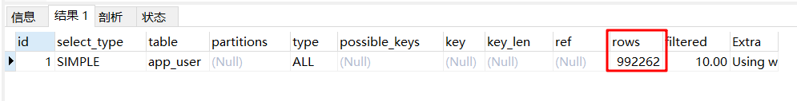

**建索引后：**

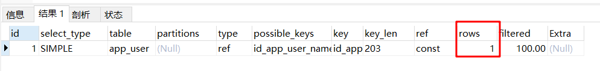

**索引在小数据量的时候，用处不大，但是在大数据量大的时候，区别十分明显**


### 6.3、索引原则

- 索引不是越多越好
- 不要对经常变动的数据加索引
- 小数据量的表不需要加索引
- 索引一般加在常用来查询的字段上


> 索引的数据结构

Hash类型的索引

Btree：InnoDB的默认数据结构

阅读：http://blog.codinglabs.org/articles/theory-of-mysql-index.html


## 7、数据库管理及备份

### 7.1、用户管理

```sql
-- 创建用户 create user 用户名 identified by '密码'
create user wang identified by '123456'

-- 修改密码（修改当前用户密码）
set password = password('123456')

-- 修改密码（修改指定用户密码）
set password for wang = password('root')

-- 重命名 rename user 原来名字 to 新名字
rename user wang2 to wang

-- 用户授权 all privleges 全部的权限，库.表
-- all privileges 除了给他人授权这一项，其他都能干
grant all privileges on *.* to wang

-- 查询权限
show grants for wang  -- 查看指定用户的权限
show grants for root@localhost

-- 撤销用户权限
revoke all privileges on *.* from wang

-- 删除用户
drop user wang

```


### 7.2、MySQL备份

为什么要备份：

- 保证重要数据不丢失
- 数据转移

MySQL数据库备份的方式

- 直接拷贝物理文件
- 在可视化工具中手动导出
  - 在想要导出的表或者库中，右键选择备份或导出

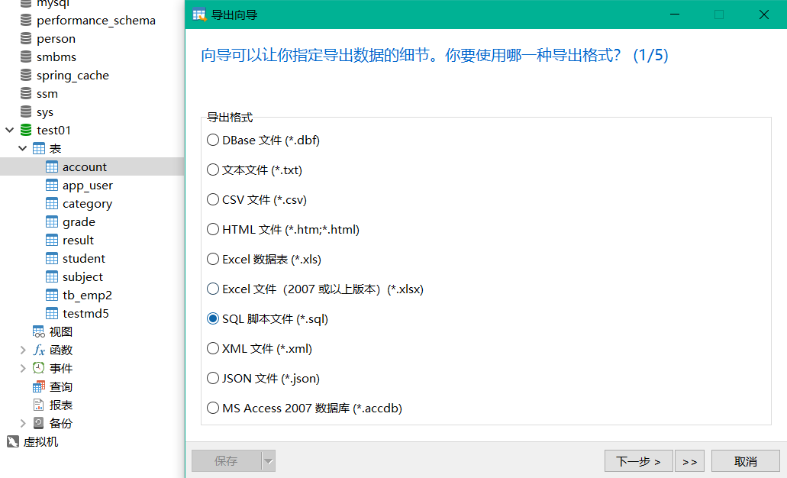

- 使用命令行导出Mysqldemp 命令行使用

```bash
#mysqldump -h 主机 -u 用户名 -p 密码 数据库 表名 > 物理磁盘位置/文件名
mysqldump -hlocalhost -uroot -p123456 test01 student >D:/s.sql

#mysqldump -h 主机 -u 用户名 -p 密码 数据库 表1 表2 表3 > 物理磁盘位置/文件名
mysqldump -hlocalhost -uroot -p123456 test01 student result >D:/r.sql

#导入
#登录的情况下，切换到指定的数据库
#source 备份文件
use test01
source D:/a.sql

mysql -u用户名 -p密码 库名< 备份文件
```


## 8、规范数据库设计

### 8.1、为什么需要设计

> 三大范式（）

**第一范式（1NF）**

原子性：保证每一个列不可分割

**第二范式（2NF）**

前提：满足第一范式

每张表只能描述一件事情

**第三范式（3NF）**

前提：满足第一、第二范式

第三范式需要确保数据表中的每一列数据都和主键直接相关，而不能间接相关


（规范数据库设计）

**规范性和性能的问题**

关联查询的表不得超过三张

- 考虑商业化的需求和目标，（成本，用户体验）数据库的性能更重要
- 在规范性能的问题的时候，需要适当的考虑一下规范性！
- 故意给某些表增加些冗余的字段。（从多表查询中变为单表查询）
- 故意增加一些计算列（从大数量降低为小数据量的查询：索引）


## 9、JDBC（重点）

### 9.1、数据库驱动

驱动：声卡、显卡、数据库、打印机

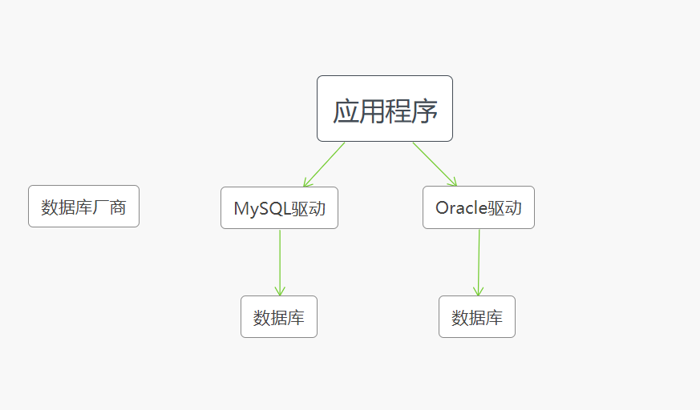


程序会通过数据库的驱动和数据库打交道！


### 9.2、JDBC

SUN公司为了简化开发人员的（对数据库的统一）操作，提供了一个（Java操作数据库的）规范，俗称JDBC这些规范的实现由具体的厂商去做

对于开发人员来说，我们只需要掌握JDBC接口操作即可！

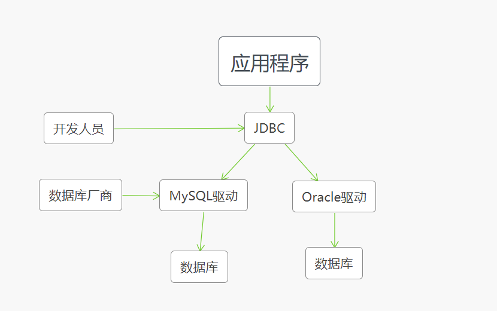

java,sql

javax.sql

还需要导入一个数据库驱动包


### 9.3、第一个JDBC程序

> 创建测试数据库

```sql
create database jdbcStudy character set utf8 collate utf8_general_ci;

use jdbcStudy;

create table users(
	id int primary key,
	`name` varchar(50),
	`password` varchar(50),
	email varchar(50),
	birthday date
);

insert into users(id,`name`,`password`,`email`,birthday) 
values(1,'zhangsan','123456','zs@qq.com','1999-10-02'),
(2,'lisi','123456','ls@qq.com','1989-10-02'),
(3,'wangsi','123456','ws@qq.com','1990-10-02');

```

1、创建一个测试项目

2、导入数据库驱动

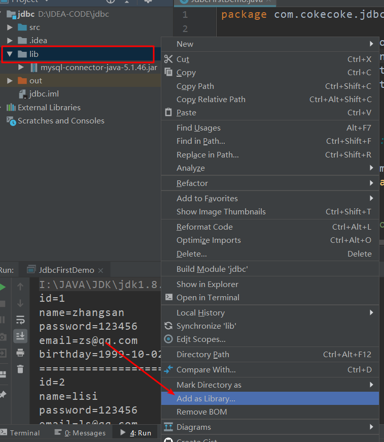


3、编写测试代码

```java
public class JdbcFirstDemo {
    public static void main(String[] args) throws Exception {

        //1.加载驱动
        Class.forName("com.mysql.jdbc.Driver");

        //2.配置用户连接信息
        //useUnicode=true&characterEncoding=utf8&useSSL=true"
        String url = "jdbc:mysql://localhost:3306/jdbcStudy?useUnicode=true&characterEncoding=utf8&useSSL=true";
        String username = "root";
        String password = "123456";

        //3.连接成功，获取数据库对象
        Connection connection = DriverManager.getConnection(url, username, password);

        //4.创建执行sql的对象
        Statement statement = connection.createStatement();

        //5.执行sql对象，可能存在结果，查看返回结果
        String sql = "select * from users";
        ResultSet resultSet = statement.executeQuery(sql);

        while (resultSet.next()){
            System.out.println("id=" + resultSet.getInt("id"));
            System.out.println("name=" + resultSet.getString("name"));
            System.out.println("password=" + resultSet.getString("password"));
            System.out.println("email=" + resultSet.getString("email"));
            System.out.println("birthday=" + resultSet.getDate("birthday"));
            System.out.println("========================");
        }
        //6.关闭资源，先开后关
        resultSet.close();
        statement.close();
        connection.close();
    }
}
```

**步骤总结：**

1、加载驱动

2、连接数据库DriverManger

3、获取执行sql的对象Statement

4、获取返回的结果集

5、释放连接


> DriverManger

```java
// DriverManager.registerDriver(new Driver());
Class.forName("com.mysql.jdbc.Driver");

Connection connection = DriverManager.getConnection(url, username, password);

//connectioin 代表数据库
//数据库设置自动提交
//事务提交
//事务回滚
connection.rollback();
connection.commit();
connection.setAutoCommit();
```


> URL

```java
String url = "jdbc:mysql://localhost:3306/jdbcStudy?useUnicode=true&characterEncoding=utf8&useSSL=true";

// mysql -- 3306
//协议://主机地址:端口号/数据库名?参数1&参数2&参数3

//oracle -- 1521
//jdbc:oracle:thin:@localhost:1521:sid
```


> Statement执行sql的对象	PrepareStatement执行sql的对象

```java
String sql = "select * from users";

statement.executeQuery(sql);//查询操作返回 ResultSet
statement.execute();//执行任何sql
statement.executeUpdate();//更新、插入、删除。都是用这个，返回一个受影响的行数。
```


> ResultSet 查询的结果集：封装了所有的查询结果

```java
//resultSet.getObject(); 在不知道列类型的情况下使用

//如果知道列的类型就使用指定的类型
resultSet.getInt();
resultSet.getString();
resultSet.getFloat();
resultSet.getDate();
resultSet.getObject();
```


> 遍历，指针

```java
resultSet.beforeFirst();//移动到最前面
resultSet.afterLast();//移动到最后面
resultSet.next();//移动到下一个数据
resultSet.previous();//移动到前一行
resultSet.absolute(row);//移动到指定行
```


> 释放资源

```java
resultSet.close();
statement.close();
connection.close();
```


### 9.4、statement对象

JDBC中的Statement对象用于向数据库发送sql语句，想完成数据库的增删改查，只需要通过这个对象数据库发送增删改查语句即可。

Statement对象的executeUpdate方法用于向数据库发送增、删、改的sql语句，executeUpdate执行完成后，将会返回一个整数（即增删改语句导致数据库几行数据发生了变化）。

statement.executeQuery方法用于向数据库发送查询语句，executeQuery方法返回代表查询结果的ResultSet对象。

> CRUD操作-create

使用executeUpdate（String sql）方法完成数据添加操作，实力操作：

```java
Statement st = conn.createStatement();
String sql = "insert into user(...) values(...)";
int num = st.executeUpdate(sql);
if(num>0){
    System.out.println("插入成功！！！");
}
```


> CRUD操作-delete

```java
Statement st = conn.createStatement();
String sql = "delete from user where id = 1";
int num = st.executeUpdate(sql);
if(num>0){
    System.out.println("删除成功！！！");
}
```


> CRUD操作-update

```java
Statement st = conn.createStatement();
String sql = "update user set name='' where id = 1";
int num = st.executeUpdate(sql);
if(num>0){
    System.out.println("修改成功！！！");
}
```


> CRUD操作-read

```java
Statement st = conn.createStatement();
String sql = "select * from user where id = 1";
ResultSet rs = st.executeQuery(sql);
if(re.next()){
    //根据获取列的数据类型，分别调用rs的响应方法映射到Java文件
}
```


```java
public class TestInsert {
    public static void main(String[] args) {
        Connection conn = null;
        Statement st = null;
        ResultSet rs = null;

        try {
            conn = JdbcUtils.getConnection();
            st = conn.createStatement();
            String sql = "insert into users(id,`name`,`password`,`email`,`birthday`) " +
                    "values(4,'张三','123456','359100378@qq.com','2020-02-22')";
            int i = st.executeUpdate(sql);
            if (i>0) {
                System.out.println("插入成功！");
            }
        } catch (SQLException e) {
            e.printStackTrace();
        }finally{
            JdbcUtils.release(conn,st,rs);
        }

    }
}
```


```java
public class TestDelete {
    public static void main(String[] args) {
        Connection conn = null;
        Statement st = null;
        ResultSet rs = null;

        try {
            conn = JdbcUtils.getConnection();
            st = conn.createStatement();
            String sql = "delete from users where id = 4";
            int i = st.executeUpdate(sql);
            if (i>0) {
                System.out.println("删除成功！");
            }
        } catch (SQLException e) {
            e.printStackTrace();
        }finally{
            JdbcUtils.release(conn,st,rs);
        }

    }
}
```


```java
public class TestUpdate {
    public static void main(String[] args) {
        Connection conn = null;
        Statement st = null;
        ResultSet rs = null;

        try {
            conn = JdbcUtils.getConnection();
            st = conn.createStatement();
            String sql = "update users set name='傻子' where id = 1";
            int i = st.executeUpdate(sql);
            if (i>0) {
                System.out.println("修改成功！");
            }
        } catch (SQLException e) {
            e.printStackTrace();
        }finally{
            JdbcUtils.release(conn,st,rs);
        }

    }
}
```


```java
public class TestSelect {
    public static void main(String[] args) {
        Connection conn = null;
        Statement st = null;
        ResultSet rs = null;
        try {
            conn = JdbcUtils.getConnection();
            st = conn.createStatement();
            String sql = "select * from users where id = 1";
            rs = st.executeQuery(sql);

            while (rs.next()){
                System.out.println("姓名："+rs.getString("name"));
            }
        } catch (SQLException e) {
            e.printStackTrace();
        }finally {
            JdbcUtils.release(conn,st,rs);
        }

    }
}
```


> SQL注入

sql存在漏洞，会被攻击导致数据泄露，sql会被拼接 'or ' 

```java
public class SQLInjection {

    public static void main(String[] args) {
       // login("zhangsan","123456");
        login(" 'or '1=1","123456");
    }

    //登录业务
    public static void login(String username,String password){
        Connection conn = null;
        Statement st = null;
        ResultSet rs = null;

        try {
            conn = JdbcUtils.getConnection();//连接数据库
            st = conn.createStatement();

            String sql = "select * from users where `name`='"+username+"' and `password`='"+password+"'";
            rs = st.executeQuery(sql);
            while (rs.next()){
                System.out.println(rs.getString("name"));
                System.out.println(rs.getString("password"));
            }

        } catch (SQLException e) {
            e.printStackTrace();
        }finally {
            JdbcUtils.release(conn,st,rs);
        }

    }
}
```


### 9.5、PreparedStatement对象

PreparedStatement可以防止sql注入，效率更好！


#### 1、新增

```java
public class TestInsert {
    public static void main(String[] args) {
        Connection conn = null;
        PreparedStatement st = null;

        try {
            conn = JdbcUtils.getConnection();

            //区别
            //使用？ 占位符代替参数
            String sql = "insert into users(id,`name`,`password`,`email`,`birthday`) values(?,?,?,?,?)";
            //预编译sql，先写sql，然后不执行
            st = conn.prepareStatement(sql);

            //手动给参数赋值
            st.setInt(1,4);
            st.setString(2,"铁蛋");
            st.setString(3,"123456");
            st.setString(4,"6666@qq.com");
            st.setDate(5, new java.sql.Date(new Date().getTime()));

            int i = st.executeUpdate();
            if (i>0) {
                System.out.println("插入成功！");
            }
        } catch (SQLException e) {
            e.printStackTrace();
        }finally{
            JdbcUtils.release(conn,st,null);
        }

    }

}
```


#### 2、删除

```java
public class TestDelete {
    public static void main(String[] args) {

        Connection conn = null;
        PreparedStatement st = null;


        try {
            conn = JdbcUtils.getConnection();

            String sql = "delete from users where id = ?";

            st = conn.prepareStatement(sql);

            st.setInt(1,4);

            int i = st.executeUpdate();
            if(i>0){
                System.out.println("删除成功！");
            }

        } catch (SQLException e) {
            e.printStackTrace();
        }finally {
            JdbcUtils.release(conn,st,null);
        }
    }
}
```


#### 3、更新

```java
public class TestUpdate {
    public static void main(String[] args) {
        Connection conn = null;
        PreparedStatement st = null;

        try {
            conn = JdbcUtils.getConnection();

            //区别
            //使用？ 占位符代替参数
            String sql = "update users set `name`=?,`password`=?,`email`=?,`birthday`=? where id = ?";
            //预编译sql，先写sql，然后不执行
            st = conn.prepareStatement(sql);

            //手动给参数赋值
            st.setString(1,"铁蛋");
            st.setString(2,"123456");
            st.setString(3,"6666@qq.com");
            st.setDate(4, new java.sql.Date(new Date().getTime()));
            st.setInt(5,2);
            int i = st.executeUpdate();
            if (i>0) {
                System.out.println("修改成功！");
            }
        } catch (SQLException e) {
            e.printStackTrace();
        }finally{
            JdbcUtils.release(conn,st,null);
        }

    }
}
```


#### 4、查询

```java
public class TestSelect {
    public static void main(String[] args) {

        Connection conn = null;
        PreparedStatement st = null;
        ResultSet rs = null;

        try {
            conn = JdbcUtils.getConnection();

            String sql = "select * from users where id = ?";

            st = conn.prepareStatement(sql);

            st.setInt(1,1);

            rs = st.executeQuery();
            while (rs.next()){
                System.out.println(rs.getString("name"));
                System.out.println(rs.getString("password"));
            }

        } catch (SQLException e) {
            e.printStackTrace();
        }finally {
            JdbcUtils.release(conn,st,rs);
        }
    }
}
```


#### 5、防止sql注入

```java
public class SQL注入 {

    public static void main(String[] args) {
        login("铁蛋","123456");
        //login(" 'or '1=1","123456");
    }

    //登录业务
    public static void login(String username,String password){
        Connection conn = null;
        PreparedStatement st = null;
        ResultSet rs = null;

        try {
            conn = JdbcUtils.getConnection();//连接数据库
            //PreparedStatement 防止sql注入的本质，把传递进来的参数当做字符串
            //假设其中存在转译字符，就直接忽略，‘’会被直接转译
            String sql = "select * from users where `name`=? and `password`=?";

            st = conn.prepareStatement(sql);
            st.setString(1,username);
            st.setString(2,password);

            rs = st.executeQuery();
            while (rs.next()){
                System.out.println(rs.getString("name"));
                System.out.println(rs.getString("password"));
            }

        } catch (SQLException e) {
            e.printStackTrace();
        }finally {
            JdbcUtils.release(conn,st,rs);
        }

    }
}
```


### 9.6、使用IDEA连接数据库

1、选择数据库

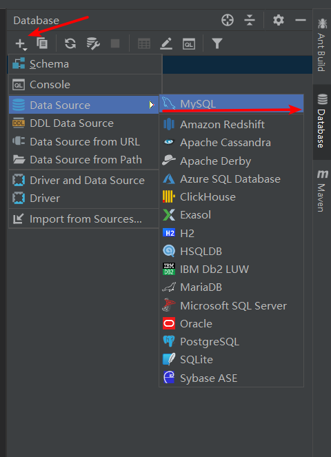


2、登录验证

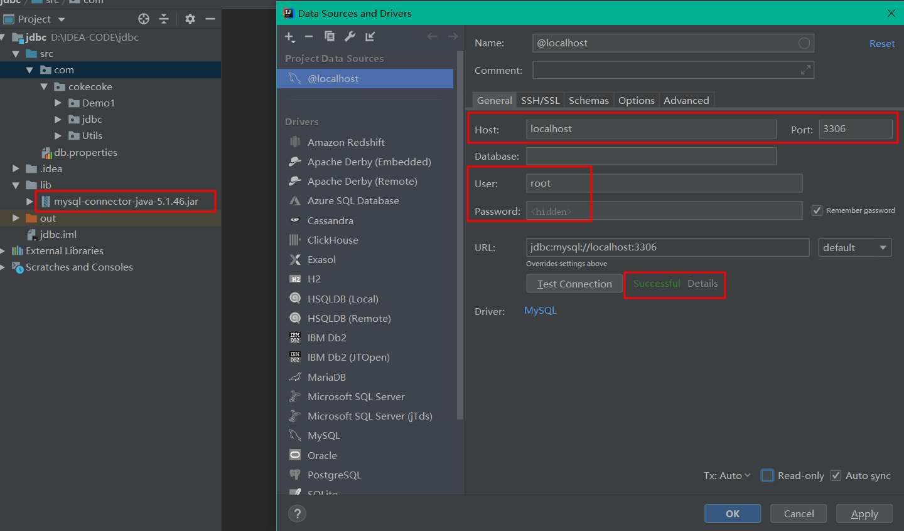


3、选择数据库

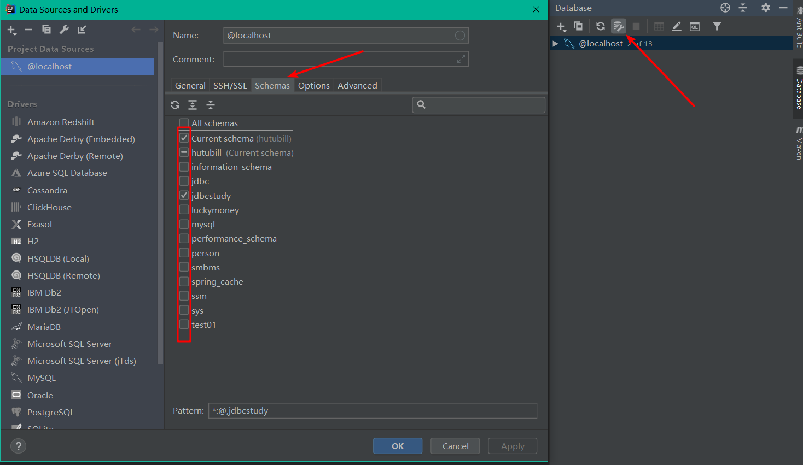


更新数据，双击数据表，修改内容后，点击DB**提交**

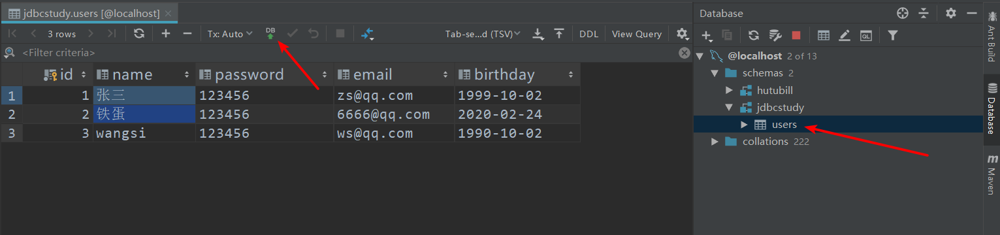


打开编写sql窗口

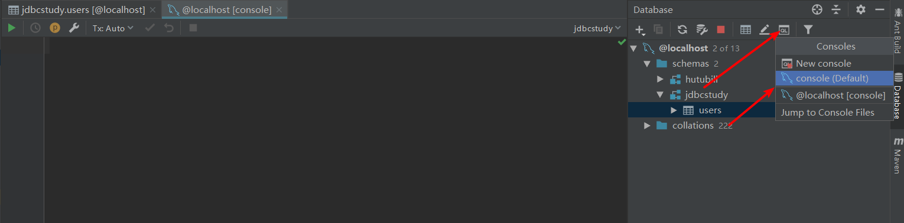


连接失败，查看原因

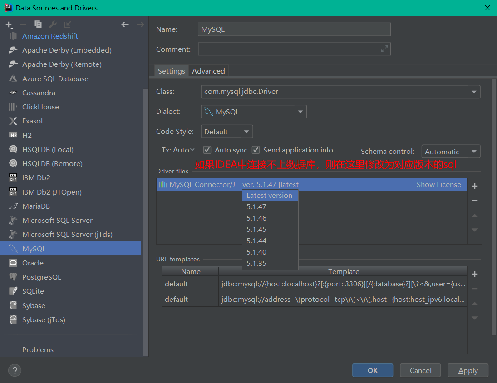


### 9.7、事务

要么都成功，要么都失败

> ACID原则

原子性：要么都完成，要么都不完成

一致性：总数不变

隔离性：多个进程互不干扰

持久性：一旦提交不可逆，持久化到数据库了


隔离性的问题：

脏读：一个事务读取了另一个没有提交的事务

不可重复读：在同一个事务内，重复读去表中的数据，表数据发生了改变

虚读（幻读）：在一个事务内，读取到了被人插入的数据，导致前后读出来的结果不一致


> 代码实现

1、开启事务`conn.setAutoCommit(false);`

2、一组业务执行完毕，提交事务

3、可以在catch语句中显示自定义回滚语句，但默认失败就会回滚

```java
public class TestTransaction2 {
    public static void main(String[] args) {
        Connection conn = null;
        PreparedStatement st = null;

        try {
            conn = JdbcUtils.getConnection();
            //关闭数据库的自动提交，自动会开启事务
            conn.setAutoCommit(false);

            String sql1 = "update account set money=money-500 where name='A';";
            st = conn.prepareStatement(sql1);
            st.executeUpdate();

            int x = 1/0;//报错

            String sql2 = "update account set money=money+500 where name='B';";
            st = conn.prepareStatement(sql2);
            st.executeUpdate();

            //提交事务
            conn.commit();
            System.out.println("执行成功！");

        } catch (SQLException e) {
            //如果失败，则默认回滚
            try {
                conn.rollback();//事务回滚
            } catch (SQLException e1) {
                e1.printStackTrace();
            }
            e.printStackTrace();
        }finally {
            JdbcUtils.release(conn,st,null);
        }
    }
}
```


### 9.8、数据库连接池

数据库连接->执行完毕->释放

连接->释放  十分浪费资源 

池化技术：准备一些预先的资源，过来就连接准备好的；

常用连接数：10个

最小连接数：10个

最小连接数：100 业务最高承载上限

等待超时：100ms

编写连接池，实现一个接口 DateSoutce


> 开源数据源实现

DBCP

C3P0

Druid：阿里巴巴


使用了这些数据连接池之后，我们在项目开发中就不需要编写连接数据库的代码了！


> DBCP

需要用到的jar包

commons-dbcp-1.4.jar、commons-pool-1.5.6.jar


> C3P0

c3p0-0.9.5.2.jar、mchange-commons-java-0.2.12.jar


> 结论

无论使用什么数据源，本质还是一样，DateSource接口不会变，方法就不会变


