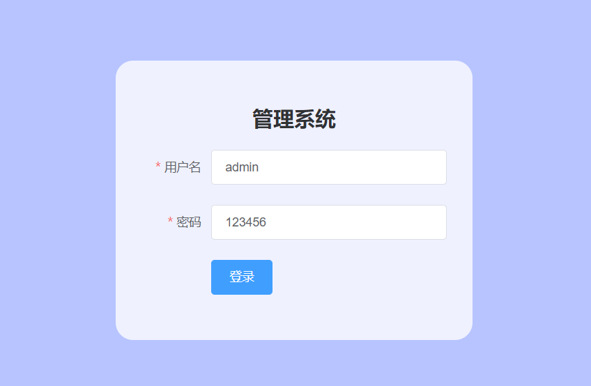

# Vue 入门

## 判断-循环

```html
<div id="app">
    <h1 v-if="type==='A'">A</h1>
    <h1 v-else-if="type==='B'">B</h1>
    <h1 v-else="type==='C'">C</h1>
</div>
<script src="https://cdn.jsdelivr.net/npm/vue/dist/vue.js"></script>
<script>
    const app = new Vue({
        el:'#app',
        data:{
            type: 'A'
        }
    }
                        })
</script>
```


```html
<div id="app">
    <li v-for="item in items">
        {{item.message}}
    </li>
</div>
<script src="https://cdn.jsdelivr.net/npm/vue/dist/vue.js"></script>
<script>
    const app = new Vue({
        el:'#app',
        data:{
            items: [
                {message: 'haha'},
                {message: 'lala'}
            ]
        }
    })
</script>
```


## 绑定事件

```html
 <div id="app">
     <button v-on:click="sayhi">click Me</button>
</div>
<script src="https://cdn.jsdelivr.net/npm/vue/dist/vue.js"></script>
<script>
    const app = new Vue({
        el:'#app',
        methods: {
            sayhi: function () {
                alert(this.message)
            }
        }
    })
</script>
```


## 双向绑定

```html
<div id="app">
    请输入：<input type="text" v-model="message">{{message}}
</div>
<script src="https://cdn.jsdelivr.net/npm/vue/dist/vue.js"></script>
<script>
    const app = new Vue({
        el:'#app',
        data:{
            message: "111"
        },
        methods: {
            sayhi: function () {
                alert(this.message)
            }
        }
    })
</script>
```

## 下拉框

```html
<div id="app">
    下拉框：
    <select v-model="selected">
        <option value="" disabled>请选择</option>
        <option>A</option>
        <option>B</option>
        <option>C</option>
    </select>
    <p>
        value：{{selected}}
    </p>
</div>
<script src="https://cdn.jsdelivr.net/npm/vue/dist/vue.js"></script>
<script>
    const app = new Vue({
        el: '#app',
        data: {
            selected: ''
        }
    });
</script>
```


## 组件

```html
 <div id="app">

     <jian v-for="item in items" v-bind:info="item"></jian>

</div>
<script src="https://cdn.jsdelivr.net/npm/vue/dist/vue.js"></script>
<script>

    Vue.component("jian",{
        props: ['info'],
        template: '<li>{{info}}</li>'
    });

    const app = new Vue({
        el: '#app',
        data: {
            items: ["java","Linux","AI"]
        }
    });
</script>
```

## Axios异步通信

```html
 <div id="app">
     <div>{{info.name}}</div>
     <div>{{info.url}}</div>
     <div>{{info.address.street}}</div>
     <div>{{info.address.city}}</div>
     <div>{{info.address.country}}</div>

     <a v-bind:href="info.url">跳转</a>
</div>
<script src="https://cdn.jsdelivr.net/npm/vue/dist/vue.js"></script>
<script src="https://unpkg.com/axios/dist/axios.min.js"></script>
<script>
    const app = new Vue({
        el: '#app',
        data(){
            return{
                //请求的返回参数合适，必须和json字符串一样
                info:{
                    name: null,
                    url: null,
                    address: {
                        street: null,
                        city: null,
                        country: null
                    }
                }
            }
        },
        mounted(){
            axios.get('data.json').then(response=>(this.info=response.data))
        }
    });
</script>
```

## 计算属性

```html
<div id="app">
    <div>currentTime1:{{currentTime1()}}</div>
    <div>currentTime2:{{currentTime2}}</div>

</div>
<script src="https://cdn.jsdelivr.net/npm/vue/dist/vue.js"></script>
<script>

    const app = new Vue({
        el: '#app',
        data: {
            message: "hello"
        },
        methods: {
            currentTime1: function () {
                return Date.now();//返回一个时间戳
            }
        },
        computed: { // 计算属性
            currentTime2: function () {
                this.message;
                return Date.now();// 返回一个时间戳
            }
        }
    });
</script>
```

```html
app.currentTime1()
1586003682355
app.currentTime1()
1586003684521
app.currentTime1()
1586003685383
app.currentTime1()
1586003686149
app.currentTime2
1586003654456
app.currentTime2
1586003654456
app.currentTime2
1586003654456
app.currentTime2
```

## 插槽slot

```html
<div id = "app">
        <todo>
            <todo-title slot="todo-title" v-bind:title="title"></todo-title>
            <todo-items slot="todo-items" v-for="item in todoItems" v-bind:item="item"></todo-items>
        </todo>
</div>
<script crossorigin="anonymous" integrity="sha384-9d6EoIG8j0F+9F5p67DNMlqMAD7yIgbW+snoBoe3B7bP/Q/rUBECFlPKV0WBTMui" src="https://lib.baomitu.com/vue/2.6.10/vue.common.dev.js"></script>
<script>

    //slot
    Vue.component("todo",{
        template:'<div>\
                        <slot name="todo-title"></slot>\
                        <ul>\
                            <slot name="todo-items"></slot>\
                        </ul>\
                    </div>'
    });
    Vue.component("todo-title",{
        props: ['title'],
        template:'<div>{{title}}</div>'
    });
    Vue.component("todo-items",{
        props: ['item'],
        template:'<li>{{item}}</li>'
    });

    const app = new Vue({
        el:'#app',
        data: {
            title: "标题",
            todoItems: ['haha','lala','gaga']
        }

    });
</script>
```

## 自定义事件

```html
<div id = "app">
        <todo>
            <todo-title slot="todo-title" v-bind:title="title"></todo-title>
            <todo-items slot="todo-items" v-for="(item,index) in todoItems"
                        v-bind:item="item" v-bind:index="index" v-on:remove="removeItems(index)"></todo-items>
        </todo>
</div>
<script crossorigin="anonymous" integrity="sha384-9d6EoIG8j0F+9F5p67DNMlqMAD7yIgbW+snoBoe3B7bP/Q/rUBECFlPKV0WBTMui" src="https://lib.baomitu.com/vue/2.6.10/vue.common.dev.js"></script>
<script>

    //slot
    Vue.component("todo",{
        template:'<div>\
                        <slot name="todo-title"></slot>\
                        <ul>\
                            <slot name="todo-items"></slot>\
                        </ul>\
                    </div>'
    });
    Vue.component("todo-title",{
        props: ['title'],
        template:'<div>{{title}}</div>'
    });
    Vue.component("todo-items",{
        props: ['item','index'],
        template:'<li>{{index}}--{{item}} <button v-on:click="remove">删除</button></li>',
        methods:{
            remove:function (index) {
                this.$emit('remove',index);
            }
        }
    });

    const app = new Vue({
        el:'#app',
        data: {
            title: "标题",
            todoItems: ['haha','lala','gaga']
        },
        methods:{
            removeItems:function (index) {
                console.log("删除了"+this.todoItems[index]+"oK");
                this.todoItems.splice(index,1);//一次删除一个元素
            }
        }

    });
</script>
```

## 小结：

核心：数据驱动，组件化

优点：借鉴AngulaJs的模块化开发 和 React 的虚拟Dom，虚拟Dom就是把Dom操作放到内存中执行

常用属性：

- v-if
- v-else-if
- v-else
- v-for
- v-on 绑定事件，简写@
- v-model 数据双向绑定
- v-bind 给组件绑定参数，简写 `:`

组件化：

- 组合组件slot插槽
- 组件内部绑定事件需要使用大搜 `this.$emit('事件名'，参数)`
- 计算属性的特色，缓存计算数据

​	遵循soC 关注度分离原则，Vue是纯粹的视图框架，并不包含，比如Ajax之类的通信功能，为了解决通信问题，我们需要使用Axios框架做异步通信；

说明：

​	Vue的开发都是基于NodeJS，实际开发采用vue-cli脚手架开发，vue-router路由，vuex做状态管理；Vue UI，界面我们一般使用ElementUI(饿了么出品)，或者ICE(阿里巴巴出品)来快速搭建前端项目；


# Vue 进阶

## 创建工程

注意：命令行都要使用管理员模式运行

1、创建一个名为hello-vue的工程  ==vue init webpack hello-vue==


2、安装依赖，我们需要安装vue-router、element-ui、sass-loader和node-sass四个插件

```c++
# 进入工程目录
cd hello-vue
# 安装 vue-router
npm install vue-router --save-dev
#安装 element-ui
npm i element-ui -S  
# 安装依赖
npm install
# 安装 SASS 加载器
cnpm install sass-loader node-sass --save-dev
# 启动测试
npm run dev
```

3、Npm命令解释：

- ==npm install moduleName==:安装模块到项目目录下
- ==npm config -g moduleName==: -g 的意思是将模块安装到全局，具体安装到磁盘的那个位置，要看npm config perfix 的位置
- ==npm install -save moduleName==: --save 的意思是将模块安装到项目目录下，并在package文件的dependecies 节点写入依赖，-S为该命令的缩写
- ==npm install -save-dev moduleName==: --save-dev 的意思是将模块安装到项目目录下，并在package的文件的devDependencies 节点写入依赖，-D为该命令的缩写

## 创建登录页面

把没有用的东西删掉

在源码目录中创建如下结构：

- assets：用于存放资源文件
- components：用于存放Vue功能组件
- views：用于存放Vue视图组件
- router：用于存放vue-router配置


创建首页视图，在views目录下创建一个名为Main.vue 的视图组件

```vue
<template>
  <el-container style="height: 500px; border: 1px solid #eee">
    <el-aside width="200px" style="background-color: rgb(238, 241, 246)">
      <el-menu :default-openeds="['1', '3']">
        <el-submenu index="1">
          <template slot="title"><i class="el-icon-message"></i>用户管理</template>
          <el-menu-item-group>
            <el-menu-item index="1-1">
              <!-- v-bind  name:对象  params:传递参数-->
              <router-link :to="{name: 'UserProfile',params: {id: 1}}">个人信息</router-link>
            </el-menu-item>
            <el-menu-item index="1-2">
              <router-link to="/user/list">用户列表</router-link>
            </el-menu-item>
          </el-menu-item-group>
        </el-submenu>
        <el-submenu index="2">
          <template slot="title"><i class="el-icon-menu"></i>内容管理</template>
          <el-menu-item-group>
            <el-menu-item index="2-1">分类管理</el-menu-item>
            <el-menu-item index="2-2">内容列表</el-menu-item>
          </el-menu-item-group>
        </el-submenu>
        <el-submenu index="3">
          <template slot="title"><i class="el-icon-setting"></i>导航三</template>
          <el-menu-item-group>
            <el-menu-item index="3-1">
              <router-link to="/goHome">首页</router-link>
            </el-menu-item>
            <el-menu-item index="3-2">选项2</el-menu-item>
          </el-menu-item-group>
        </el-submenu>
      </el-menu>
    </el-aside>

    <el-container>
      <el-header style="text-align: right; font-size: 12px">
        <el-dropdown>
          <i class="el-icon-setting" style="margin-right: 15px"></i>
          <el-dropdown-menu slot="dropdown">
            <el-dropdown-item>个人信息</el-dropdown-item>
            <el-dropdown-item>退出登录</el-dropdown-item>
          </el-dropdown-menu>
        </el-dropdown>
        <span>{{name}}</span>
      </el-header>

      <el-main>
        <router-view/>
      </el-main>
    </el-container>
  </el-container>
</template>

<script>
  export default {
    props:['name'],
    name: "Main"
  };
</script>

<style>
  .el-header {
    background-color: #89a1d1;
    color: #333;
    line-height: 60px;
  }

  .el-aside {
    color: #333;
  }
</style>
```

创建登录页视图在views目录下创建一个名为Login.vue的视图组件，其中el-* 的元素为ElementUI

```vue
<template>
  <div class="login-container">
    <el-form ref="form" :rules="rules" :model="form" label-width="80px" class="login-form">
      <h2 class="login-title">管理系统</h2>
      <el-form-item label="用户名" prop="username">
        <el-input v-model="form.username"></el-input>
      </el-form-item>
      <el-form-item label="密码" prop="password">
        <el-input v-model="form.password"></el-input>
      </el-form-item>

      <el-form-item>
        <el-button type="primary" @click="submitForm('form')">登录</el-button>
      </el-form-item>
    </el-form>
  </div>
</template>
<script>
  export default {
    name: 'Login',
    data() {
      return {
        form: {
          username: "admin",
          password: "123456"
        },
        rules: {
          username: [
            {required: true, message: "用户名不能为空", trigger: 'blur'},
            {min: 3, max: 10, message: "用户名3-5位", trigger: 'blur'}
          ],
          password: [
            {required: true, message: "密码不能为空", trigger: 'blur'},
            {min: 3, max: 10, message: "密码3-5位", trigger: 'blur'}
          ]
        }
      };
    },
    methods: {
      submitForm(formName) {
        this.$refs[formName].validate(valid => {
          // console.log(valid) 验证通过为true，有一个不通过就是false
          if (valid) {
            // 通过的逻辑
            this.$router.push("/main")
          } else {
            console.log('验证失败');
            return false;
          }
        });
      }
    }
  };
</script>

<style acoped>
  .login-form {
    width: 350px;
    margin: 160px auto; /* 上下间距160px，左右自动居中*/
    background-color: rgba(137, 161, 209, 0.8); /* 透明背景色 */
    padding: 30px;
    border-radius: 20px; /* 圆角 */
  }

  /* 背景 */
  .login-container {
    position: absolute;
    width: 100%;
    height: 100%;
    background-color: #dccaff;
    //background: url();
  }

  /* 标题 */
  .login-title {
    color: #303133;
    text-align: center;
  }
</style> -->
```

创建路由，在router目录下创建一个名为index.js的vue-router路由配置文件

```javascript
import Vue from 'vue'
import Router from 'vue-router'

import Main from '../views/Main'
import Login from '../views/Login'
import UserList from '../views/user/List'
import UserProfile from '../views/user/Profile'
import NotFound from '../views/NotFound'

Vue.use(Router);
export default new Router({
  mode: 'history',
  routes:[
    {
        //首页
      path:'/main',
      component: Main,
      props:true,
    },
    {
        //登录页
      path:'/login',
      component: Login
    },
    {
      path:'/goHome',
      redirect: '/main/a'
    },
    {
      path:'*',
      component: NotFound
    }

  ]
})
```

访问：http://localhost:8080/login





## 路由嵌套

​	嵌套又称子油路由，在实际应用中，通常多层嵌套的组件组合而成。同样的，URL中各段动态路径也按某种结构对用嵌套的各层组件：

1、用户信息组件，在views/user目录下创建名为Profile.vue的视图组件：

```js
import Vue from 'vue'
import Router from 'vue-router'

import Main from '../views/Main'
import Login from '../views/Login'
import UserList from '../views/user/List'
import UserProfile from '../views/user/Profile'
import NotFound from '../views/NotFound'

Vue.use(Router);
export default new Router({
  mode: 'history',
  routes:[
    {
      path:'/main',
      component: Main,
      props:true,
      //子路由
      children: [
        {path:'/user/list',component: UserList},
        {path:'/user/profile/',component: UserProfile}
      ]
    },
    {
      path:'/login',
      component: Login
    },
    {
      path:'/goHome',
      redirect: '/main'
    },
    {
      path:'*',
      component: NotFound
    }

  ]
})
```

## 参数传递

1、页面传递参数

```vue
<el-menu-item index="1-1">
              <!-- v-bind  name:对象  params:传递参数-->
              <router-link :to="{name: 'UserProfile',params: {id: 1}}">个人信息</router-link>
</el-menu-item>
```

2、登录判断成功携带用户参数

```js
methods: {
      submitForm(formName) {
        this.$refs[formName].validate(valid => {
          // console.log(valid) 验证通过为true，有一个不通过就是false
          if (valid) {
            // 通过的逻辑
            this.$router.push("/main/"+this.form.username)//携带用户登录名
          } else {
            console.log('验证失败');
            return false;
          }
        });
      }
    }
```

3、路由绑定参数

```js
routes:[
    {
      path:'/main/:name',
      component: Main,
      props:true,
      //子路由
      children: [
        {path:'/user/list',component: UserList},
        {path:'/user/profile/:id',name:'UserProfile',component: UserProfile,props: true}
      ]
    },
```

6、前端取出参数Mian.vue

```vue
<script>
  export default {
    props:['name'],
    name: "Main"
  };
</script>


<span>{{name}}</span>
```


5、重定向页面

```vue
{
      path:'/goHome',
      redirect: '/main'
    }
```


## 路由钩子

路由模式有两种

- hash：路径带 # 符号，如：http://localhost:8080/#/login
- history：路径不带 # 符号，如：http://localhost:8080/login

修改路由配置，代码入下;

```js
export default new Router({
  mode: 'history',
  routes:[
    ]
)};
```

处理404 创建一个名为`NotFound.vue` 的视图组件，代码如下：

```vue
<template>
    <h1>你找的页面走丢了</h1>
</template>

<script>
    export default {
        name: "NotFound"
    }
</script>

<style scoped>

</style>

```

添加路由配置

```js
import NotFound from '../views/NotFound'

{
      path:'*',
      component: NotFound
    }
```


## 路由与异步请求

beforeRouteEnter ：在进入路由前执行
beforeRouteLeave ： 在离开路由前执行

代码：

```js
export default {
      props:['id'],
      name: "UserProfile",
      //路由钩子
      beforeRouteEnter:(to,from,next)=>{ // 之前
          console.log("进入路由之前");
          next(vm => {
            vm.getData();//进入路由之前执行方法
          });
      },
      beforeRouteLeave:(to,from,next)=>{ // 之后
        console.log("进入路由之后");
        next();
      }
    }
```

参数说明：

- to：路由将要跳转的路径信息
- from：路径跳转前的路径信息
- next：路由的控机参数
  - next() 跳入下一个页面
  - next(‘/paht’) 改变路由的跳转方法，将其跳转大搜另一个路由
  - next(false)返回原来的页面
  - next( ( vm=>{} ) )仅在`beforeRouteEnter`中可用，vm是组件实例

**在钩子函数中使用异步请求**

1、安装Axios 

```shell
#安装
cnpm install axios -s
cnpm install --save vue-axios
```


2、main.js 引用Axios

```js
import axios from 'axios';
import VueAxios from 'vue-axios';

Vue.use(VueAxios, axios);
```

3、准备数据：自有我们的static目录下的文件是可以被访问到的，所以我们把静态文件放入改目录下。

```json
//静态数据存放位置
static/mock/data.json

{
  "name": "haha",
  "url": "http://www.cokecoke.top",
  "page": 1,
  "isNonProfit": true,
  "address": {
    "street": "上海",
    "city": "浦东新区",
    "country": "中国"
  }
}
```

4、在beforeRouteEnter 中进行异步请求

```js
export default {
      props:['id'],
      name: "UserProfile",
      //路由钩子
      beforeRouteEnter:(to,from,next)=>{ // 之前
          console.log("进入路由之前");
          next(vm => {
            vm.getData();//进入路由之前执行方法
          });
      },
      beforeRouteLeave:(to,from,next)=>{ // 之后
        console.log("进入路由之后");
        next();
      },
      methods:{
        getData:function () {
          this.axios({
            method:'get',
            url: 'http://localhost:8080/static/mock/data.json'
          }).then(function (response) {
            console.log(response)
          })
        }
      }
    }
```


