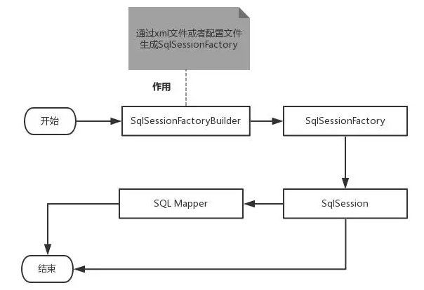
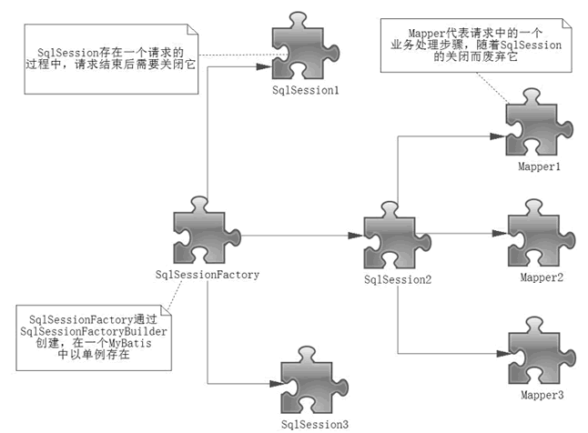

# 1、Mybatis简介


## 1.1、什么是MyBatis

- MyBatis 是一款优秀的**持久层框架**
- MyBatis 避免了几乎所有的 JDBC 代码和手动设置参数以及获取结果集的过程
- MyBatis 可以使用简单的 XML 或注解来配置和映射原生信息，将接口和 Java 的 实体类 【Plain Old Java Objects,普通的 Java对象】映射成数据库中的记录。
- MyBatis 本是apache的一个开源项目ibatis, 2010年这个项目由apache 迁移到了google code，并且改名为MyBatis 。
- 2013年11月迁移到**Github** .
- Mybatis官方文档 : http://www.mybatis.org/mybatis-3/zh/index.html
- GitHub : https://github.com/mybatis/mybatis-3


## 1.2、持久化

- **持久化是将程序数据在持久状态和瞬时状态间转换的机制。**
  - 即把数据（如内存中的对象）保存到可永久保存的存储设备中（如磁盘）。持久化的主要应用是将内存中的对象存储在数据库中，或者存储在磁盘文件中、XML数据文件中等等。
  - JDBC就是一种持久化机制。文件IO也是一种持久化机制。
  - 在生活中 : 将鲜肉冷藏，吃的时候再解冻的方法也是。将水果做成罐头的方法也是。
- **为什么需要持久化服务呢？那是由于内存本身的缺陷引起的**
  - 内存断电后数据会丢失，但有一些对象是无论如何都不能丢失的，比如银行账号等，遗憾的是，人们还无法保证内存永不掉电。
  - 内存过于昂贵，与硬盘、光盘等外存相比，内存的价格要高2~3个数量级，而且维持成本也高，至少需要一直供电吧。所以即使对象不需要永久保存，也会因为内存的容量限制不能一直呆在内存中，需要持久化来缓存到外存。


## 1.3、持久层

- 什么是持久层？

  - 完成持久化工作的代码块 . ----> dao层 【DAO (Data Access Object) 数据访问对象】

  - 大多数情况下特别是企业级应用，数据持久化往往也就意味着将内存中的数据保存到磁盘上加以固化，而持久化的实现过程则大多通过各种**关系数据库**来完成。

  - 不过这里有一个字需要特别强调，也就是所谓的“层”。对于应用系统而言，数据持久功能大多是必不可少的组成部分。也就是说，我们的系统中，已经天然的具备了“持久层”概念？也许是，但也许实际情况并非如此。之所以要独立出一个“持久层”的概念,而不是“持久模块”，“持久单元”，也就意味着，我们的系统架构中，应该有一个相对独立的逻辑层面，专著于数据持久化逻辑的实现.

  - 与系统其他部分相对而言，这个层面应该具有一个较为清晰和严格的逻辑边界。 【说白了就是用来操作数据库存在的！】

    

## 1.4、为什么需要Mybatis

- Mybatis就是帮助程序猿将数据存入数据库中 , 和从数据库中取数据 .
- 传统的jdbc操作 , 有很多重复代码块 .比如 : 数据取出时的封装 , 数据库的建立连接等等... , 通过框架可以减少重复代码,提高开发效率 .
- MyBatis 是一个半自动化的**ORM框架 (Object Relationship Mapping) -->对象关系映射**
- 所有的事情，不用Mybatis依旧可以做到，只是用了它，所有实现会更加简单！**技术没有高低之分，只有使用这个技术的人有高低之别**
- MyBatis的优点
  - 简单易学：本身就很小且简单。没有任何第三方依赖，最简单安装只要两个jar文件+配置几个sql映射文件就可以了，易于学习，易于使用，通过文档和源代码，可以比较完全的掌握它的设计思路和实现。
  - 灵活：mybatis不会对应用程序或者数据库的现有设计强加任何影响。 sql写在xml里，便于统一管理和优化。通过sql语句可以满足操作数据库的所有需求。
  - 解除sql与程序代码的耦合：通过提供DAO层，将业务逻辑和数据访问逻辑分离，使系统的设计更清晰，更易维护，更易单元测试。sql和代码的分离，提高了可维护性。
  - 提供xml标签，支持编写动态sql。
  - .......
- 最重要的一点，使用的人多！公司需要！


# 2、MyBatis：第一个程序

## 2.1、搭建实验数据库

```sql
CREATE DATABASE `mybatis`;

USE `mybatis`;

DROP TABLE IF EXISTS `user`;

CREATE TABLE `user` (
  `id` int(20) NOT NULL,
  `name` varchar(30) DEFAULT NULL,
  `pwd` varchar(30) DEFAULT NULL,
  PRIMARY KEY (`id`)
) ENGINE=InnoDB DEFAULT CHARSET=utf8;

insert  into `user`(`id`,`name`,`pwd`) values (1,'赵信','123456'),(2,'张三','abcdef'),(3,'李四','987654');
```

## 2.2、导入MyBatis相关 jar 包

- GitHub上找

```xml
<dependency>
    <groupId>org.mybatis</groupId>
    <artifactId>mybatis</artifactId>
    <version>3.5.2</version>
</dependency>
<dependency>
    <groupId>mysql</groupId>
    <artifactId>mysql-connector-java</artifactId>
    <version>5.1.47</version>
</dependency>
```

## 2.3、编写MyBatis核心配置文件

- 查看帮助文档

```xml
<?xml version="1.0" encoding="UTF-8" ?>
<!DOCTYPE configuration
        PUBLIC "-//mybatis.org//DTD Config 3.0//EN"
        "http://mybatis.org/dtd/mybatis-3-config.dtd">
<configuration>
    <environments default="development">
        <environment id="development">
            <transactionManager type="JDBC"/>
            <dataSource type="POOLED">
                <property name="driver" value="com.mysql.jdbc.Driver"/>
                <property name="url" value="jdbc:mysql://localhost:3306/mybatis?useSSL=true&amp;useUnicode=true&amp;characterEncoding=utf8"/>
                <property name="username" value="root"/>
                <property name="password" value="123456"/>
            </dataSource>
        </environment>
    </environments>
    <mappers>
        <mapper resource="com/kuang/dao/userMapper.xml"/>
    </mappers>
</configuration>
```

## 2.4、编写MyBatis工具类

- 查看帮助文档

```java
import org.apache.ibatis.io.Resources;
import org.apache.ibatis.session.SqlSession;
import org.apache.ibatis.session.SqlSessionFactory;
import org.apache.ibatis.session.SqlSessionFactoryBuilder;
import java.io.IOException;
import java.io.InputStream;

public class MybatisUtils {

    private static SqlSessionFactory sqlSessionFactory;

    static {
        try {
            String resource = "mybatis-config.xml";
            InputStream inputStream = Resources.getResourceAsStream(resource);
            sqlSessionFactory = new SqlSessionFactoryBuilder().build(inputStream);
        } catch (IOException e) {
            e.printStackTrace();
        }
    }

    //获取SqlSession连接
    public static SqlSession getSession(){
        return sqlSessionFactory.openSession();
    }

}
```

## 2.5、创建实体类

```java
@Data
@AllArgsConstructor
@NoArgsConstructor
public class User {
    
    private int id;  //id
    private String name;   //姓名
    private String pwd;   //密码
    
}
```

## 2.6、编写Mapper接口类

```java
import com.kuang.pojo.User;
import java.util.List;

public interface UserMapper {
    List<User> selectUser();
}
```

## 2.7、编写Mapper.xml配置文件

- namespace 十分重要，不能写错！

```xml
<?xml version="1.0" encoding="UTF-8" ?>
<!DOCTYPE mapper
        PUBLIC "-//mybatis.org//DTD Mapper 3.0//EN"
        "http://mybatis.org/dtd/mybatis-3-mapper.dtd">
<mapper namespace="com.kuang.dao.UserMapper">
  <select id="selectUser" resultType="com.kuang.pojo.User">
    select * from user
  </select>
</mapper>
```

## 2.8、编写测试类

- Junit 包测试

```java
public class MyTest {
    @Test
    public void selectUser() {
        SqlSession session = MybatisUtils.getSession();
        //方法一:
        //List<User> users = 			session.selectList("com.kuang.mapper.UserMapper.selectUser");
        //方法二:
        UserMapper mapper = session.getMapper(UserMapper.class);
        List<User> users = mapper.selectUser();

        for (User user: users){
            System.out.println(user);
        }
        session.close();
    }
}
```

## 问题说明

可能出现问题说明：Maven静态资源过滤问题**

```xml
<resources>
    <resource>
        <directory>src/main/java</directory>
        <includes>
            <include>**/*.properties</include>
            <include>**/*.xml</include>
        </includes>
        <filtering>false</filtering>
    </resource>
    <resource>
        <directory>src/main/resources</directory>
        <includes>
            <include>**/*.properties</include>
            <include>**/*.xml</include>
        </includes>
        <filtering>false</filtering>
    </resource>
</resources>
```

# 3、配置解析

## 3.1、核心配置文件

- mybatis-config.xml 系统核心配置文件
- MyBatis 的配置文件包含了会深深影响 MyBatis 行为的设置和属性信息。
- 能配置的内容如下：

```xml
configuration（配置）
    properties（属性）
    settings（设置）
    typeAliases（类型别名）
    typeHandlers（类型处理器）
    objectFactory（对象工厂）
    plugins（插件）
    environments（环境配置）
        environment（环境变量）
            transactionManager（事务管理器）
            dataSource（数据源）
    databaseIdProvider（数据库厂商标识）
    mappers（映射器）
<!-- 注意元素节点的顺序！顺序不对会报错 -->
```

我们可以阅读 mybatis-config.xml 上面的dtd的头文件！

## 3.2、environments元素

```xml
<environments default="development">
  <environment id="development">
    <transactionManager type="JDBC">
      <property name="..." value="..."/>
    </transactionManager>
    <dataSource type="POOLED">
      <property name="driver" value="${driver}"/>
      <property name="url" value="${url}"/>
      <property name="username" value="${username}"/>
      <property name="password" value="${password}"/>
    </dataSource>
  </environment>
</environments>
```

- 配置MyBatis的多套运行环境，将SQL映射到多个不同的数据库上，必须指定其中一个为默认运行环境（通过default指定）

- 子元素节点：**environment**

  - 具体的一套环境，通过设置id进行区别，id保证唯一！

  - 子元素节点：transactionManager - [ 事务管理器 ]

    ```xml
    <!-- 语法 -->
    <transactionManager type="[ JDBC | MANAGED ]"/>
    ```

    - 详情：[点击查看官方文档](http://www.mybatis.org/mybatis-3/zh/configuration.html#environments)
    - 这两种事务管理器类型都不需要设置任何属性。

  - 子元素节点：**数据源（dataSource）**

    - dataSource 元素使用标准的 JDBC 数据源接口来配置 JDBC 连接对象的资源。

    - 数据源是必须配置的。

    - **有三种内建的数据源类型**

      ```java
      type="[UNPOOLED|POOLED|JNDI]"）
      ```

    - unpooled： 这个数据源的实现只是每次被请求时打开和关闭连接。

    - **pooled**： 这种数据源的实现利用“池”的概念将 JDBC 连接对象组织起来 , 这是一种使得并发 Web 应用快速响应请求的流行处理方式。

    - jndi：这个数据源的实现是为了能在如 Spring 或应用服务器这类容器中使用，容器可以集中或在外部配置数据源，然后放置一个 JNDI 上下文的引用。

    - 数据源也有很多第三方的实现，比如dbcp，c3p0，druid等等....

## 3.3、mappers元素

**mappers**

- 映射器 : 定义映射SQL语句文件
- 既然 MyBatis 的行为其他元素已经配置完了，我们现在就要定义 SQL 映射语句了。但是首先我们需要告诉 MyBatis 到哪里去找到这些语句。 Java 在自动查找这方面没有提供一个很好的方法，所以最佳的方式是告诉 MyBatis 到哪里去找映射文件。你可以使用相对于类路径的资源引用， 或完全限定资源定位符（包括 `file:///` 的 URL），或类名和包名等。映射器是MyBatis中最核心的组件之一，在MyBatis 3之前，只支持xml映射器，即：所有的SQL语句都必须在xml文件中配置。而从MyBatis 3开始，还支持接口映射器，这种映射器方式允许以Java代码的方式注解定义SQL语句，非常简洁。

**引入资源方式**

```xml
<!-- 使用相对于类路径的资源引用 -->
<mappers>
  <mapper resource="org/mybatis/builder/PostMapper.xml"/>
</mappers>
<!-- 使用完全限定资源定位符（URL） -->
<mappers>
  <mapper url="file:///var/mappers/AuthorMapper.xml"/>
</mappers>
<!-- 
使用映射器接口实现类的完全限定类名
需要配置文件名称和接口名称一致，并且位于同一目录下
-->
<mappers>
  <mapper class="org.mybatis.builder.AuthorMapper"/>
</mappers>
<!-- 
将包内的映射器接口实现全部注册为映射器
但是需要配置文件名称和接口名称一致，并且位于同一目录下
-->
<mappers>
  <package name="org.mybatis.builder"/>
</mappers>
```

**Mapper文件**

```xml
<?xml version="1.0" encoding="UTF-8" ?>
<!DOCTYPE mapper
        PUBLIC "-//mybatis.org//DTD Mapper 3.0//EN"
        "http://mybatis.org/dtd/mybatis-3-mapper.dtd">
<mapper namespace="com.kuang.mapper.UserMapper">
    
</mapper>
```

- namespace中文意思：命名空间，作用如下：
  1. namespace和子元素的id联合保证唯一 , 区别不同的mapper
  2. 绑定DAO接口
     - namespace的命名必须跟某个接口同名
     - 接口中的方法与映射文件中sql语句id应该一一对应
  3. namespace命名规则 : 包名+类名

MyBatis 的真正强大在于它的映射语句，这是它的魔力所在。由于它的异常强大，映射器的 XML 文件就显得相对简单。如果拿它跟具有相同功能的 JDBC 代码进行对比，你会立即发现省掉了将近 95% 的代码。MyBatis 为聚焦于 SQL 而构建，以尽可能地为你减少麻烦。

## 3.4、Properties优化

数据库这些属性都是可外部配置且可动态替换的，既可以在典型的 Java 属性文件中配置，亦可通过 properties 元素的子元素来传递。[具体的官方文档](http://www.mybatis.org/mybatis-3/zh/configuration.html#properties)

我们来优化我们的配置文件

第一步 ; 在资源目录下新建一个db.properties

```properties
driver=com.mysql.jdbc.Driver
url=jdbc:mysql://localhost:3306/mybatis?useSSL=true&useUnicode=true&characterEncoding=utf8
username=root
password=123456
```

第二步 : 将文件导入properties 配置文件

```xml
<configuration>
    <!--导入properties文件-->
    <properties resource="db.properties"/>

    <environments default="development">
        <environment id="development">
            <transactionManager type="JDBC"/>
            <dataSource type="POOLED">
                <property name="driver" value="${driver}"/>
                <property name="url" value="${url}"/>
                <property name="username" value="${username}"/>
                <property name="password" value="${password}"/>
            </dataSource>
        </environment>
    </environments>
    <mappers>
        <mapper resource="mapper/UserMapper.xml"/>
    </mappers>
</configuration>
```

更多操作，可以查看官方文档！【演示带领学习】

- 配置文件优先级问题
- 新特性：使用占位符

## 3.5、typeAliases优化

类型别名是为 Java 类型设置一个短的名字。它只和 XML 配置有关，存在的意义仅在于用来减少类完全限定名的冗余。

```xml
<!--配置别名,注意顺序-->
<typeAliases>
    <typeAlias type="com.kuang.pojo.User" alias="User"/>
</typeAliases>
```

当这样配置时，`User`可以用在任何使用`com.kuang.pojo.User`的地方。

也可以指定一个包名，MyBatis 会在包名下面搜索需要的 Java Bean，比如:

```xml
<typeAliases>
    <package name="com.kuang.pojo"/>
</typeAliases>
```

每一个在包 `com.kuang.pojo` 中的 Java Bean，在没有注解的情况下，会使用 Bean 的首字母小写的非限定类名来作为它的别名。

若有注解，则别名为其注解值。见下面的例子：

```java
@Alias("user")
public class User {
    ...
}
```

【演示】去官网查看一下Mybatis默认的一些类型别名！

## 3.6、设置

- **[设置（settings）](http://www.mybatis.org/mybatis-3/zh/configuration.html#settings)**相关 => 查看帮助文档

  - 懒加载
  - 日志实现
  - 缓存开启关闭

- 一个配置完整的 settings 元素的示例如下：

  ```xml
  <settings>
    <setting name="cacheEnabled" value="true"/>
    <setting name="lazyLoadingEnabled" value="true"/>
    <setting name="multipleResultSetsEnabled" value="true"/>
    <setting name="useColumnLabel" value="true"/>
    <setting name="useGeneratedKeys" value="false"/>
    <setting name="autoMappingBehavior" value="PARTIAL"/>
    <setting name="autoMappingUnknownColumnBehavior" value="WARNING"/>
    <setting name="defaultExecutorType" value="SIMPLE"/>
    <setting name="defaultStatementTimeout" value="25"/>
    <setting name="defaultFetchSize" value="100"/>
    <setting name="safeRowBoundsEnabled" value="false"/>
    <setting name="mapUnderscoreToCamelCase" value="false"/>
    <setting name="localCacheScope" value="SESSION"/>
    <setting name="jdbcTypeForNull" value="OTHER"/>
    <setting name="lazyLoadTriggerMethods" value="equals,clone,hashCode,toString"/>
  </settings>
  ```

## 3.7、类型处理器

[官方文档](http://www.mybatis.org/mybatis-3/zh/configuration.html#typeHandlers)

- 无论是 MyBatis 在预处理语句（PreparedStatement）中设置一个参数时，还是从结果集中取出一个值时， 都会用类型处理器将获取的值以合适的方式转换成 Java 类型。
- 你可以重写类型处理器或创建你自己的类型处理器来处理不支持的或非标准的类型。【了解即可】

## 3.8、对象工厂

[官方文档](http://www.mybatis.org/mybatis-3/zh/configuration.html#objectFactory)

- MyBatis 每次创建结果对象的新实例时，它都会使用一个对象工厂（ObjectFactory）实例来完成。
- 默认的对象工厂需要做的仅仅是实例化目标类，要么通过默认构造方法，要么在参数映射存在的时候通过有参构造方法来实例化。
- 如果想覆盖对象工厂的默认行为，则可以通过创建自己的对象工厂来实现。【了解即可】

## 3.9、生命周期和作用域

**作用域（Scope）和生命周期**

理解我们目前已经讨论过的不同作用域和生命周期类是至关重要的，因为错误的使用会导致非常严重的并发问题。

我们可以先画一个流程图，分析一下Mybatis的执行过程！



**作用域理解**

- SqlSessionFactoryBuilder 的作用在于创建 SqlSessionFactory，创建成功后，SqlSessionFactoryBuilder 就失去了作用，所以它只能存在于创建 SqlSessionFactory 的方法中，而不要让其长期存在。因此 **SqlSessionFactoryBuilder 实例的最佳作用域是方法作用域**（也就是局部方法变量）。
- SqlSessionFactory 可以被认为是一个数据库连接池，它的作用是创建 SqlSession 接口对象。因为 MyBatis 的本质就是 Java 对数据库的操作，所以 SqlSessionFactory 的生命周期存在于整个 MyBatis 的应用之中，所以一旦创建了 SqlSessionFactory，就要长期保存它，直至不再使用 MyBatis 应用，所以可以认为 SqlSessionFactory 的生命周期就等同于 MyBatis 的应用周期。
- 由于 SqlSessionFactory 是一个对数据库的连接池，所以它占据着数据库的连接资源。如果创建多个 SqlSessionFactory，那么就存在多个数据库连接池，这样不利于对数据库资源的控制，也会导致数据库连接资源被消耗光，出现系统宕机等情况，所以尽量避免发生这样的情况。
- 因此在一般的应用中我们往往希望 SqlSessionFactory 作为一个单例，让它在应用中被共享。所以说 **SqlSessionFactory 的最佳作用域是应用作用域。**
- 如果说 SqlSessionFactory 相当于数据库连接池，那么 SqlSession 就相当于一个数据库连接（Connection 对象），你可以在一个事务里面执行多条 SQL，然后通过它的 commit、rollback 等方法，提交或者回滚事务。所以它应该存活在一个业务请求中，处理完整个请求后，应该关闭这条连接，让它归还给 SqlSessionFactory，否则数据库资源就很快被耗费精光，系统就会瘫痪，所以用 try...catch...finally... 语句来保证其正确关闭。
- **所以 SqlSession 的最佳的作用域是请求或方法作用域。**




# 4、日志

## 4.1、日志工厂

- SLF4J
- LOG4J
- LOG4J2
- JDK_LOGGING
- COMMONS_LOGGING
- STDOUT_LOGGING
- NO_LOGGING

在Mybatis中具体使用哪一个日志实现，在设置中设定！

**STDOUT_LOGGING标准日志输出**

在Mybatis核心配置文件中，配置我们的日志！

```xml
<!--设置日志实现-->
    <settings>
        <setting name="logImpl" value="STDOUT_LOGGING"/>
    </settings>

```


## 4.2、log4j


- Log4j是[Apache](https://baike.baidu.com/item/Apache/8512995)的一个开源项目，通过使用Log4j，我们可以控制日志信息输送的目的地是[控制台](https://baike.baidu.com/item/控制台/2438626)、文件、[GUI](https://baike.baidu.com/item/GUI)组件
- 我们也可以控制每一条日志的输出格式;
- 通过定义每一条日志信息的级别，我们能够更加细致地控制日志的生成过程。
- 通过一个[配置文件](https://baike.baidu.com/item/配置文件/286550)来灵活地进行配置，而不需要修改应用的代码。

1. 导入log4j的包

```java
<!-- https://mvnrepository.com/artifact/log4j/log4j -->
<dependency>
    <groupId>log4j</groupId>
    <artifactId>log4j</artifactId>
    <version>1.2.17</version>
</dependency>

```

​	2.log4j.properties

```properties
#将等级为DEBUG的日志信息输出到console和file这两个目的地

### 设置###
log4j.rootLogger = debug,console,file

### 输出信息到控制抬 ###
log4j.appender.console = org.apache.log4j.ConsoleAppender
log4j.appender.console.Target = System.out
log4j.appender.console.Threshold=debug
log4j.appender.console.layout = org.apache.log4j.PatternLayout
log4j.appender.console.layout.ConversionPattern = [%-5p] %d{yyyy-MM-dd HH:mm:ss,SSS} method:%l%n%m%n

### 输出DEBUG 级别以上的日志到=E://logs/error.log ###
log4j.appender.D = org.apache.log4j.DailyRollingFileAppender
log4j.appender.D.File =./logs/log.log
log4j.appender.D.Append = true
log4j.appender.D.Threshold = DEBUG
log4j.appender.D.layout = org.apache.log4j.PatternLayout
log4j.appender.D.layout.ConversionPattern = %-d{yyyy-MM-dd HH:mm:ss}  [ %t:%r ] - [ %p ]  %m%n

### 日志输出级别 ###
log4j.logger.org.mybatis=debug
log4j.logger.java.sql=debug
log4j.logger.java.sql.Statement=debug
log4j.logger.java.sql.ResultSet=debug
log4j.logger.java.sql.PreparedStatement=debug
```

**简单使用**

1. 在要使用Log4j的类中，导入包 import org.apache.log4j.Logger;

2. 日志对象，参数为当前类的class

   ```java
       static Logger logger = Logger.getLogger(UserMapperTest.class);
   ```

3. 日志级别

   ```java
   logger.info("info:进入了log4jTest");
   logger.debug("debug:进入了log4jTest");
   logger.error("error:进入了log4jTest");
   ```

   

# 5、分页

为什么需要分页？

- 减少数据的处理量

## 5.1、使用limit分页

1. 接口

```java
List<user> getUserByLimit(Map<String,Integer> map);
```

2. Mapper.xml

```sql
<select id="getUserByLimit" parameterType="map" resultMap="UserMap">
        select * from mybatis.user limit #{startIndex},#{pageSize};
    </select>
```

3. 测试

```java
@Test
    public void test1() {

        SqlSession sqlsession = MybatisUtils.getSqlsession();
        //2、执行sql
        UserMapper userMapper = sqlsession.getMapper(UserMapper.class);
        List<user> userList = userMapper.getUserList();

        for (user user : userList) {
            System.out.println(user);
        }
        sqlsession.close();
    }
```


## 5.2、RowBounds分页

1. 接口

```java
List<user> getUserLimit(Map<String,Integer> map);
```

2. Mapper.xml

```sql
<select id="getUserLimit" parameterType="map" resultMap="UserMap">
        select * from mybatis.user;
    </select>
```

3. 测试

```java
 @Test
    public void test1() {
        SqlSession sqlsession = MybatisUtils.getSqlsession();
        RowBounds rowBounds = new RowBounds(0,2);

        <!-- 通过java层代码实现分页-->
        List<user> list = sqlsession.selectList("com.cokecoke.dao.UserMapper.getUserLimit", null, rowBounds);
        for (user user : list) {
            System.out.println(user);
        }

        sqlsession.close();
    }
```


## 5.3、PageHelper分页

### 1. 引入分页插件

引入分页插件有下面2种方式，推荐使用 Maven 方式。

#### 1). 引入 Jar 包

你可以从下面的地址中下载最新版本的 jar 包

- https://oss.sonatype.org/content/repositories/releases/com/github/pagehelper/pagehelper/
- http://repo1.maven.org/maven2/com/github/pagehelper/pagehelper/

由于使用了sql 解析工具，你还需要下载 jsqlparser.jar(需要和PageHelper 依赖的版本一致) ：

- http://repo1.maven.org/maven2/com/github/jsqlparser/jsqlparser/

#### 2). 使用 Maven

在 pom.xml 中添加如下依赖：

```
<dependency>
    <groupId>com.github.pagehelper</groupId>
    <artifactId>pagehelper</artifactId>
    <version>最新版本</version>
</dependency>
```

最新版本号可以从首页查看。

### 2. 配置拦截器插件

特别注意，新版拦截器是 `com.github.pagehelper.PageInterceptor`。 `com.github.pagehelper.PageHelper` 现在是一个特殊的 `dialect` 实现类，是分页插件的默认实现类，提供了和以前相同的用法。

#### 1. 在 MyBatis 配置 xml 中配置拦截器插件

```xml
<!-- 
    plugins在配置文件中的位置必须符合要求，否则会报错，顺序如下:
    properties?, settings?, 
    typeAliases?, typeHandlers?, 
    objectFactory?,objectWrapperFactory?, 
    plugins?, 
    environments?, databaseIdProvider?, mappers?
-->
<plugins>
    <!-- com.github.pagehelper为PageHelper类所在包名 -->
    <plugin interceptor="com.github.pagehelper.PageInterceptor">
        <!-- 使用下面的方式配置参数，后面会有所有的参数介绍 -->
        <property name="param1" value="value1"/>
	</plugin>
</plugins>
```

#### 2. 在 Spring 配置文件中配置拦截器插件

使用 spring 的属性配置方式，可以使用 `plugins` 属性像下面这样配置：

```xml
<bean id="sqlSessionFactory" class="org.mybatis.spring.SqlSessionFactoryBean">
  <!-- 注意其他配置 -->
  <property name="plugins">
    <array>
      <bean class="com.github.pagehelper.PageInterceptor">
        <property name="properties">
          <!--使用下面的方式配置参数，一行配置一个 -->
          <value>
            params=value1
          </value>
        </property>
      </bean>
    </array>
  </property>
</bean>
```

#### 3. 分页插件参数介绍

分页插件提供了多个可选参数，这些参数使用时，按照上面两种配置方式中的示例配置即可。

分页插件可选参数如下：

- `dialect`：默认情况下会使用 PageHelper 方式进行分页，如果想要实现自己的分页逻辑，可以实现 `Dialect`(`com.github.pagehelper.Dialect`) 接口，然后配置该属性为实现类的全限定名称。

**下面几个参数都是针对默认 dialect 情况下的参数。使用自定义 dialect 实现时，下面的参数没有任何作用。**

1. `helperDialect`：分页插件会自动检测当前的数据库链接，自动选择合适的分页方式。 你可以配置`helperDialect`属性来指定分页插件使用哪种方言。配置时，可以使用下面的缩写值：
   `oracle`,`mysql`,`mariadb`,`sqlite`,`hsqldb`,`postgresql`,`db2`,`sqlserver`,`informix`,`h2`,`sqlserver2012`,`derby`
   **特别注意：**使用 SqlServer2012 数据库时，需要手动指定为 `sqlserver2012`，否则会使用 SqlServer2005 的方式进行分页。
   你也可以实现 `AbstractHelperDialect`，然后配置该属性为实现类的全限定名称即可使用自定义的实现方法。
2. `offsetAsPageNum`：默认值为 `false`，该参数对使用 `RowBounds` 作为分页参数时有效。 当该参数设置为 `true` 时，会将 `RowBounds` 中的 `offset` 参数当成 `pageNum` 使用，可以用页码和页面大小两个参数进行分页。
3. `rowBoundsWithCount`：默认值为`false`，该参数对使用 `RowBounds` 作为分页参数时有效。 当该参数设置为`true`时，使用 `RowBounds` 分页会进行 count 查询。
4. `pageSizeZero`：默认值为 `false`，当该参数设置为 `true` 时，如果 `pageSize=0` 或者 `RowBounds.limit = 0` 就会查询出全部的结果（相当于没有执行分页查询，但是返回结果仍然是 `Page` 类型）。
5. `reasonable`：分页合理化参数，默认值为`false`。当该参数设置为 `true` 时，`pageNum<=0` 时会查询第一页， `pageNum>pages`（超过总数时），会查询最后一页。默认`false` 时，直接根据参数进行查询。
6. `params`：为了支持`startPage(Object params)`方法，增加了该参数来配置参数映射，用于从对象中根据属性名取值， 可以配置 `pageNum,pageSize,count,pageSizeZero,reasonable`，不配置映射的用默认值， 默认值为`pageNum=pageNum;pageSize=pageSize;count=countSql;reasonable=reasonable;pageSizeZero=pageSizeZero`。
7. `supportMethodsArguments`：支持通过 Mapper 接口参数来传递分页参数，默认值`false`，分页插件会从查询方法的参数值中，自动根据上面 `params` 配置的字段中取值，查找到合适的值时就会自动分页。 使用方法可以参考测试代码中的 `com.github.pagehelper.test.basic` 包下的 `ArgumentsMapTest` 和 `ArgumentsObjTest`。
8. `autoRuntimeDialect`：默认值为 `false`。设置为 `true` 时，允许在运行时根据多数据源自动识别对应方言的分页 （不支持自动选择`sqlserver2012`，只能使用`sqlserver`），用法和注意事项参考下面的**场景五**。
9. `closeConn`：默认值为 `true`。当使用运行时动态数据源或没有设置 `helperDialect` 属性自动获取数据库类型时，会自动获取一个数据库连接， 通过该属性来设置是否关闭获取的这个连接，默认`true`关闭，设置为 `false` 后，不会关闭获取的连接，这个参数的设置要根据自己选择的数据源来决定。
10. `aggregateFunctions`(5.1.5+)：默认为所有常见数据库的聚合函数，允许手动添加聚合函数（影响行数），所有以聚合函数开头的函数，在进行 count 转换时，会套一层。其他函数和列会被替换为 count(0)，其中count列可以自己配置。

**重要提示：**

当 `offsetAsPageNum=false` 的时候，由于 `PageNum` 问题，`RowBounds`查询的时候 `reasonable` 会强制为 `false`。使用 `PageHelper.startPage` 方法不受影响。

#### 4. 如何选择配置这些参数

单独看每个参数的说明可能是一件让人不爽的事情，这里列举一些可能会用到某些参数的情况。

##### 场景一

如果你仍然在用类似ibatis式的命名空间调用方式，你也许会用到`rowBoundsWithCount`， 分页插件对`RowBounds`支持和 MyBatis 默认的方式是一致，默认情况下不会进行 count 查询，如果你想在分页查询时进行 count 查询， 以及使用更强大的 `PageInfo` 类，你需要设置该参数为 `true`。

**注：** `PageRowBounds` 想要查询总数也需要配置该属性为 `true`。

##### 场景二

如果你仍然在用类似ibatis式的命名空间调用方式，你觉得 `RowBounds` 中的两个参数 `offset,limit` 不如 `pageNum,pageSize` 容易理解， 你可以使用 `offsetAsPageNum` 参数，将该参数设置为 `true` 后，`offset`会当成 `pageNum` 使用，`limit` 和 `pageSize` 含义相同。

##### 场景三

如果觉得某个地方使用分页后，你仍然想通过控制参数查询全部的结果，你可以配置 `pageSizeZero` 为 `true`， 配置后，当 `pageSize=0` 或者 `RowBounds.limit = 0` 就会查询出全部的结果。

##### 场景四

如果你分页插件使用于类似分页查看列表式的数据，如新闻列表，软件列表， 你希望用户输入的页数不在合法范围（第一页到最后一页之外）时能够正确的响应到正确的结果页面， 那么你可以配置 `reasonable` 为 `true`，这时如果 `pageNum<=0` 会查询第一页，如果 `pageNum>总页数` 会查询最后一页。

##### 场景五

如果你在 Spring 中配置了动态数据源，并且连接不同类型的数据库，这时你可以配置 `autoRuntimeDialect` 为 `true`，这样在使用不同数据源时，会使用匹配的分页进行查询。 这种情况下，你还需要特别注意 `closeConn` 参数，由于获取数据源类型会获取一个数据库连接，所以需要通过这个参数来控制获取连接后，是否关闭该连接。 默认为 `true`，有些数据库连接关闭后就没法进行后续的数据库操作。而有些数据库连接不关闭就会很快由于连接数用完而导致数据库无响应。所以在使用该功能时，特别需要注意你使用的数据源是否需要关闭数据库连接。

当不使用动态数据源而只是自动获取 `helperDialect` 时，数据库连接只会获取一次，所以不需要担心占用的这一个连接是否会导致数据库出错，但是最好也根据数据源的特性选择是否关闭连接。

### 3. 如何在代码中使用

阅读前请注意看[重要提示](https://github.com/pagehelper/Mybatis-PageHelper/blob/master/wikis/zh/Important.md)

分页插件支持以下几种调用方式：

```java
//第一种，RowBounds方式的调用
List<User> list = sqlSession.selectList("x.y.selectIf", null, new RowBounds(0, 10));

//第二种，Mapper接口方式的调用，推荐这种使用方式。
PageHelper.startPage(1, 10);
List<User> list = userMapper.selectIf(1);

//第三种，Mapper接口方式的调用，推荐这种使用方式。
PageHelper.offsetPage(1, 10);
List<User> list = userMapper.selectIf(1);

//第四种，参数方法调用
//存在以下 Mapper 接口方法，你不需要在 xml 处理后两个参数
public interface CountryMapper {
    List<User> selectByPageNumSize(
            @Param("user") User user,
            @Param("pageNum") int pageNum, 
            @Param("pageSize") int pageSize);
}
//配置supportMethodsArguments=true
//在代码中直接调用：
List<User> list = userMapper.selectByPageNumSize(user, 1, 10);

//第五种，参数对象
//如果 pageNum 和 pageSize 存在于 User 对象中，只要参数有值，也会被分页
//有如下 User 对象
public class User {
    //其他fields
    //下面两个参数名和 params 配置的名字一致
    private Integer pageNum;
    private Integer pageSize;
}
//存在以下 Mapper 接口方法，你不需要在 xml 处理后两个参数
public interface CountryMapper {
    List<User> selectByPageNumSize(User user);
}
//当 user 中的 pageNum!= null && pageSize!= null 时，会自动分页
List<User> list = userMapper.selectByPageNumSize(user);

//第六种，ISelect 接口方式
//jdk6,7用法，创建接口
Page<User> page = PageHelper.startPage(1, 10).doSelectPage(new ISelect() {
    @Override
    public void doSelect() {
        userMapper.selectGroupBy();
    }
});
//jdk8 lambda用法
Page<User> page = PageHelper.startPage(1, 10).doSelectPage(()-> userMapper.selectGroupBy());

//也可以直接返回PageInfo，注意doSelectPageInfo方法和doSelectPage
pageInfo = PageHelper.startPage(1, 10).doSelectPageInfo(new ISelect() {
    @Override
    public void doSelect() {
        userMapper.selectGroupBy();
    }
});
//对应的lambda用法
pageInfo = PageHelper.startPage(1, 10).doSelectPageInfo(() -> userMapper.selectGroupBy());

//count查询，返回一个查询语句的count数
long total = PageHelper.count(new ISelect() {
    @Override
    public void doSelect() {
        userMapper.selectLike(user);
    }
});
//lambda
total = PageHelper.count(()->userMapper.selectLike(user));
```

# 6、多对一、一对多

## 多对一的处理

多对一的理解：

- 多个学生对应一个老师
- 如果对于学生这边，就是一个多对一的现象，即从学生这边关联一个老师！

### 数据库设计


```sql
CREATE TABLE `teacher` (
  `id` INT(10) NOT NULL,
  `name` VARCHAR(30) DEFAULT NULL,
  PRIMARY KEY (`id`)
) ENGINE=INNODB DEFAULT CHARSET=utf8

INSERT INTO teacher(`id`, `name`) VALUES (1, '秦老师'); 

CREATE TABLE `student` (
  `id` INT(10) NOT NULL,
  `name` VARCHAR(30) DEFAULT NULL,
  `tid` INT(10) DEFAULT NULL,
  PRIMARY KEY (`id`),
  KEY `fktid` (`tid`),
  CONSTRAINT `fktid` FOREIGN KEY (`tid`) REFERENCES `teacher` (`id`)
) ENGINE=INNODB DEFAULT CHARSET=utf8


INSERT INTO `student` (`id`, `name`, `tid`) VALUES ('1', '小明', '1'); 
INSERT INTO `student` (`id`, `name`, `tid`) VALUES ('2', '小红', '1'); 
INSERT INTO `student` (`id`, `name`, `tid`) VALUES ('3', '小张', '1'); 
INSERT INTO `student` (`id`, `name`, `tid`) VALUES ('4', '小李', '1'); 
INSERT INTO `student` (`id`, `name`, `tid`) VALUES ('5', '小王', '1'); 
```

### 搭建测试环境

【Lombok的使用】

IDEA安装Lombok插件

引入Maven依赖

```xml
<!-- https://mvnrepository.com/artifact/org.projectlombok/lombok -->
<dependency>
  <groupId>org.projectlombok</groupId>
  <artifactId>lombok</artifactId>
  <version>1.16.10</version>
</dependency>
```

在代码中增加注解

```java
@Data //GET,SET,ToString，有参，无参构造
public class Teacher {
    private int id;
    private String name;
}
```

```java
@Data
public class Student {
    private int id;
    private String name;
    //多个学生可以是同一个老师，即多对一
    private Teacher teacher;
}
```

编写实体类对应的Mapper接口 【两个】

- **无论有没有需求，都应该写上，以备后来之需！**

```JAVA
public interface StudentMapper {
}
```

```JAVA
public interface TeacherMapper {
}
```

编写Mapper接口对应的 mapper.xml配置文件 【两个】

- **无论有没有需求，都应该写上，以备后来之需！**

```XML
<?xml version="1.0" encoding="UTF-8" ?>
<!DOCTYPE mapper
        PUBLIC "-//mybatis.org//DTD Mapper 3.0//EN"
        "http://mybatis.org/dtd/mybatis-3-mapper.dtd">
<mapper namespace="com.kuang.mapper.StudentMapper">

</mapper>
```

```XML
<?xml version="1.0" encoding="UTF-8" ?>
<!DOCTYPE mapper
        PUBLIC "-//mybatis.org//DTD Mapper 3.0//EN"
        "http://mybatis.org/dtd/mybatis-3-mapper.dtd">
<mapper namespace="com.kuang.mapper.TeacherMapper">

</mapper>
```

### 按查询嵌套处理

给StudentMapper接口增加方法

```java
//获取所有学生及对应老师的信息
public List<Student> getStudents();
```

编写对应的Mapper文件

```xml
<?xml version="1.0" encoding="UTF-8" ?>
<!DOCTYPE mapper
        PUBLIC "-//mybatis.org//DTD Mapper 3.0//EN"
        "http://mybatis.org/dtd/mybatis-3-mapper.dtd">
<mapper namespace="com.kuang.mapper.StudentMapper">

    <!--
    需求：获取所有学生及对应老师的信息
    思路：
        1. 获取所有学生的信息
        2. 根据获取的学生信息的老师ID->获取该老师的信息
        3. 思考问题，这样学生的结果集中应该包含老师，该如何处理呢，数据库中我们一般使用关联查询？
            1. 做一个结果集映射：StudentTeacher
            2. StudentTeacher结果集的类型为 Student
            3. 学生中老师的属性为teacher，对应数据库中为tid。
               多个 [1,...）学生关联一个老师=> 一对一，一对多
            4. 查看官网找到：association – 一个复杂类型的关联；使用它来处理关联查询
    -->
    <select id="getStudents" resultMap="StudentTeacher">
      select * from student
    </select>
    <resultMap id="StudentTeacher" type="Student">
        <!--association关联属性  property属性名 javaType属性类型 column在多的一方的表中的列名-->
        <association property="teacher"  column="tid" javaType="Teacher" select="getTeacher"/>
    </resultMap>
    <!--
    这里传递过来的id，只有一个属性的时候，下面可以写任何值
    association中column多参数配置：
        column="{key=value,key=value}"
        其实就是键值对的形式，key是传给下个sql的取值名称，value是片段一中sql查询的字段名。
    -->
    <select id="getTeacher" resultType="teacher">
        select * from teacher where id = #{id}
    </select>

</mapper>
```

编写完毕去Mybatis配置文件中，注册Mapper！

注意点说明：

```xml
<resultMap id="StudentTeacher" type="Student">
    <!--association关联属性  property属性名 javaType属性类型 column在多的一方的表中的列名-->
    <association property="teacher"  column="{id=tid,name=tid}" javaType="Teacher" select="getTeacher"/>
</resultMap>
<!--
这里传递过来的id，只有一个属性的时候，下面可以写任何值
association中column多参数配置：
    column="{key=value,key=value}"
    其实就是键值对的形式，key是传给下个sql的取值名称，value是片段一中sql查询的字段名。
-->
<select id="getTeacher" resultType="teacher">
    select * from teacher where id = #{id} and name = #{name}
</select>
```

测试

```java
@Test
public void testGetStudents(){
    SqlSession session = MybatisUtils.getSession();
    StudentMapper mapper = session.getMapper(StudentMapper.class);

    List<Student> students = mapper.getStudents();

    for (Student student : students){
        System.out.println(
                "学生名:"+ student.getName()
                        +"\t老师:"+student.getTeacher().getName());
    }
}
```

### 按结果嵌套处理

除了上面这种方式，还有其他思路吗？

我们还可以按照结果进行嵌套处理；

接口方法编写

```java
public List<Student> getStudents2();
```

编写对应的mapper文件

```xml
<!--
按查询结果嵌套处理
思路：
    1. 直接查询出结果，进行结果集的映射
-->
<select id="getStudents2" resultMap="StudentTeacher2" >
    select s.id sid, s.name sname , t.name tname
    from student s,teacher t
    where s.tid = t.id
</select>

<resultMap id="StudentTeacher2" type="Student">
    <id property="id" column="sid"/>
    <result property="name" column="sname"/>
    <!--关联对象property 关联对象在Student实体类中的属性-->
    <association property="teacher" javaType="Teacher">
        <result property="name" column="tname"/>
    </association>
</resultMap>
```

去mybatis-config文件中注入【此处应该处理过了】

测试

```java
@Test
public void testGetStudents2(){
    SqlSession session = MybatisUtils.getSession();
    StudentMapper mapper = session.getMapper(StudentMapper.class);

    List<Student> students = mapper.getStudents2();

    for (Student student : students){
        System.out.println(
                "学生名:"+ student.getName()
                        +"\t老师:"+student.getTeacher().getName());
    }
}
```

### 小结

- 按照查询进行嵌套处理就像SQL中的子查询
- 按照结果进行嵌套处理就像SQL中的联表查询

## 一对多的处理

一对多的理解：

- 一个老师拥有多个学生
- 如果对于老师这边，就是一个一对多的现象，即从一个老师下面拥有一群学生（集合）！

### 实体类编写

```java
@Data
public class Student {
    private int id;
    private String name;
    private int tid;
}
@Data 
public class Teacher {
    private int id;
    private String name;
    //一个老师多个学生
    private List<Student> students;
}
```

..... 和之前一样，搭建测试的环境！

### 按结果嵌套处理

TeacherMapper接口编写方法

```java
//获取指定老师，及老师下的所有学生
public Teacher getTeacher(int id);
```

编写接口对应的Mapper配置文件

```xml
<mapper namespace="com.kuang.mapper.TeacherMapper">

    <!--
    思路:
        1. 从学生表和老师表中查出学生id，学生姓名，老师姓名
        2. 对查询出来的操作做结果集映射
            1. 集合的话，使用collection！
                JavaType和ofType都是用来指定对象类型的
                JavaType是用来指定pojo中属性的类型
                ofType指定的是映射到list集合属性中pojo的类型。
    -->
    <select id="getTeacher" resultMap="TeacherStudent">
        select s.id sid, s.name sname , t.name tname, t.id tid
        from student s,teacher t
        where s.tid = t.id and t.id=#{id}
    </select>

    <resultMap id="TeacherStudent" type="Teacher">
        <result  property="name" column="tname"/>
        <collection property="students" ofType="Student">
            <result property="id" column="sid" />
            <result property="name" column="sname" />
            <result property="tid" column="tid" />
        </collection>
    </resultMap>
</mapper>
```

将Mapper文件注册到MyBatis-config文件中

```xml
<mappers>
    <mapper resource="mapper/TeacherMapper.xml"/>
</mappers>
```

测试

```java
@Test
public void testGetTeacher(){
    SqlSession session = MybatisUtils.getSession();
    TeacherMapper mapper = session.getMapper(TeacherMapper.class);
    Teacher teacher = mapper.getTeacher(1);
    System.out.println(teacher.getName());
    System.out.println(teacher.getStudents());
}
```

### 按查询嵌套处理

TeacherMapper接口编写方法

```java
public Teacher getTeacher2(int id);
```

编写接口对应的Mapper配置文件

```xml
<select id="getTeacher2" resultMap="TeacherStudent2">
  select * from teacher where id = #{id}
</select>
<resultMap id="TeacherStudent2" type="Teacher">
    <!--column是一对多的外键 , 写的是一的主键的列名-->
    <collection property="students" javaType="ArrayList" ofType="Student" column="id" select="getStudentByTeacherId"/>
</resultMap>
<select id="getStudentByTeacherId" resultType="Student">
    select * from student where tid = #{id}
</select>
```

将Mapper文件注册到MyBatis-config文件中

测试

```java
@Test
public void testGetTeacher2(){
    SqlSession session = MybatisUtils.getSession();
    TeacherMapper mapper = session.getMapper(TeacherMapper.class);
    Teacher teacher = mapper.getTeacher2(1);
    System.out.println(teacher.getName());
    System.out.println(teacher.getStudents());
}
```

### 小结

1. 关联-association
2. 集合-collection
3. 所以association是用于一对一和多对一，而collection是用于一对多的关系
4. JavaType和ofType都是用来指定对象类型的
   - JavaType是用来指定pojo中属性的类型
   - ofType指定的是映射到list集合属性中pojo的类型。

**注意说明：**

1. 保证SQL的可读性，尽量通俗易懂
2. 根据实际要求，尽量编写性能更高的SQL语句
3. 注意属性名和字段不一致的问题
4. 注意一对多和多对一 中：字段和属性对应的问题
5. 尽量使用Log4j，通过日志来查看自己的错误


# 7、动态SQL


