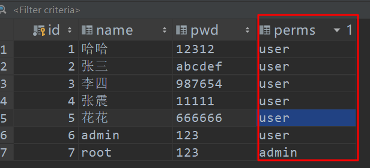

# 一、快速上手shiro

## 1、导入pom依赖

```xml
<dependencies>
        <!-- https://mvnrepository.com/artifact/org.apache.shiro/shiro-core -->
        <dependency>
            <groupId>org.apache.shiro</groupId>
            <artifactId>shiro-core</artifactId>
            <version>1.5.2</version>
        </dependency>

        <dependency>
            <groupId>org.slf4j</groupId>
            <artifactId>jcl-over-slf4j</artifactId>
            <version>1.7.5</version>
        </dependency>

        <dependency>
            <groupId>org.slf4j</groupId>
            <artifactId>slf4j-log4j12</artifactId>
            <version>1.7.30</version>
        </dependency>

        <dependency>
            <groupId>log4j</groupId>
            <artifactId>log4j</artifactId>
            <version>1.2.17</version>
        </dependency>

```

## 2、编写shiro.ini

```ini

[users]
# user 'root' with password 'secret' and the 'admin' role
root = secret, admin
# user 'guest' with the password 'guest' and the 'guest' role
guest = guest, guest
# user 'presidentskroob' with password '12345' ("That's the same combination on
# my luggage!!!" ;)), and role 'president'
presidentskroob = 12345, president
# user 'darkhelmet' with password 'ludicrousspeed' and roles 'darklord' and 'schwartz'
darkhelmet = ludicrousspeed, darklord, schwartz
# user 'lonestarr' with password 'vespa' and roles 'goodguy' and 'schwartz'
lonestarr = vespa, goodguy, schwartz


[roles]
# 'admin' role has all permissions, indicated by the wildcard '*'
admin = *
# The 'schwartz' role can do anything (*) with any lightsaber:
schwartz = lightsaber:*
# The 'goodguy' role is allowed to 'drive' (action) the winnebago (type) with
# license plate 'eagle5' (instance specific id)
goodguy = winnebago:drive:eagle5
```

## 3、编写Quickstart

```java
package com.coke;/*

import org.apache.shiro.SecurityUtils;
import org.apache.shiro.authc.*;
import org.apache.shiro.config.IniSecurityManagerFactory;
import org.apache.shiro.mgt.SecurityManager;
import org.apache.shiro.session.Session;
import org.apache.shiro.subject.Subject;
import org.apache.shiro.util.Factory;
import org.slf4j.Logger;
import org.slf4j.LoggerFactory;


/**
 * Simple Quickstart application showing how to use Shiro's API.
 *
 * @since 0.9 RC2
 */
public class Quickstart {

    private static final transient Logger log = LoggerFactory.getLogger(Quickstart.class);


    public static void main(String[] args) {

        // The easiest way to create a Shiro SecurityManager with configured
        // realms, users, roles and permissions is to use the simple INI config.
        // We'll do that by using a factory that can ingest a .ini file and
        // return a SecurityManager instance:

        // Use the shiro.ini file at the root of the classpath
        // (file: and url: prefixes load from files and urls respectively):
        Factory<SecurityManager> factory = new IniSecurityManagerFactory("classpath:shiro.ini");
        SecurityManager securityManager = factory.getInstance();

        // for this simple example quickstart, make the SecurityManager
        // accessible as a JVM singleton.  Most applications wouldn't do this
        // and instead rely on their container configuration or web.xml for
        // webapps.  That is outside the scope of this simple quickstart, so
        // we'll just do the bare minimum so you can continue to get a feel
        // for things.
        SecurityUtils.setSecurityManager(securityManager);

        // Now that a simple Shiro environment is set up, let's see what you can do:

        // get the currently executing user:
        Subject currentUser = SecurityUtils.getSubject();

        // Do some stuff with a Session (no need for a web or EJB container!!!)
        Session session = currentUser.getSession();
        session.setAttribute("someKey", "aValue");
        String value = (String) session.getAttribute("someKey");
        if (value.equals("aValue")) {
            log.info("Retrieved the correct value! [" + value + "]");
        }

        // let's login the current user so we can check against roles and permissions:
        if (!currentUser.isAuthenticated()) {
            UsernamePasswordToken token = new UsernamePasswordToken("lonestarr", "vespa");
            token.setRememberMe(true);
            try {
                currentUser.login(token);
            } catch (UnknownAccountException uae) {
                log.info("There is no user with username of " + token.getPrincipal());
            } catch (IncorrectCredentialsException ice) {
                log.info("Password for account " + token.getPrincipal() + " was incorrect!");
            } catch (LockedAccountException lae) {
                log.info("The account for username " + token.getPrincipal() + " is locked.  " +
                        "Please contact your administrator to unlock it.");
            }
            // ... catch more exceptions here (maybe custom ones specific to your application?
            catch (AuthenticationException ae) {
                //unexpected condition?  error?
            }
        }

        //say who they are:
        //print their identifying principal (in this case, a username):
        log.info("User [" + currentUser.getPrincipal() + "] logged in successfully.");

        //test a role:
        if (currentUser.hasRole("schwartz")) {
            log.info("May the Schwartz be with you!");
        } else {
            log.info("Hello, mere mortal.");
        }

        //test a typed permission (not instance-level)
        if (currentUser.isPermitted("lightsaber:wield")) {
            log.info("You may use a lightsaber ring.  Use it wisely.");
        } else {
            log.info("Sorry, lightsaber rings are for schwartz masters only.");
        }

        //a (very powerful) Instance Level permission:
        if (currentUser.isPermitted("winnebago:drive:eagle5")) {
            log.info("You are permitted to 'drive' the winnebago with license plate (id) 'eagle5'.  " +
                    "Here are the keys - have fun!");
        } else {
            log.info("Sorry, you aren't allowed to drive the 'eagle5' winnebago!");
        }

        //all done - log out!
        currentUser.logout();

        System.exit(0);
    }
}
```

## 4、配置log4j

```properties
log4j.rootLogger=INFO, stdout

log4j.appender.stdout=org.apache.log4j.ConsoleAppender
log4j.appender.stdout.layout=org.apache.log4j.PatternLayout
log4j.appender.stdout.layout.ConversionPattern=%d %p [%c] - %m %n

# General Apache libraries
log4j.logger.org.apache=WARN

# Spring
log4j.logger.org.springframework=WARN

# Default Shiro logging
log4j.logger.org.apache.shiro=INFO

# Disable verbose logging
log4j.logger.org.apache.shiro.util.ThreadContext=WARN
log4j.logger.org.apache.shiro.cache.ehcache.EhCache=WARN
```

# 二、分析核心代码

```java
Factory<SecurityManager> factory = new IniSecurityManagerFactory("classpath:shiro.ini");
SecurityManager securityManager = factory.getInstance();
SecurityUtils.setSecurityManager(securityManager);


//获取Subject实例
Subject currentUser = SecurityUtils.getSubject();
//从实例中获取session
Session session = currentUser.getSession();
//认证用户信息
!currentUser.isAuthenticated()
//获取当前用户认证
currentUser.getPrincipal()
//获取用户角色
currentUser.hasRole("schwartz")
//获取当前用户权限
currentUser.isPermitted("lightsaber:wield")
//注销
currentUser.logout();

```


# 三、编写Demo测试使用

1、新建Model：shiro-springboot，导入pom依赖

```xml
<dependencies>
        <dependency>
            <groupId>org.springframework.boot</groupId>
            <artifactId>spring-boot-starter-web</artifactId>
        </dependency>

        <!-- https://mvnrepository.com/artifact/org.apache.shiro/shiro-spring -->
        <dependency>
            <groupId>org.apache.shiro</groupId>
            <artifactId>shiro-spring</artifactId>
            <version>1.5.2</version>
        </dependency>

        <dependency>
            <groupId>org.thymeleaf</groupId>
            <artifactId>thymeleaf-spring5</artifactId>
        </dependency>
        <dependency>
            <groupId>org.thymeleaf.extras</groupId>
            <artifactId>thymeleaf-extras-java8time</artifactId>
        </dependency>

        <dependency>
            <groupId>org.springframework.boot</groupId>
            <artifactId>spring-boot-starter-test</artifactId>
            <scope>test</scope>
            <exclusions>
                <exclusion>
                    <groupId>org.junit.vintage</groupId>
                    <artifactId>junit-vintage-engine</artifactId>
                </exclusion>
            </exclusions>
        </dependency>
    </dependencies>
```

2、新建HTML前端页面及相应的Controller，保证Demo能正常跑通。

controller

```java
@Controller
public class MyController {

    @RequestMapping({"/","/index"})
    public String toIndex(Model model){
        model.addAttribute("msg","hello,shiro");
        return "index";
    }

    @RequestMapping("/user/add")
    public String add(){
        return "/user/add";
    }

    @RequestMapping("/user/update")
    public String update(){
        return "/user/update";
    }

    @RequestMapping("/toLogin")
    public String toLogin(){
        return "login";
    }

```

3、编写shiro核心业务代码，创建config

ShiroConfig

```java
@Configuration
public class ShiroConfig {

    //3、ShiroFillterFactorBean
    @Bean
    public ShiroFilterFactoryBean getShiroFilterFactoryBean(@Qualifier("securityManager") DefaultWebSecurityManager defaultWebSecurityManager){
        ShiroFilterFactoryBean bean = new ShiroFilterFactoryBean();
        //设置安全管理器
        bean.setSecurityManager(defaultWebSecurityManager);
        //设置登录请求
        bean.setLoginUrl("/toLogin");
        return bean;
    }

    //2、DefaultWebSecurityManager
    @Bean(name="securityManager")
    public DefaultWebSecurityManager getDefaultWebSecurityManager(@Qualifier("userRealm") UserRealm userRealm){
        DefaultWebSecurityManager securityManager = new DefaultWebSecurityManager();
        securityManager.setRealm(userRealm);
        return securityManager;
    }

    //1、创建 realm 对象
    @Bean
    public UserRealm userRealm(){
        return new UserRealm();
    }

}
```

步骤：

- 1、自定义 realm 对象(DefaultWebSecurityManager安全管理器需要用到Realm)

  - ```java
    //自定义UserRealm
    public class UserRealm extends AuthorizingRealm {
    
        //授权
        protected AuthorizationInfo doGetAuthorizationInfo(PrincipalCollection principalCollection) {
            System.out.println("执行了授权操作：doGetAuthorizationInfo");
            return null;
        }
    
        //认证
        protected AuthenticationInfo doGetAuthenticationInfo(AuthenticationToken authenticationToken) throws AuthenticationException {
            System.out.println("执行了认证操作：doGetAuthenticationInfo");
            return null;
        }
    }
    ```

  - 放进ShiroConfig配置类

  - ```java
    @Bean
    public UserRealm userRealm(){
        return new UserRealm();
    }
    ```

  - 

- 2、DefaultWebSecurityManager(ShiroFillterFactorBean 需要一个安全管理器)

  - ```java
    @Bean(name="securityManager")
        public DefaultWebSecurityManager getDefaultWebSecurityManager(@Qualifier("userRealm") UserRealm userRealm){
            DefaultWebSecurityManager securityManager = new DefaultWebSecurityManager();
            securityManager.setRealm(userRealm);
            return securityManager;
        }
    ```

- 3、ShiroFillterFactorBean(设置拦截器，添加内置过滤)

  - ```java
     @Bean
        public ShiroFilterFactoryBean getShiroFilterFactoryBean(@Qualifier("securityManager") DefaultWebSecurityManager defaultWebSecurityManager){
            ShiroFilterFactoryBean bean = new ShiroFilterFactoryBean();
            //设置安全管理器
            bean.setSecurityManager(defaultWebSecurityManager);
            //添加shiro的内置过滤器
            /*
            * anon:无需认证就可访问
            * authc:必须认证就行可以访问
            * user：必须拥有记住我功能才能使用
            * perms：拥有对某个资源的权限才能访问
            * role：拥有某个角色权限才能访问
            * */
            //拦截
            Map<String,String> filterMap = new LinkedHashMap<String,String>();
            filterMap.put("/user/*","authc");
            bean.setFilterChainDefinitionMap(filterMap);
      
            //设置登录请求
            bean.setLoginUrl("/toLogin");
            return bean;
        }
    ```

    

# 四、Shiro 整合Mybatis、Druid

## 1、导入pom依赖

```xml
<!--整合mybatis,Druid-->
        <dependency>
            <groupId>mysql</groupId>
            <artifactId>mysql-connector-java</artifactId>
        </dependency>
        <!-- https://mvnrepository.com/artifact/com.alibaba/druid -->
        <dependency>
            <groupId>com.alibaba</groupId>
            <artifactId>druid</artifactId>
            <version>1.1.12</version>
        </dependency>
        <dependency>
            <groupId>org.mybatis.spring.boot</groupId>
            <artifactId>mybatis-spring-boot-starter</artifactId>
            <version>2.1.1</version>
        </dependency>
        <dependency>
            <groupId>log4j</groupId>
            <artifactId>log4j</artifactId>
            <version>1.2.17</version>
        </dependency>
        <dependency>
            <groupId>org.projectlombok</groupId>
            <artifactId>lombok</artifactId>
        </dependency>

        <dependency>
            <groupId>com.github.theborakompanioni</groupId>
            <artifactId>thymeleaf-extras-shiro</artifactId>
            <version>2.0.0</version>
        </dependency>
```

## 2、连接数据库及配置

```properties
spring:
  datasource:
    driver-class-name: com.mysql.cj.jdbc.Driver
    url: jdbc:mysql://localhost:3306/mybatis?serverTimezone=UTC&useUnicode=true&characterEncoding=utf-8
    username: root
    password: 123456
    type: com.alibaba.druid.pool.DruidDataSource
    # 初始化大小，最小，最大
    initialSize: 5
    minIdle: 5
    maxActive: 20
    # 配置获取连接等待超时的时间
    maxWait: 60000
    # 配置间隔多久才进行一次检测，检测需要关闭的空闲连接，单位是毫秒
    timeBetweenEvictionRunsMillis: 60000
    # 配置一个连接在池中最小生存的时间，单位是毫秒
    minEvictableIdleTimeMillis: 300000
    validationQuery: SELECT 1 FROM DUAL
    testWhileIdle: true
    testOnBorrow: false
    testOnReturn: false
    poolPreparedStatements: true
    # 配置监控统计拦截的filters,去掉监控界面sql无法统计，‘wall’用于防火墙
    filters: stat,wall,log4j
    maxPoolPreparedStatementPerConnectionSize: 20
    userGlobalDataSourceStat: true
    # 通过connectProperties属性来打开mergeSql功能；慢SQL记录
    connectionProperties: druid.stat.mergeSql=true;druid.stat.slowSqlMillis=500
```

## 3、编写实体类pojo

```java
@Data
@AllArgsConstructor
@NoArgsConstructor
public class User {
    private int id;
    private String name;
    private String pwd;
    private String perms;
}

```

## 4、编写UserMapper接口、UserMapper.xml

```java
@Mapper
@Repository
public interface UserMapper {
    public User queryUser(String username);
}

```

```xml
<?xml version="1.0" encoding="UTF-8" ?>
<!DOCTYPE mapper
        PUBLIC "-//mybatis.org//DTD Mapper 3.0//EN"
        "http://mybatis.org/dtd/mybatis-3-mapper.dtd">
<mapper namespace="com.coke.mapper.UserMapper">
    <select id="queryUser" parameterType="String" resultType="User">
        select * from mybatis.user where name=#{username}
    </select>
</mapper>
```

## 5、绑定Mybatis

```properties
#绑定mybatis
mybatis.type-aliases-package=com.coke.pojo
mybatis.mapper-locations=classpath:mybatis/mapper/*.xml
```

## 6、认证授权

1、Controller

```java
@RequestMapping("/login")
    public String login(String username,String password,Model model){
        //获取当前用户
        Subject currentUser = SecurityUtils.getSubject();
        //封装用户登录数据
        UsernamePasswordToken token = new UsernamePasswordToken(username,password);

        try {
            currentUser.login(token);//执行方法登录，没有异常登陆成功，否则捕获异常
            return "index";
        }catch (UnknownAccountException e){//用户名不存在
            model.addAttribute("msg","用户名不存在！");
            return "login";
        }catch (IncorrectCredentialsException ice){//密码错误
            model.addAttribute("msg","密码错误！");
            return "login";
        }

    }
```

2、Realm

```java
 //认证
    protected AuthenticationInfo doGetAuthenticationInfo(AuthenticationToken authenticationToken) throws AuthenticationException {
        System.out.println("执行了认证操作：doGetAuthenticationInfo");

        UsernamePasswordToken userToken = (UsernamePasswordToken) authenticationToken;
        //数据库查询用户
        User user = userService.queryUser(userToken.getUsername());
        if (user == null){
            return null;//抛出异常 UnknownAccountException
        }
        //把用户放入session
        Subject currentSubject = SecurityUtils.getSubject();
        Session session = currentSubject.getSession();
        session.setAttribute("loginUser",user);
        //密码认证，shiro自动认证
        return new SimpleAuthenticationInfo(user,user.getPwd(),"");
    }
```

3、拦截授权

```java
@Bean
    public ShiroFilterFactoryBean getShiroFilterFactoryBean(@Qualifier("securityManager") DefaultWebSecurityManager defaultWebSecurityManager){
        ShiroFilterFactoryBean bean = new ShiroFilterFactoryBean();
        //设置安全管理器
        bean.setSecurityManager(defaultWebSecurityManager);
        //添加shiro的内置过滤器
        /*
        * anon:无需认证就可访问
        * authc:必须认证才可以访问
        * user：必须拥有记住我功能才能使用
        * perms：拥有对某个资源的权限才能访问
        * role：拥有某个角色权限才能访问
        * */
        //拦截
        Map<String,String> filterMap = new LinkedHashMap<String,String>();
        //授权
        filterMap.put("/user/add","perms[user]");
        filterMap.put("/user/update","perms[admin]");
        filterMap.put("/user/*","authc");
        bean.setFilterChainDefinitionMap(filterMap);

        //设置登录请求
        bean.setLoginUrl("/toLogin");
        //未授权页面
        bean.setUnauthorizedUrl("/noauth");

        return bean;
    }
```

- 授权规则与数据库perms字段进行权限判断



4、认证用户是否拥有权限

```java
 //认证
    protected AuthenticationInfo doGetAuthenticationInfo(AuthenticationToken authenticationToken) throws AuthenticationException {
        System.out.println("执行了认证操作：doGetAuthenticationInfo");

        UsernamePasswordToken userToken = (UsernamePasswordToken) authenticationToken;
        //数据库查询用户
        User user = userService.queryUser(userToken.getUsername());
        if (user == null){
            return null;//抛出异常 UnknownAccountException
        }
        //把用户放入session
        Subject currentSubject = SecurityUtils.getSubject();
        Session session = currentSubject.getSession();
        session.setAttribute("loginUser",user);
        //密码认证，shiro自动认证
        return new SimpleAuthenticationInfo(user,user.getPwd(),"");
    }
```

5、认证通过进行授权

```java
//授权
    protected AuthorizationInfo doGetAuthorizationInfo(PrincipalCollection principalCollection) {
        System.out.println("执行了授权操作：doGetAuthorizationInfo");
        SimpleAuthorizationInfo info = new SimpleAuthorizationInfo();//授权
        //info.addStringPermission("user:update");
        //获取当前登录的对象
        Subject subject = SecurityUtils.getSubject();
        User currentUser = (User) subject.getPrincipal();//拿到user对象
        info.addStringPermission(currentUser.getPerms());
        return info;
    }
```


6、未授权及登录注销

```java
@RequestMapping("/noauth")
    @ResponseBody
    public String noauth(){
        return "未授权，请授权后登录";
    }

    @RequestMapping("/user/logout")
    public String logout(){
        Subject currentUser = SecurityUtils.getSubject();
        //注销
        currentUser.logout();
        return "login";
    }
```


# 五、登录页权限限定

```html
<!DOCTYPE html>
<html lang="en" xmlns:th="http://www.thymeleaf.org"
      xmlns:shiro="http://www.thymeleaf.org/thymeleaf-extras-shiro">
<head>
    <meta charset="UTF-8">
    <title>Title</title>
</head>
<body>
<h1>首页</h1>

<H2 th:text="${msg}"></H2>

    <div th:if="${session.loginUser==null}">
        <a th:href="@{/toLogin}">登录</a>
    </div>
    <div shiro:hasPermission="user">
        <a th:href="@{/user/add}">add</a>
    </div>
    <div shiro:hasPermission="admin">
        <a th:href="@{/user/update}">update</a>
    </div>

    <a th:href="@{/user/logout}">logout</a>

</body>
</html>
```


