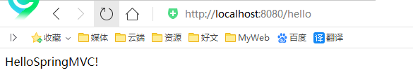
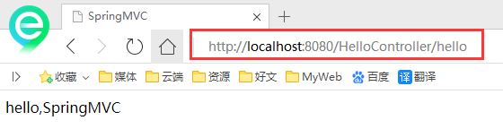
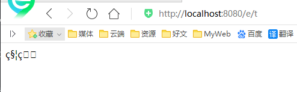

# HelloSpringMVC

## 配置版

新建一个Moudle ， 添加web的支持！

确定导入了SpringMVC 的依赖！

```java
<!--依赖问题-->
  <dependencies>

    <!--Junit-->
    <dependency>
      <groupId>junit</groupId>
      <artifactId>junit</artifactId>
      <version>4.12</version>
    </dependency>
    
    <!--Servlet - JSP -->
    <dependency>
      <groupId>javax.servlet</groupId>
      <artifactId>servlet-api</artifactId>
      <version>2.5</version>
    </dependency>
    <dependency>
      <groupId>javax.servlet.jsp</groupId>
      <artifactId>jsp-api</artifactId>
      <version>2.2</version>
    </dependency>
    <dependency>
      <groupId>javax.servlet</groupId>
      <artifactId>jstl</artifactId>
      <version>1.2</version>
    </dependency>

    <!--Spring-->
    <dependency>
      <groupId>org.springframework</groupId>
      <artifactId>spring-webmvc</artifactId>
      <version>5.1.9.RELEASE</version>
    </dependency>
    <dependency>
      <groupId>org.springframework</groupId>
      <artifactId>spring-jdbc</artifactId>
      <version>5.1.9.RELEASE</version>
    </dependency>
    <dependency>
      <groupId>org.projectlombok</groupId>
      <artifactId>lombok</artifactId>
      <version>1.18.8</version>
    </dependency>
  </dependencies>


  <!-- 静态资源导出问题-->
  <build>
    <resources>
      <resource>
        <directory>src/main/java</directory>
        <includes>
          <include>**/*.properties</include>
          <include>**/*.xml</include>
        </includes>
        <filtering>false</filtering>
      </resource>
      <resource>
        <directory>src/main/resources</directory>
        <includes>
          <include>**/*.properties</include>
          <include>**/*.xml</include>
        </includes>
        <filtering>false</filtering>
      </resource>
    </resources>
  </build>
```


配置web.xml ， 注册DispatcherServlet

```xml
<?xml version="1.0" encoding="UTF-8"?>
<web-app xmlns="http://xmlns.jcp.org/xml/ns/javaee"
         xmlns:xsi="http://www.w3.org/2001/XMLSchema-instance"
         xsi:schemaLocation="http://xmlns.jcp.org/xml/ns/javaee http://xmlns.jcp.org/xml/ns/javaee/web-app_4_0.xsd"
         version="4.0">

    <!--1.注册DispatcherServlet-->
    <servlet>
        <servlet-name>springmvc</servlet-name>
        <servlet-class>org.springframework.web.servlet.DispatcherServlet</servlet-class>
        <!--关联一个springmvc的配置文件:【servlet-name】-servlet.xml-->
        <init-param>
            <param-name>contextConfigLocation</param-name>
            <param-value>classpath:springmvc-servlet.xml</param-value>
        </init-param>
        <!--启动级别-1-->
        <load-on-startup>1</load-on-startup>
    </servlet>

    <!--/ 匹配所有的请求；（不包括.jsp）-->
    <!--/* 匹配所有的请求；（包括.jsp）-->
    <servlet-mapping>
        <servlet-name>springmvc</servlet-name>
        <url-pattern>/</url-pattern>
    </servlet-mapping>

</web-app>
```

编写SpringMVC 的 配置文件！名称：springmvc-servlet.xml : [servletname]-servlet.xml说明，这里的名称要求是按照官方来的

```xml
<?xml version="1.0" encoding="UTF-8"?>
<beans xmlns="http://www.springframework.org/schema/beans"
      xmlns:xsi="http://www.w3.org/2001/XMLSchema-instance"
      xsi:schemaLocation="http://www.springframework.org/schema/beans
       http://www.springframework.org/schema/beans/spring-beans.xsd">

</beans>
```

添加 处理映射器

```xml
<bean class="org.springframework.web.servlet.handler.BeanNameUrlHandlerMapping"/>
```

添加 处理器适配器

```xml
<bean class="org.springframework.web.servlet.mvc.SimpleControllerHandlerAdapter"/>
```

添加 视图解析器

```xml
<!--视图解析器:DispatcherServlet给他的ModelAndView-->
<bean class="org.springframework.web.servlet.view.InternalResourceViewResolver" id="InternalResourceViewResolver">
    <!--前缀-->
    <property name="prefix" value="/WEB-INF/jsp/"/>
    <!--后缀-->
    <property name="suffix" value=".jsp"/>
</bean>
```

编写我们要操作业务Controller ，要么实现Controller接口，要么增加注解；需要返回一个ModelAndView，装数据，封视图；

```java
package com.kuang.controller;

import org.springframework.web.servlet.ModelAndView;
import org.springframework.web.servlet.mvc.Controller;

import javax.servlet.http.HttpServletRequest;
import javax.servlet.http.HttpServletResponse;

//注意：这里我们先导入Controller接口
public class HelloController implements Controller {

    public ModelAndView handleRequest(HttpServletRequest request, HttpServletResponse response) throws Exception {
        //ModelAndView 模型和视图
        ModelAndView mv = new ModelAndView();

        //封装对象，放在ModelAndView中。Model
        mv.addObject("msg","HelloSpringMVC!");
        //封装要跳转的视图，放在ModelAndView中
        mv.setViewName("hello"); //: /WEB-INF/jsp/hello.jsp
        return mv;
    }
    
}
```

将自己的类交给SpringIOC容器，注册bean

```xml
<!--Handler-->
<bean id="/hello" class="com.kuang.controller.HelloController"/>
```

写要跳转的jsp页面，显示ModelandView存放的数据，以及我们的正常页面；

```jsp
<%@ page contentType="text/html;charset=UTF-8" language="java" %>
<html>
<head>
    <title>Kuangshen</title>
</head>
<body>
    ${msg}
</body>
</html>
```

配置Tomcat 启动测试！




**可能遇到的问题：访问出现404，排查步骤：**

1. 查看控制台输出，看一下是不是缺少了什么jar包。
2. 如果jar包存在，显示无法输出，就在IDEA的项目发布中，添加lib依赖！
3. 重启Tomcat 即可解决！

小结：看这个估计大部分同学都能理解其中的原理了，但是我们实际开发才不会这么写，不然就疯了，还学这个玩意干嘛！我们来看个注解版实现，这才是SpringMVC的精髓，到底有多么简单，看这个图就知道了。


## 注解版

**第一步:新建一个Moudle , 添加web支持！**建立包结构 com.cokecoke.controller

**第二步:由于Maven可能存在资源过滤的问题，我们将配置完善**

```xml
<build>
    <resources>
        <resource>
            <directory>src/main/java</directory>
            <includes>
                <include>**/*.properties</include>
                <include>**/*.xml</include>
            </includes>
            <filtering>false</filtering>
        </resource>
        <resource>
            <directory>src/main/resources</directory>
            <includes>
                <include>**/*.properties</include>
                <include>**/*.xml</include>
            </includes>
            <filtering>false</filtering>
        </resource>
    </resources>
</build>
```

**第三步:在pom.xml文件引入相关的依赖**：
主要有Spring框架核心库、Spring MVC、servlet , JSTL等。我们在父依赖中已经引入了！

**第四步:配置web.xml**

注意点：

- 注意web.xml版本问题，要最新版！

- 注册DispatcherServlet

- 关联SpringMVC的配置文件

- 启动级别为1

- 映射路径为 / 【不要用/*，会404】

  ```xml
  <?xml version="1.0" encoding="UTF-8"?>
  <web-app xmlns="http://xmlns.jcp.org/xml/ns/javaee"
           xmlns:xsi="http://www.w3.org/2001/XMLSchema-instance"
           xsi:schemaLocation="http://xmlns.jcp.org/xml/ns/javaee http://xmlns.jcp.org/xml/ns/javaee/web-app_4_0.xsd"
           version="4.0">
  
      <!--1.注册servlet-->
      <servlet>
          <servlet-name>SpringMVC</servlet-name>
          <servlet-class>org.springframework.web.servlet.DispatcherServlet</servlet-class>
          <!--通过初始化参数指定SpringMVC配置文件的位置，进行关联-->
          <init-param>
              <param-name>contextConfigLocation</param-name>
              <param-value>classpath:springmvc-servlet.xml</param-value>
          </init-param>
          <!-- 启动顺序，数字越小，启动越早 -->
          <load-on-startup>1</load-on-startup>
      </servlet>
  
      <!--所有请求都会被springmvc拦截 -->
      <servlet-mapping>
          <servlet-name>SpringMVC</servlet-name>
          <url-pattern>/</url-pattern>
      </servlet-mapping>
  
  </web-app>
  ```

  ```java
  **/ 和 /\* 的区别：**
  < url-pattern > / </ url-pattern > 不会匹配到.jsp， 只针对我们编写的请求；
  即：.jsp 不会进入spring的 DispatcherServlet类 。
  < url-pattern > /* </ url-pattern > 会匹配 *.jsp，
  会出现返回 jsp视图 时再次进入spring的DispatcherServlet 类，导致找不到对应的controller所以报404错。
  ```

**第五步:添加Spring MVC配置文件**

- 让IOC的注解生效
- 静态资源过滤 ：HTML . JS . CSS . 图片 ， 视频 .....
- MVC的注解驱动
- 配置视图解析器

在resource目录下添加springmvc-servlet.xml配置文件，配置的形式与Spring容器配置基本类似，为了支持基于注解的IOC，设置了自动扫描包的功能，具体配置信息如下：

```xml
<?xml version="1.0" encoding="UTF-8"?>
<beans xmlns="http://www.springframework.org/schema/beans"
       xmlns:xsi="http://www.w3.org/2001/XMLSchema-instance"
       xmlns:context="http://www.springframework.org/schema/context"
       xmlns:mvc="http://www.springframework.org/schema/mvc"
       xsi:schemaLocation="http://www.springframework.org/schema/beans
        http://www.springframework.org/schema/beans/spring-beans.xsd
        http://www.springframework.org/schema/context
        https://www.springframework.org/schema/context/spring-context.xsd
        http://www.springframework.org/schema/mvc
        https://www.springframework.org/schema/mvc/spring-mvc.xsd">

    <!-- 自动扫描包，让指定包下的注解生效,由IOC容器统一管理 -->
    <context:component-scan base-package="com.kuang.controller"/>
    <!-- 让Spring MVC不处理静态资源 -->
    <mvc:default-servlet-handler />
    <!--
    支持mvc注解驱动
        在spring中一般采用@RequestMapping注解来完成映射关系
        要想使@RequestMapping注解生效
        必须向上下文中注册DefaultAnnotationHandlerMapping
        和一个AnnotationMethodHandlerAdapter实例
        这两个实例分别在类级别和方法级别处理。
        而annotation-driven配置帮助我们自动完成上述两个实例的注入。
     -->
    <mvc:annotation-driven />

    <!-- 视图解析器 -->
    <bean class="org.springframework.web.servlet.view.InternalResourceViewResolver"
          id="internalResourceViewResolver">
        <!-- 前缀 -->
        <property name="prefix" value="/WEB-INF/jsp/" />
        <!-- 后缀 -->
        <property name="suffix" value=".jsp" />
    </bean>

</beans>
```

在视图解析器中我们把所有的视图都存放在/WEB-INF/目录下，这样可以保证视图安全，因为这个目录下的文件，客户端不能直接访问。

**第六步:创建Controller**

编写一个Java控制类： com.kuang.controller.HelloController , 注意编码规范

```java
package com.kuang.controller;

import org.springframework.stereotype.Controller;
import org.springframework.ui.Model;
import org.springframework.web.bind.annotation.RequestMapping;

@Controller
@RequestMapping("/HelloController")
public class HelloController {

    //真实访问地址 : 项目名/HelloController/hello
    @RequestMapping("/hello")
    public String sayHello(Model model){
        //向模型中添加属性msg与值，可以在JSP页面中取出并渲染
        model.addAttribute("msg","hello,SpringMVC");
        //web-inf/jsp/hello.jsp
        return "hello";
    }
}
```

- @Controller是为了让Spring IOC容器初始化时自动扫描到；
- @RequestMapping是为了映射请求路径，这里因为类与方法上都有映射所以访问时应该是/HelloController/hello；
- 方法中声明Model类型的参数是为了把Action中的数据带到视图中；
- 方法返回的结果是视图的名称hello，加上配置文件中的前后缀变成WEB-INF/jsp/**hello**.jsp。

**第七步:创建视图层**

在WEB-INF/ jsp目录中创建hello.jsp ， 视图可以直接取出并展示从Controller带回的信息；

可以通过EL表示取出Model中存放的值，或者对象；

```jsp
<%@ page contentType="text/html;charset=UTF-8" language="java" %>
<html>
<head>
    <title>SpringMVC</title>
</head>
<body>
    ${msg}
</body>
</html>
```

**第八步:配置Tomcat运行**

配置Tomcat ， 开启服务器 ， 访问 对应的请求路径！



**OK，运行成功！**

## 小结

实现步骤其实非常的简单：

1. 新建一个web项目
2. 导入相关jar包
3. 编写web.xml , 注册DispatcherServlet
4. 编写springmvc配置文件
5. 接下来就是去创建对应的控制类 , controller
6. 最后完善前端视图和controller之间的对应
7. 测试运行调试.

使用springMVC必须配置的三大件：

**处理器映射器、处理器适配器、视图解析器**

通常，我们只需要**手动配置视图解析器**，而**处理器映射器**和**处理器适配器**只需要开启**注解驱动**即可，而省去了大段的xml配置


## 数据处理

### 处理提交数据

**1、提交的域名称和处理方法的参数名一致**

提交数据 : [http://localhost](http://localhost/):8080/hello?name=kuangshen

处理方法 :

```java
@RequestMapping("/hello")
public String hello(String name){
    System.out.println(name);
    return "hello";
}
```

后台输出 : kuangshen

**2、提交的域名称和处理方法的参数名不一致**

提交数据 : [http://localhost](http://localhost/):8080/hello?username=kuangshen

处理方法 :

```java
//@RequestParam("username") : username提交的域的名称 .
@RequestMapping("/hello")
public String hello(@RequestParam("username") String name){
    System.out.println(name);
    return "hello";
}
```

后台输出 : kuangshen

**3、提交的是一个对象**

要求提交的表单域和对象的属性名一致 , 参数使用对象即可

1. 实体类

   ```Java
   public class User {
       private int id;
       private String name;
       private int age;
       //构造
       //get/set
       //tostring()
   }
   ```

2. 提交数据 : [http://localhost](http://localhost/):8080/mvc04/user?name=kuangshen&id=1&age=15

3. 处理方法 :

   ```java
   @RequestMapping("/user")
   public String user(User user){
       System.out.println(user);
       return "hello";
   }
   ```

   后台输出 : User { id=1, name='kuangshen', age=15 }

**说明：如果使用对象的话，前端传递的参数名和对象名必须一致，否则就是null。**

### 数据显示到前端

**第一种 : 通过ModelAndView**

我们前面一直都是如此 . 就不过多解释

```java
public class ControllerTest1 implements Controller {

    public ModelAndView handleRequest(HttpServletRequest httpServletRequest, HttpServletResponse httpServletResponse) throws Exception {
        //返回一个模型视图对象
        ModelAndView mv = new ModelAndView();
        mv.addObject("msg","ControllerTest1");
        mv.setViewName("test");
        return mv;
    }
}
```

**第二种 : 通过ModelMap**

ModelMap

```java
@RequestMapping("/hello")
public String hello(@RequestParam("username") String name, ModelMap model){
    //封装要显示到视图中的数据
    //相当于req.setAttribute("name",name);
    model.addAttribute("name",name);
    System.out.println(name);
    return "hello";
}
```

**第三种 : 通过Model**

Model

```java
@RequestMapping("/ct2/hello")
public String hello(@RequestParam("username") String name, Model model){
    //封装要显示到视图中的数据
    //相当于req.setAttribute("name",name);
    model.addAttribute("msg",name);
    System.out.println(name);
    return "test";
}
```

### 对比

就对于新手而言简单来说使用区别就是：

```
Model 只有寥寥几个方法只适合用于储存数据，简化了新手对于Model对象的操作和理解；

ModelMap 继承了 LinkedMap ，除了实现了自身的一些方法，同样的继承 LinkedMap 的方法和特性；

ModelAndView 可以在储存数据的同时，可以进行设置返回的逻辑视图，进行控制展示层的跳转。
```

当然更多的以后开发考虑的更多的是性能和优化，就不能单单仅限于此的了解。

**请使用80%的时间打好扎实的基础，剩下18%的时间研究框架，2%的时间去学点英文，框架的官方文档永远是最好的教程。**

### 乱码问题

测试步骤：

1. 我们可以在首页编写一个提交的表单

   ```html
   <form action="/e/t" method="post">
     <input type="text" name="name">
     <input type="submit">
   </form>
   ```

2. 后台编写对应的处理类

   ```java
   @Controller
   public class Encoding {
       @RequestMapping("/e/t")
       public String test(Model model,String name){
           model.addAttribute("msg",name); //获取表单提交的值
           return "test"; //跳转到test页面显示输入的值
       }
   }
   ```

3. 输入中文测试，发现乱码
   

不得不说，乱码问题是在我们开发中十分常见的问题，也是让我们程序猿比较头大的问题！

以前乱码问题通过过滤器解决 , 而SpringMVC给我们提供了一个过滤器 , 可以在web.xml中配置 .

修改了xml文件需要重启服务器！

```xml
<filter>
    <filter-name>encoding</filter-name>
    <filter-class>org.springframework.web.filter.CharacterEncodingFilter</filter-class>
    <init-param>
        <param-name>encoding</param-name>
        <param-value>utf-8</param-value>
    </init-param>
</filter>
<filter-mapping>
    <filter-name>encoding</filter-name>
    <url-pattern>/</url-pattern>
</filter-mapping>
```

有些极端情况下.这个过滤器对get的支持不好 .

处理方法 :

1. 修改tomcat配置文件 ： 设置编码！

   ```xml
   <Connector URIEncoding="utf-8" port="8080" protocol="HTTP/1.1"
              connectionTimeout="20000"
              redirectPort="8443" />
   ```

2. 自定义过滤器

   ```java
   package com.kuang.filter;
   
   import javax.servlet.*;
   import javax.servlet.http.HttpServletRequest;
   import javax.servlet.http.HttpServletRequestWrapper;
   import javax.servlet.http.HttpServletResponse;
   import java.io.IOException;
   import java.io.UnsupportedEncodingException;
   import java.util.Map;
   
   /**
    * 解决get和post请求 全部乱码的过滤器
    */
   public class GenericEncodingFilter implements Filter {
   
       @Override
       public void destroy() {
       }
   
       @Override
       public void doFilter(ServletRequest request, ServletResponse response, FilterChain chain) throws IOException, ServletException {
           //处理response的字符编码
           HttpServletResponse myResponse=(HttpServletResponse) response;
           myResponse.setContentType("text/html;charset=UTF-8");
   
           // 转型为与协议相关对象
           HttpServletRequest httpServletRequest = (HttpServletRequest) request;
           // 对request包装增强
           HttpServletRequest myrequest = new MyRequest(httpServletRequest);
           chain.doFilter(myrequest, response);
       }
   
       @Override
       public void init(FilterConfig filterConfig) throws ServletException {
       }
   
   }
   
   //自定义request对象，HttpServletRequest的包装类
   class MyRequest extends HttpServletRequestWrapper {
   
       private HttpServletRequest request;
       //是否编码的标记
       private boolean hasEncode;
       //定义一个可以传入HttpServletRequest对象的构造函数，以便对其进行装饰
       public MyRequest(HttpServletRequest request) {
           super(request);// super必须写
           this.request = request;
       }
   
       // 对需要增强方法 进行覆盖
       @Override
       public Map getParameterMap() {
           // 先获得请求方式
           String method = request.getMethod();
           if (method.equalsIgnoreCase("post")) {
               // post请求
               try {
                   // 处理post乱码
                   request.setCharacterEncoding("utf-8");
                   return request.getParameterMap();
               } catch (UnsupportedEncodingException e) {
                   e.printStackTrace();
               }
           } else if (method.equalsIgnoreCase("get")) {
               // get请求
               Map<String, String[]> parameterMap = request.getParameterMap();
               if (!hasEncode) { // 确保get手动编码逻辑只运行一次
                   for (String parameterName : parameterMap.keySet()) {
                       String[] values = parameterMap.get(parameterName);
                       if (values != null) {
                           for (int i = 0; i < values.length; i++) {
                               try {
                                   // 处理get乱码
                                   values[i] = new String(values[i]
                                           .getBytes("ISO-8859-1"), "utf-8");
                               } catch (UnsupportedEncodingException e) {
                                   e.printStackTrace();
                               }
                           }
                       }
                   }
                   hasEncode = true;
               }
               return parameterMap;
           }
           return super.getParameterMap();
       }
   
       //取一个值
       @Override
       public String getParameter(String name) {
           Map<String, String[]> parameterMap = getParameterMap();
           String[] values = parameterMap.get(name);
           if (values == null) {
               return null;
           }
           return values[0]; // 取回参数的第一个值
       }
   
       //取所有值
       @Override
       public String[] getParameterValues(String name) {
           Map<String, String[]> parameterMap = getParameterMap();
           String[] values = parameterMap.get(name);
           return values;
       }
   }
   ```

这个也是我在网上找的一些大神写的，一般情况下，SpringMVC默认的乱码处理就已经能够很好的解决了！

**然后在web.xml中配置这个过滤器即可！**

乱码问题，需要平时多注意，在尽可能能设置编码的地方，都设置为统一编码 UTF-8！


## 什么是JSON？

- JSON(JavaScript Object Notation, JS 对象标记) 是一种轻量级的数据交换格式，目前使用特别广泛。
- 采用完全独立于编程语言的**文本格式**来存储和表示数据。
- 简洁和清晰的层次结构使得 JSON 成为理想的数据交换语言。
- 易于人阅读和编写，同时也易于机器解析和生成，并有效地提升网络传输效率。

在 JavaScript 语言中，一切都是对象。因此，任何JavaScript 支持的类型都可以通过 JSON 来表示，例如字符串、数字、对象、数组等。看看他的要求和语法格式：

- 对象表示为键值对，数据由逗号分隔
- 花括号保存对象
- 方括号保存数组

**JSON 键值对**是用来保存 JavaScript 对象的一种方式，和 JavaScript 对象的写法也大同小异，键/值对组合中的键名写在前面并用双引号 "" 包裹，使用冒号 : 分隔，然后紧接着值：

```json
{"name": "QinJiang"}
{"age": "3"}
{"sex": "男"}
```

很多人搞不清楚 JSON 和 JavaScript 对象的关系，甚至连谁是谁都不清楚。其实，可以这么理解：

- JSON 是 JavaScript 对象的字符串表示法，它使用文本表示一个 JS 对象的信息，本质是一个字符串。

  ```javascript
  var obj = {a: 'Hello', b: 'World'}; //这是一个对象，注意键名也是可以使用引号包裹的
  var json = '{"a": "Hello", "b": "World"}'; //这是一个 JSON 字符串，本质是一个字符串
  ```

**JSON 和 JavaScript 对象互转**

- 要实现从JSON字符串转换为JavaScript 对象，使用 JSON.parse() 方法：

  ```javascript
  var obj = JSON.parse('{"a": "Hello", "b": "World"}'); 
  //结果是 {a: 'Hello', b: 'World'}
  ```

- 要实现从JavaScript 对象转换为JSON字符串，使用 JSON.stringify() 方法：

  ```javascript
  var json = JSON.stringify({a: 'Hello', b: 'World'});
  //结果是 '{"a": "Hello", "b": "World"}'
  ```

**代码测试**

1. 新建一个module ，springmvc-05-json ， 添加web的支持

2. 在web目录下新建一个 json-1.html ， 编写测试内容

   ```html
   <!DOCTYPE html>
   <html lang="en">
   <head>
   <meta charset="UTF-8">
   <title>JSON_秦疆</title>
   </head>
   <body>
   
   <script type="text/javascript">
   //编写一个js的对象
   var user = {
    name:"秦疆",
    age:3,
    sex:"男"
   };
   //将js对象转换成json字符串
   var str = JSON.stringify(user);
   console.log(str);
   
   //将json字符串转换为js对象
   var user2 = JSON.parse(str);
   console.log(user2.age,user2.name,user2.sex);
   
   </script>
   
   </body>
   </html>
   ```

3. 在IDEA中使用浏览器打开，查看控制台输出！

### Controller返回JSON数据

- Jackson应该是目前比较好的json解析工具了

- 当然工具不止这一个，比如还有阿里巴巴的 fastjson 等等。

- 我们这里使用Jackson，使用它需要导入它的jar包；

  ```xml
  <!-- https://mvnrepository.com/artifact/com.fasterxml.jackson.core/jackson-core -->
  <dependency>
      <groupId>com.fasterxml.jackson.core</groupId>
      <artifactId>jackson-databind</artifactId>
      <version>2.9.8</version>
  </dependency>
  ```

- 配置SpringMVC需要的配置
  **web.xml**

  ```xml
  <?xml version="1.0" encoding="UTF-8"?>
  <web-app xmlns="http://xmlns.jcp.org/xml/ns/javaee"
           xmlns:xsi="http://www.w3.org/2001/XMLSchema-instance"
           xsi:schemaLocation="http://xmlns.jcp.org/xml/ns/javaee http://xmlns.jcp.org/xml/ns/javaee/web-app_4_0.xsd"
           version="4.0">
  
      <!--1.注册servlet-->
      <servlet>
          <servlet-name>SpringMVC</servlet-name>
          <servlet-class>org.springframework.web.servlet.DispatcherServlet</servlet-class>
          <!--通过初始化参数指定SpringMVC配置文件的位置，进行关联-->
          <init-param>
              <param-name>contextConfigLocation</param-name>
              <param-value>classpath:springmvc-servlet.xml</param-value>
          </init-param>
          <!-- 启动顺序，数字越小，启动越早 -->
          <load-on-startup>1</load-on-startup>
      </servlet>
  
      <!--所有请求都会被springmvc拦截 -->
      <servlet-mapping>
          <servlet-name>SpringMVC</servlet-name>
          <url-pattern>/</url-pattern>
      </servlet-mapping>
  
      <filter>
          <filter-name>encoding</filter-name>
          <filter-class>org.springframework.web.filter.CharacterEncodingFilter</filter-class>
          <init-param>
              <param-name>encoding</param-name>
              <param-value>utf-8</param-value>
          </init-param>
      </filter>
      <filter-mapping>
          <filter-name>encoding</filter-name>
          <url-pattern>/</url-pattern>
      </filter-mapping>
  
  </web-app>
  ```

**springmvc-servlet.xml**

```xml
<?xml version="1.0" encoding="UTF-8"?>
<beans xmlns="http://www.springframework.org/schema/beans"
       xmlns:xsi="http://www.w3.org/2001/XMLSchema-instance"
       xmlns:context="http://www.springframework.org/schema/context"
       xmlns:mvc="http://www.springframework.org/schema/mvc"
       xsi:schemaLocation="http://www.springframework.org/schema/beans
        http://www.springframework.org/schema/beans/spring-beans.xsd
        http://www.springframework.org/schema/context
        https://www.springframework.org/schema/context/spring-context.xsd
        http://www.springframework.org/schema/mvc
        https://www.springframework.org/schema/mvc/spring-mvc.xsd">

    <!-- 自动扫描指定的包，下面所有注解类交给IOC容器管理 -->
    <context:component-scan base-package="com.kuang.controller"/>

    <!-- 视图解析器 -->
    <bean class="org.springframework.web.servlet.view.InternalResourceViewResolver"
          id="internalResourceViewResolver">
        <!-- 前缀 -->
        <property name="prefix" value="/WEB-INF/jsp/" />
        <!-- 后缀 -->
        <property name="suffix" value=".jsp" />
    </bean>

</beans>
```

- 我们随便编写一个User的实体类，然后我们去编写我们的测试Controller；

  ```java
  package com.kuang.pojo;
  
  import lombok.AllArgsConstructor;
  import lombok.Data;
  import lombok.NoArgsConstructor;
  
  //需要导入lombok
  @Data
  @AllArgsConstructor
  @NoArgsConstructor
  public class User {
  
      private String name;
      private int age;
      private String sex;
      
  }
  ```

- 这里我们需要两个新东西，一个是@ResponseBody，一个是ObjectMapper对象，我们看下具体的用法

编写一个Controller；

```java
@Controller
public class UserController {

    @RequestMapping("/json1")
    @ResponseBody
    public String json1() throws JsonProcessingException {
        //创建一个jackson的对象映射器，用来解析数据
        ObjectMapper mapper = new ObjectMapper();
        //创建一个对象
        User user = new User("秦疆1号", 3, "男");
        //将我们的对象解析成为json格式
        String str = mapper.writeValueAsString(user);
        //由于@ResponseBody注解，这里会将str转成json格式返回；十分方便
        return str;
    }

}
```

- 配置Tomcat ， 启动测试一下！

[http://localhost](http://localhost/):8080/json1

- 发现出现了乱码问题，我们需要设置一下他的编码格式为utf-8，以及它返回的类型；

- 通过@RequestMaping的produces属性来实现，修改下代码

  ```java
  //produces:指定响应体返回类型和编码
  @RequestMapping(value = "/json1",produces = "application/json;charset=utf-8")
  ```

- 再次测试， [http://localhost](http://localhost/):8080/json1 ， 乱码问题OK！

==【注意：使用json记得处理乱码问题】==

### 代码优化

**乱码统一解决**

 上一种方法比较麻烦，如果项目中有许多请求则每一个都要添加，可以通过Spring配置统一指定，这样就不用每次都去处理了！

 我们可以在springmvc的配置文件上添加一段消息StringHttpMessageConverter转换配置！

```xml
<mvc:annotation-driven>
    <mvc:message-converters register-defaults="true">
        <bean class="org.springframework.http.converter.StringHttpMessageConverter">
            <constructor-arg value="UTF-8"/>
        </bean>
        <bean class="org.springframework.http.converter.json.MappingJackson2HttpMessageConverter">
            <property name="objectMapper">
                <bean class="org.springframework.http.converter.json.Jackson2ObjectMapperFactoryBean">
                    <property name="failOnEmptyBeans" value="false"/>
                </bean>
            </property>
        </bean>
    </mvc:message-converters>
</mvc:annotation-driven>
```

**返回json字符串统一解决**

在类上直接使用 **@RestController** ，这样子，里面所有的方法都只会返回 json 字符串了，不用再每一个都添加@ResponseBody ！我们在前后端分离开发中，一般都使用 @RestController ，十分便捷！

```java
@RestController
public class UserController {

    //produces:指定响应体返回类型和编码
    @RequestMapping(value = "/json1")
    public String json1() throws JsonProcessingException {
        //创建一个jackson的对象映射器，用来解析数据
        ObjectMapper mapper = new ObjectMapper();
        //创建一个对象
        User user = new User("秦疆1号", 3, "男");
        //将我们的对象解析成为json格式
        String str = mapper.writeValueAsString(user);
        //由于@ResponseBody注解，这里会将str转成json格式返回；十分方便
        return str;
    }

}
```

启动tomcat测试，结果都正常输出！

### 测试集合输出

增加一个新的方法

```java
@RequestMapping("/json2")
public String json2() throws JsonProcessingException {

    //创建一个jackson的对象映射器，用来解析数据
    ObjectMapper mapper = new ObjectMapper();
    //创建一个对象
    User user1 = new User("秦疆1号", 3, "男");
    User user2 = new User("秦疆2号", 3, "男");
    User user3 = new User("秦疆3号", 3, "男");
    User user4 = new User("秦疆4号", 3, "男");
    List<User> list = new ArrayList<User>();
    list.add(user1);
    list.add(user2);
    list.add(user3);
    list.add(user4);

    //将我们的对象解析成为json格式
    String str = mapper.writeValueAsString(list);
    return str;
}
```

运行结果 : 十分完美，没有任何问题！

### 输出时间对象

增加一个新的方法

```java
@RequestMapping("/json3")
public String json3() throws JsonProcessingException {

    ObjectMapper mapper = new ObjectMapper();

    //创建时间一个对象，java.util.Date
    Date date = new Date();
    //将我们的对象解析成为json格式
    String str = mapper.writeValueAsString(date);
    return str;
}
```

运行结果 :

- 默认日期格式会变成一个数字，是1970年1月1日到当前日期的毫秒数！
- Jackson 默认是会把时间转成timestamps形式

**解决方案：取消timestamps形式 ， 自定义时间格式**

```java
@RequestMapping("/json4")
public String json4() throws JsonProcessingException {

    ObjectMapper mapper = new ObjectMapper();

    //不使用时间戳的方式
    mapper.configure(SerializationFeature.WRITE_DATES_AS_TIMESTAMPS, false);
    //自定义日期格式对象
    SimpleDateFormat sdf = new SimpleDateFormat("yyyy-MM-dd HH:mm:ss");
    //指定日期格式
    mapper.setDateFormat(sdf);

    Date date = new Date();
    String str = mapper.writeValueAsString(date);

    return str;
}
```

运行结果 : 成功的输出了时间！

### 抽取为工具类

**如果要经常使用的话，这样是比较麻烦的，我们可以将这些代码封装到一个工具类中；我们去编写下**

```java
package com.kuang.utils;

import com.fasterxml.jackson.core.JsonProcessingException;
import com.fasterxml.jackson.databind.ObjectMapper;
import com.fasterxml.jackson.databind.SerializationFeature;

import java.text.SimpleDateFormat;

public class JsonUtils {
    
    public static String getJson(Object object) {
        return getJson(object,"yyyy-MM-dd HH:mm:ss");
    }

    public static String getJson(Object object,String dateFormat) {
        ObjectMapper mapper = new ObjectMapper();
        //不使用时间差的方式
        mapper.configure(SerializationFeature.WRITE_DATES_AS_TIMESTAMPS, false);
        //自定义日期格式对象
        SimpleDateFormat sdf = new SimpleDateFormat(dateFormat);
        //指定日期格式
        mapper.setDateFormat(sdf);
        try {
            return mapper.writeValueAsString(object);
        } catch (JsonProcessingException e) {
            e.printStackTrace();
        }
        return null;
    }
}
```

我们使用工具类，代码就更加简洁了！

```java
@RequestMapping("/json5")
public String json5() throws JsonProcessingException {
    Date date = new Date();
    String json = JsonUtils.getJson(date);
    return json;
}
```

大工告成！完美！

### FastJson

 fastjson.jar是阿里开发的一款专门用于Java开发的包，可以方便的实现json对象与JavaBean对象的转换，实现JavaBean对象与json字符串的转换，实现json对象与json字符串的转换。实现json的转换方法很多，最后的实现结果都是一样的。

fastjson 的 pom依赖！

```xml
<dependency>
    <groupId>com.alibaba</groupId>
    <artifactId>fastjson</artifactId>
    <version>1.2.60</version>
</dependency>
```

fastjson 三个主要的类：

- 【JSONObject 代表 json 对象 】
  - JSONObject实现了Map接口, 猜想 JSONObject底层操作是由Map实现的。
  - JSONObject对应json对象，通过各种形式的get()方法可以获取json对象中的数据，也可利用诸如size()，isEmpty()等方法获取"键：值"对的个数和判断是否为空。其本质是通过实现Map接口并调用接口中的方法完成的。
- 【JSONArray 代表 json 对象数组】
  - 内部是有List接口中的方法来完成操作的。
- 【JSON 代表 JSONObject和JSONArray的转化】
  - JSON类源码分析与使用
  - 仔细观察这些方法，主要是实现json对象，json对象数组，javabean对象，json字符串之间的相互转化。

**代码测试，我们新建一个FastJsonDemo 类**

```java
package com.kuang.controller;

import com.alibaba.fastjson.JSON;
import com.alibaba.fastjson.JSONObject;
import com.kuang.pojo.User;

import java.util.ArrayList;
import java.util.List;

public class FastJsonDemo {
    public static void main(String[] args) {
        //创建一个对象
        User user1 = new User("秦疆1号", 3, "男");
        User user2 = new User("秦疆2号", 3, "男");
        User user3 = new User("秦疆3号", 3, "男");
        User user4 = new User("秦疆4号", 3, "男");
        List<User> list = new ArrayList<User>();
        list.add(user1);
        list.add(user2);
        list.add(user3);
        list.add(user4);

        System.out.println("*******Java对象 转 JSON字符串*******");
        String str1 = JSON.toJSONString(list);
        System.out.println("JSON.toJSONString(list)==>"+str1);
        String str2 = JSON.toJSONString(user1);
        System.out.println("JSON.toJSONString(user1)==>"+str2);

        System.out.println("\n****** JSON字符串 转 Java对象*******");
        User jp_user1=JSON.parseObject(str2,User.class);
        System.out.println("JSON.parseObject(str2,User.class)==>"+jp_user1);

        System.out.println("\n****** Java对象 转 JSON对象 ******");
        JSONObject jsonObject1 = (JSONObject) JSON.toJSON(user2);
        System.out.println("(JSONObject) JSON.toJSON(user2)==>"+jsonObject1.getString("name"));

        System.out.println("\n****** JSON对象 转 Java对象 ******");
        User to_java_user = JSON.toJavaObject(jsonObject1, User.class);
        System.out.println("JSON.toJavaObject(jsonObject1, User.class)==>"+to_java_user);
    }
}
```

这种工具类，我们只需要掌握使用就好了，在使用的时候在根据具体的业务去找对应的实现。和以前的commons-io那种工具包一样，拿来用就好了！