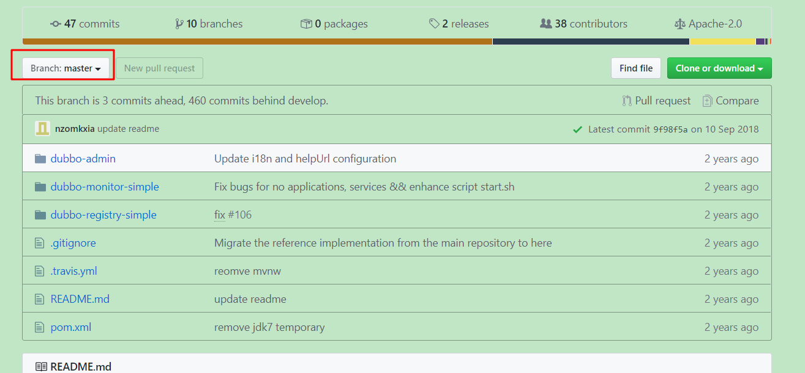

# Dubbo+zookeeper

我们讨论过Nginx+tomcat组成的集群，这已经是非常灵活的集群技术，但是当我们的系统遇到更大的瓶颈，全部应用的单点服务器已经不能满足我们的需求，这时，我们要考虑另外一种，我们熟悉的内容，就是分布式，而当下流行的Dubbo框架。

# 一，背景

  以前我们需要远程调用他人的接口，我们是这么做的：


### 我们遇到的问题：

​    (1) 当服务越来越多时，服务URL配置管理变得非常困难，F5硬件负载均衡器的单点压力也越来越大。
此时需要一个服务注册中心，动态的注册和发现服务，使服务的位置透明。
并通过在消费方获取服务提供方地址列表，实现软负载均衡和Failover，降低对F5硬件负载均衡器的依赖，也能减少部分成本。
​    (2) 当进一步发展，服务间依赖关系变得错踪复杂，甚至分不清哪个应用要在哪个应用之前启动，架构师都不能完整的描述应用的架构关系。
这时，需要自动画出应用间的依赖关系图，以帮助架构师理清理关系。
​    (3) 接着，服务的调用量越来越大，服务的容量问题就暴露出来，这个服务需要多少机器支撑？什么时候该加机器？
​    为了解决这些问题，第一步，要将服务现在每天的调用量，响应时间，都统计出来，作为容量规划的参考指标。
​    其次，要可以动态调整权重，在线上，将某台机器的权重一直加大，并在加大的过程中记录响应时间的变化，直到响应时间到达阀值，记录此时的访问量，再以此访问量乘以机器数反推总容量。

###  为解决这些问题，Dubbo为我们做了什么呢：


## 负载均衡：


###    架构如图：


# Dubbo与Zookeeper、SpringBoot整合使用

 Zookeeper作为Dubbo服务的注册中心，Dubbo原先基于数据库的注册中心，没采用Zookeeper，Zookeeper一个分布式的服务框架，是树型的目录服务的数据存储，能做到集群管理数据 ，这里能很好的作为Dubbo服务的注册中心，Dubbo能与Zookeeper做到集群部署，当提供者出现断电等异常停机时，Zookeeper注册中心能自动删除提供者信息，当提供者重启时，能自动恢复注册数据，以及订阅请求。我们先在linux上安装Zookeeper，我们安装最简单的单点，集群比较麻烦。


单机模式

​    单机安装非常简单，只要获取到 Zookeeper 的压缩包并解压到某个目录如：C:\zookeeper-3.4.5\下，Zookeeper 的启动脚本在 bin 目录下，Windows 下的启动脚本是 zkServer.cmd。

​    在你执行启动脚本之前，还有几个基本的配置项需要配置一下，Zookeeper 的配置文件在 conf 目录下，这个目录下有 zoo_sample.cfg 和 log4j.properties，你需要做的就是将 zoo_sample.cfg 改名为 zoo.cfg，因为 Zookeeper 在启动时会找这个文件作为默认配置文件。下面详细介绍一下，这个配置文件中各个配置项的意义。


# 配置dubbo-admin的管理页面，方便我们管理页面

gethub地址：https://github.com/apache/dubbo-admin/tree/master




下载并解压出文件


在cmd管理员窗口，使用maven命令打包项目

```java
mvn clean package -Dmaven.test.skip=true
```


打包成功：


启动zookeeper服务，执行dubbo-admin-0.0.1-SNAPSHOT.jar


执行完毕，去访问一下：http://localhost:7001/  输出默认账号密码：root-root


zookeeper：注册中心

dubbo-admin：是一个监控管理后台，查看我们注册了哪些服务，哪些服务被消费了

dubbo：jar包


测试demo

一、新建SpringBoot项目

- provider-server 服务提供者
- consumer-server 消费者

1、导入pom依赖

```xml
<!--导入dubbo依赖-->
        <!-- https://mvnrepository.com/artifact/org.apache.dubbo/dubbo-spring-boot-starter -->
        <dependency>
            <groupId>org.apache.dubbo</groupId>
            <artifactId>dubbo-spring-boot-starter</artifactId>
            <version>2.7.5</version>
        </dependency>
        <!-- https://mvnrepository.com/artifact/com.github.sgroschupf/zkclient -->
        <dependency>
            <groupId>com.github.sgroschupf</groupId>
            <artifactId>zkclient</artifactId>
            <version>0.1</version>
        </dependency>

        <!--日志冲突-->
        <!--引入zookeeper-->
        <dependency>
            <groupId>org.apache.curator</groupId>
            <artifactId>curator-framework</artifactId>
            <version>2.12.0</version>
        </dependency>
        <dependency>
            <groupId>org.apache.curator</groupId>
            <artifactId>curator-recipes</artifactId>
            <version>2.12.0</version>
        </dependency>


        <dependency>
            <groupId>org.apache.zookeeper</groupId>
            <artifactId>zookeeper</artifactId>
            <version>3.4.13</version>
            <exclusions>
                <exclusion>
                    <artifactId>log4j</artifactId>
                    <groupId>log4j</groupId>
                </exclusion>
                <exclusion>
                    <artifactId>org.slog4j</artifactId>
                    <groupId>slog4j-log4j12</groupId>
                </exclusion>
            </exclusions>
        </dependency>
```


步骤：

前提：zookeeper服务中心已开启

1、提供者提供服务

- 导入依赖
- 配置注册中心的地址，以及服务发现名，和扫描的包
- 在想要被注册的服务上面，增加一个@Service

2、消费者如何消费

- 导入依赖
- 配置注册中心的地址，配置自己的服务名
- 从远程注入服务 @Reference

