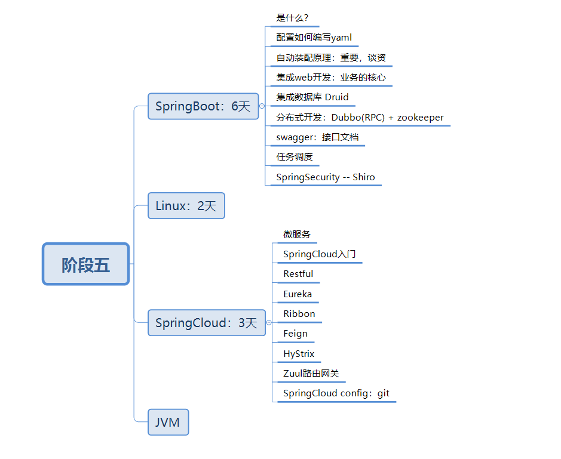
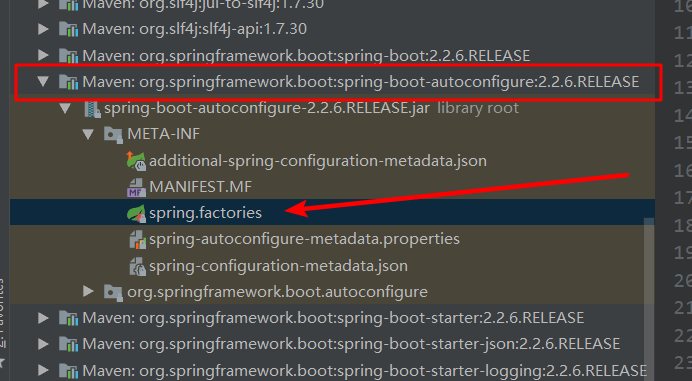

# 微服务




## 回顾什么是Spring

Spring是一个开源框架，2003 年兴起的一个轻量级的Java 开发框架，作者：Rod Johnson  。

**Spring是为了解决企业级应用开发的复杂性而创建的，简化开发。**


## Spring是如何简化Java开发的

为了降低Java开发的复杂性，Spring采用了以下4种关键策略：

1、基于POJO的轻量级和最小侵入性编程，所有东西都是bean；

2、通过IOC，依赖注入（DI）和面向接口实现松耦合；

3、基于切面（AOP）和惯例进行声明式编程；

4、通过切面和模版减少样式代码，RedisTemplate，xxxTemplate；


## 什么是SpringBoot

学过javaweb的同学就知道，开发一个web应用，从最初开始接触Servlet结合Tomcat, 跑出一个Hello Wolrld程序，是要经历特别多的步骤；后来就用了框架Struts，再后来是SpringMVC，到了现在的SpringBoot，过一两年又会有其他web框架出现；你们有经历过框架不断的演进，然后自己开发项目所有的技术也在不断的变化、改造吗？建议都可以去经历一遍；

言归正传，什么是SpringBoot呢，就是一个javaweb的开发框架，和SpringMVC类似，对比其他javaweb框架的好处，官方说是简化开发，约定大于配置，  you can "just run"，能迅速的开发web应用，几行代码开发一个http接口。

所有的技术框架的发展似乎都遵循了一条主线规律：从一个复杂应用场景 衍生 一种规范框架，人们只需要进行各种配置而不需要自己去实现它，这时候强大的配置功能成了优点；发展到一定程度之后，人们根据实际生产应用情况，选取其中实用功能和设计精华，重构出一些轻量级的框架；之后为了提高开发效率，嫌弃原先的各类配置过于麻烦，于是开始提倡“约定大于配置”，进而衍生出一些一站式的解决方案。

是的这就是Java企业级应用->J2EE->spring->springboot的过程。

随着 Spring 不断的发展，涉及的领域越来越多，项目整合开发需要配合各种各样的文件，慢慢变得不那么易用简单，违背了最初的理念，甚至人称配置地狱。Spring Boot 正是在这样的一个背景下被抽象出来的开发框架，目的为了让大家更容易的使用 Spring 、更容易的集成各种常用的中间件、开源软件；

Spring Boot 基于 Spring 开发，Spirng Boot 本身并不提供 Spring 框架的核心特性以及扩展功能，只是用于快速、敏捷地开发新一代基于 Spring 框架的应用程序。也就是说，它并不是用来替代 Spring 的解决方案，而是和 Spring 框架紧密结合用于提升 Spring 开发者体验的工具。Spring Boot 以**约定大于配置的核心思想**，默认帮我们进行了很多设置，多数 Spring Boot 应用只需要很少的 Spring 配置。同时它集成了大量常用的第三方库配置（例如 Redis、MongoDB、Jpa、RabbitMQ、Quartz 等等），Spring Boot 应用中这些第三方库几乎可以零配置的开箱即用。

简单来说就是SpringBoot其实不是什么新的框架，它默认配置了很多框架的使用方式，就像maven整合了所有的jar包，spring boot整合了所有的框架 。

Spring Boot 出生名门，从一开始就站在一个比较高的起点，又经过这几年的发展，生态足够完善，Spring Boot 已经当之无愧成为 Java 领域最热门的技术。


# 原理初探

自动配置：

pom.xml

- **spring-boot-dependencies**：核心依赖在父工程中
- 在写入或者引入一些SpringBoot依赖的时候，不需要指定版本，就是因为有些版本仓库


启动器

- ```java
  <dependency>
      <groupId>org.springframework.boot</groupId>
      <artifactId>spring-boot-starter</artifactId>
  </dependency>
  ```

- 启动器：说白了就是SpringBoot的启动场景；

- 比如spring-boot-starter-web，他就会帮我们自动导入web环境所有的依赖！

- SpringBoot会将所有的场景的功能场景，都变成一个个启动器

- 如果我们要使用什么功能，就只需要找到对应的启动器就可以了 starter


主程序

```java
@SpringBootApplication //标注这个类是一个SpringBoot的应用
public class Springboot01HelloworldApplication {

    public static void main(String[] args) {
        //将SpringBoot应用启动
        SpringApplication.run(Springboot01HelloworldApplication.class, args);
    }
}
```

- 注解

  ```java
  @SpringBootConfiguration：SpringBoot的配置
      @Configuration：spring配置类
      @Component：说明这也是一个spring的组件
  
  @EnableAutoConfiguration：自动配置
      @AutoConfigurationPackage：自动配置包
      	@Import(AutoConfigurationPackages.Registrar.class)：自动配置‘包注册’
  	@Import(AutoConfigurationImportSelector.class)：自动配置导入选择
      
      //获取所有配置
      List<String> configurations = getCandidateConfigurations(annotationMetadata, attributes);
  ```

  

  获取候选的配置

  ```java
  protected List<String> getCandidateConfigurations(AnnotationMetadata metadata, AnnotationAttributes attributes) {
  		List<String> configurations = SpringFactoriesLoader.loadFactoryNames(getSpringFactoriesLoaderFactoryClass(),
  				getBeanClassLoader());
  		Assert.notEmpty(configurations, "No auto configuration classes found in META-INF/spring.factories. If you "
  				+ "are using a custom packaging, make sure that file is correct.");
  		return configurations;
  	}
  ```

   META-INF/spring.factories: 自动配置的核心文件

  

  

```java
所有的资源加载到配置类中
Properties properties = PropertiesLoaderUtils.loadProperties(resource);
```


结论：

SpringBoot所有的自动配置都是在启动的时候扫描加载：spring.factories所有的自动配置类都在这里面，但是不一定全部生效，要条件判断是否成立，只要导入对用start，就有对应的启动器了，有了启动器我们自动配置就会生效，然后自动配置成功！

1. SpringBoot在启动的时候，从类路径下/META/INF/spring.factories获取指定的值；
2. 将这些自动配置的类导入容器，自动配置就会生效，帮我们进行自动配置！
3. 以前我们需要自动配置的东西，现在SpringBoot帮我们做了！
4. 整合javaEE，解决方案和自动配置的东西都在spring-boot-autoconfigure-2.2.6.RELEASE.jar这个包下
5. 它会把所有需要导入的组件，以类名的方式返回，这些组件就会被添加到容器；
6. 容器中也会存在非常多的xxxAutoConfiguration的文件（@Bean），就是这些类给容器导入了这个场景需要的所有组件；

# SpringBoot配置


