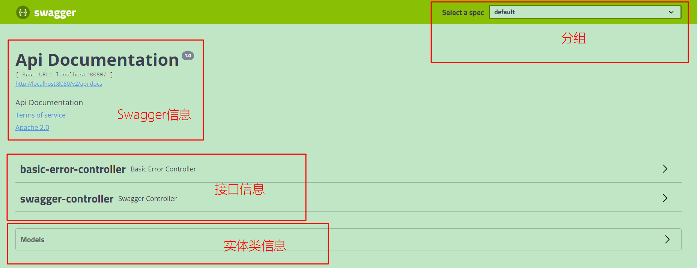

# 一、swagger是什么？

1、是一款让你更好的书写API文档的规范且完整框架。

2、提供描述、生产、消费和可视化RESTful Web Service。

3、是由庞大工具集合支撑的形式化规范。这个集合涵盖了从终端用户接口、底层代码库到商业API管理的方方面面。

# 二、SpringBoot集成Swagger2

1、导入pom依赖

```xml
<!-- https://mvnrepository.com/artifact/io.springfox/springfox-swagger2 -->
<dependency>
    <groupId>io.springfox</groupId>
    <artifactId>springfox-swagger2</artifactId>
    <version>2.9.2</version>
</dependency>

<!-- https://mvnrepository.com/artifact/io.springfox/springfox-swagger-ui -->
<dependency>
    <groupId>io.springfox</groupId>
    <artifactId>springfox-swagger-ui</artifactId>
    <version>2.9.2</version>
</dependency>

```

2、编写HelloController测试项目

3、配置Swagger -->Config

```java
@Configuration
@EnableSwagger2  //开启Swagger2
public class SwaggerConfig {
    
}
```

运行测试：http://localhost:8080/swagger-ui.html




配置Swagger信息

```java
@Configuration
@EnableSwagger2  //开启Swagger2
public class SwaggerConfig {

    //配置Swagger的Docket的bean实例
    @Bean
    public Docket docket(){
        return new Docket(DocumentationType.SWAGGER_2)
                .apiInfo(apiInfo());
    }

    //配置swagger信息apiInfo
    @Bean
    public ApiInfo apiInfo(){
        //作者信息
        Contact contact = new Contact("可乐", "cokecoke.top", "359100378@qq.com");
        return new ApiInfo(
                "可乐的Swagger API文档",
                "人生苦短，不想输，就别懒！",
                "1.0",
                "cokecoke.top",
                contact,
                "Apache 2.0",
                "http://www.apache.org/licenses/LICENSE-2.0",
                new ArrayList());
    }

}
```

Swagger配置扫描接口

```java
 @Bean
    public Docket docket(){
        return new Docket(DocumentationType.SWAGGER_2)
                .apiInfo(apiInfo())
                .select()
                //RequestHandlerSelectors 配置要扫描接口的方式
                //basePackage：指定要扫描的包
                //any():全部扫描
                //none():不扫描
                //withClassAnnotation():扫描类上的注解，参数是一个注解的反射对象
                //withMethodAnnotation():扫描方法上的注解
                .apis(RequestHandlerSelectors.basePackage("com.coke.swagger.controller"))
                //指定过滤路径
                //.paths(PathSelectors.ant("/coke/**"))
                .build();
    }
```

配置是否启动swagger

```java
	@Bean
    public Docket docket(){
        return new Docket(DocumentationType.SWAGGER_2)
                .apiInfo(apiInfo())
                .enable(false)//enable是否启用swagger  true&false
                .select()
                .apis(RequestHandlerSelectors.basePackage("com.coke.swagger.controller"))
                .build();
    }
```


如何设置Swagger只在生产环境使用，再发布的时候不使用？

- 判断是不是生产环境
- 注入enable（） true&false

设置项目当前项目环境application.properties

```properties
#application.properties 激活开发环境
spring.profiles.active=dev

#application-dev.properties
server.port=8080

#application-pro.properties
server.port=8081
```

设置要显示的swagger环境，通过environment。acceptsProfiles判断是否处在自己设定的环境当中

```java
@Bean
    public Docket docket(Environment environment){

        //设置要显示的swagger环境
        Profiles profiles = Profiles.of("dev","test");
        //通过environment。acceptsProfiles判断是否处在自己设定的环境当中
        boolean flag = environment.acceptsProfiles(profiles);

        return new Docket(DocumentationType.SWAGGER_2)
                .apiInfo(apiInfo())
                .groupName("可乐")
                .enable(flag)//enable是否启用swagger  true&false
                .select()
                .apis(RequestHandlerSelectors.basePackage("com.coke.swagger.controller"))
                .build();
    }
```


配置API文档的分组，多个Docket实例即可

```java
	@Bean
    public Docket docket1(){
        return new Docket(DocumentationType.SWAGGER_2).groupName("A");
    }
    @Bean
    public Docket docket2(){
        return new Docket(DocumentationType.SWAGGER_2).groupName("B");
    }
    @Bean
    public Docket docket3(){
        return new Docket(DocumentationType.SWAGGER_2).groupName("C");
    }
```


实体类配置：

```java
@ApiModel("用户实体类")
public class User {
    @ApiModelProperty("用户名")
    public String username;
    @ApiModelProperty("密码")
    public String password;
}

```

controller

```java
@RestController
public class SwaggerController {

    @GetMapping("/hello")
    public String hello(){
        return "hello";
    }

    @ApiOperation("Post测试类")
    @PostMapping("/post")
    public User getUser(@ApiParam("用户名")User user){
        int i = 5/0;
        return user;
    }

    @ApiOperation("Hello控制类")
    @GetMapping("/hello2")
    public String hello2(@ApiParam("用户名") String username){
        return "hello"+username;
    }
}
```


总结：

- 可以通过Swagger给一些比较难理解的属性或者接口，增加注释信息
- 接口文档实时更新
- 可以在线测试

注意：正式发布项目的时候，关闭swagger！处于安全考虑，而且节省运行内存。


