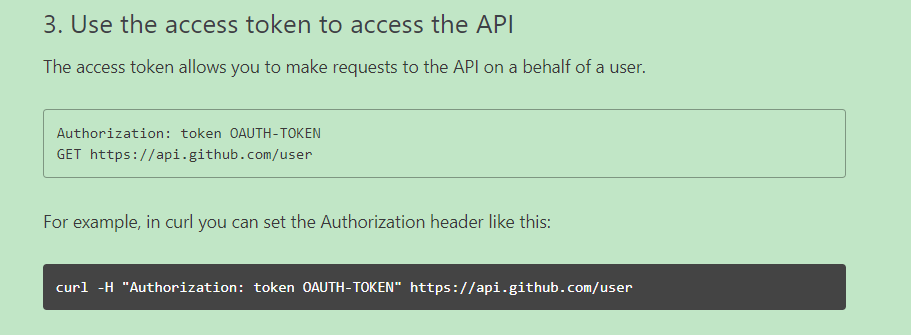
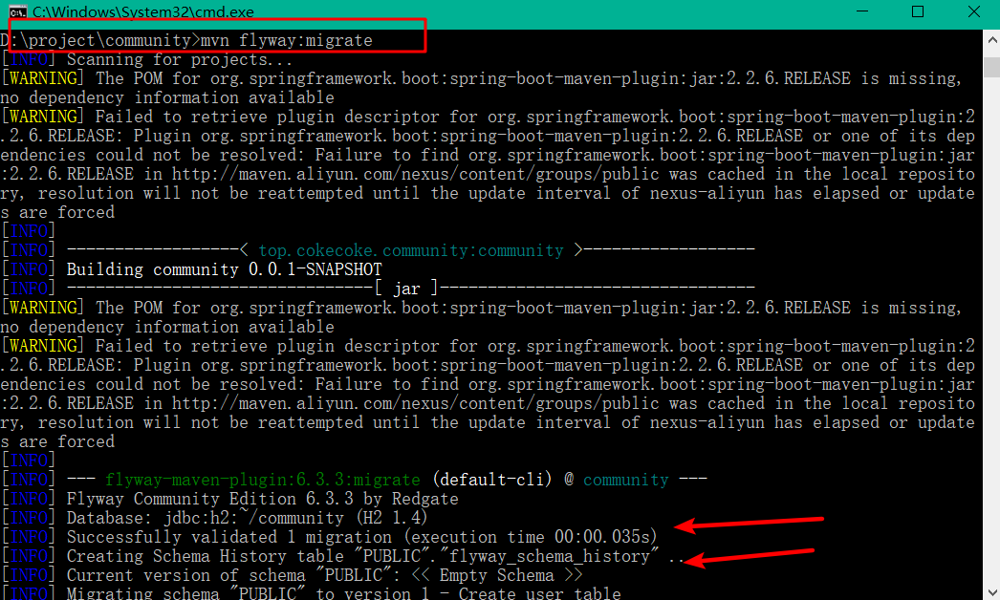
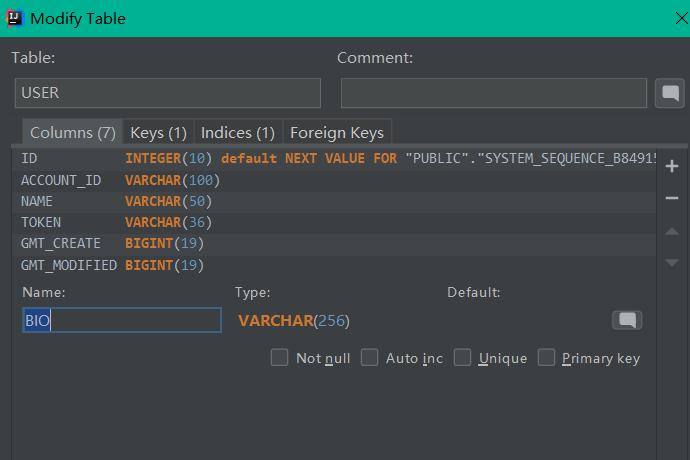

# 码匠笔记项目


# 简介

开源论坛、问答系统，现有功能提问、回复、通知、最新、最热、消除零回复功能。功能持续更新中…… 技术栈 Spring、Spring Boot、MyBatis、MySQL/H2、Bootstrap 

模仿elasticsearch中文社区使用SpringBoot搭建开源论坛项目

gitee:https://gitee.com/cokecoke/community


# 一、环境准备

工具：IDEA

JDK：1.8

Maven：6.1

使用IDE初始化SpringBoot community项目


编写HelloWorld运行测试成功！

# 二、编码

## 1、项目准备

1.1、使用gitee管理代码


1.2、分析页面，使用Bootstrap快速搭建前端页面


## 2、获取前端页面

2.1、下载bootstrap并引入样式


```html
<!DOCTYPE HTML>
<html xmlns:th="http://www.thymeleaf.org">
<head>
    <title>码匠笔记</title>
    <meta http-equiv="Content-Type" content="text/html; charset=UTF-8" />
    <link rel="stylesheet" href="../static/css/bootstrap.min.css"/>
    <link rel="stylesheet" href="../static/css/bootstrap-theme.min.css"/>
    <script src="../static/js/bootstrap.min.js"></script>
</head>
<body>
<p th:text="'Hello, ' + ${name} + '!'" />
</body>
</html>
```


bootstrap获取实例：https://v3.bootcss.com/components/#navbar


修改部分样式

```html
<nav class="navbar navbar-default">
    <div class="container-fluid">

        <div class="navbar-header">
            <button type="button" class="navbar-toggle collapsed" data-toggle="collapse" data-target="#bs-example-navbar-collapse-1" aria-expanded="false">
                <span class="sr-only">码匠社区</span>
                <span class="icon-bar"></span>
                <span class="icon-bar"></span>
                <span class="icon-bar"></span>
            </button>
            <a class="navbar-brand" href="#">码匠社区</a>
        </div>

        <div class="collapse navbar-collapse" id="bs-example-navbar-collapse-1">
            <form class="navbar-form navbar-left">
                <div class="form-group">
                    <input type="text" class="form-control" placeholder="搜索问题">
                </div>
                <button type="submit" class="btn btn-default">搜索</button>
            </form>
            <ul class="nav navbar-nav navbar-right">
                <li><a href="#>登录</a></li>
                <li class="dropdown">
                    <a href="#" class="dropdown-toggle" data-toggle="dropdown" role="button"
                       aria-haspopup="true" aria-expanded="false">我<span class="caret"></span></a>
                    <ul class="dropdown-menu">
                        <li><a href="#">消息中心</a></li>
                        <li><a href="#">个人资料</a></li>
                        <li><a href="#">退出登录</a></li>
                    </ul>
                </li>
            </ul>
        </div>
    </div>
</nav>

```


效果：


## 3、登录功能实现

使用GitHub API实现第三方登录

地址：https://developer.github.com/apps/building-oauth-apps/authorizing-oauth-apps/

### 1、创建OAuth Apps


### 2、注册新的OAuth应用程序


### 3、得到Client ID、Client Secret


### 4、步骤

- 调用GitHub获取授权，设置`redirect_uri`回调地址，并返回code

- ```java
  https://github.com/login/oauth/authorize
  ```

- 接收返回的code，服务端模拟POST请求，调用access_token并传递code，返回access_token签名

- ```java
  https://github.com/login/oauth/access_token
  
  //签名
  access_token=e72e16c7e42f292c6912e7710c838347ae178b4a&token_type=bearer
  ```

- 通过签名再次调用GitHub API，获取user，得到具体用户信息

- ```java
  https://api.github.com/user
  ```


### 5、模拟请求

```
Client ID
7dee50860d88167df3f5
Client Secret
4df10e997ec47d60e36c6192bd433fba600f0c12
```

5.1、修改登录a连接请求地址

- 1、请求的地址：https://github.com/login/oauth/authorize
- 2、回调的地址：http://localhost:8887/callback
- 3、scope：授权列表
- 4、state：跨站使用信息

```html
<li th:if="${session.user == null}">
    
     <a href="https://github.com/login/oauth/authorize?client_id=7dee50860d88167df3f5&redirect_uri=http://localhost:8887/callback&scope=user&state=1">登录	</a>
    
</li>
```


5.2、编写代码，接收返回

- 这里使用第三方工具OKHttp，模拟POST请求，获取access_token

简介：

HTTP是现代应用常用的一种交换数据和媒体的网络方式，高效地使用HTTP能让资源加载更快，节省带宽。OkHttp是一个高效的HTTP客户端，它有以下默认特性：

- 支持HTTP/2，允许所有同一个主机地址的请求共享同一个socket连接
- 连接池减少请求延时
- 透明的GZIP压缩减少响应数据的大小
- 缓存响应内容，避免一些完全重复的请求

当网络出现问题的时候OkHttp依然坚守自己的职责，它会自动恢复一般的连接问题，如果你的服务有多个IP地址，当第一个IP请求失败时，OkHttp会交替尝试你配置的其他IP，OkHttp使用现代TLS技术(SNI, ALPN)初始化新的连接，当握手失败时会回退到TLS 1.0。

```java
//认证
@Controller 
public class AuthorizeController {

    @GetMapping("/callback")
    public String callback(@RequestParam(name="code")String code,
                           @RequestParam(name="state")String state){
            return "index";
        }
    }
}
```

编写针对第三方业务的实体类

- ```java
  @Component
  public class GithubProvider {}
  ```

- 封装需要的参数为对象


```java
@Data
@AllArgsConstructor
@NoArgsConstructor
public class AccessTokenDTO {
    private String client_id;
    private String client_secret;
    private String code;
    private String redirect_uri;
    private String state;
}
```

编写POST请求方法

- 引入OkHttp需要的依赖

- ```xml
  <!-- https://mvnrepository.com/artifact/com.squareup.okhttp3/okhttp -->
  <dependency>
      <groupId>com.squareup.okhttp3</groupId>
      <artifactId>okhttp</artifactId>
      <version>4.4.1</version>
  </dependency>
  <!-- https://mvnrepository.com/artifact/com.alibaba/fastjson -->
  <dependency>
      <groupId>com.alibaba</groupId>
      <artifactId>fastjson</artifactId>
      <version>1.2.68</version>
  </dependency>
  ```

  处理GitHub请求的access_token

  ```java
  @Component
  public class GithubProvider {
  
      public String getAccessToken(AccessTokenDTO accessTokenDTO){
          MediaType mediaType = MediaType.get("application/json; charset=utf-8");
          OkHttpClient client = new OkHttpClient();
  
          RequestBody body = RequestBody.create(mediaType, JSON.toJSONString(accessTokenDTO));
          Request request = new Request.Builder()
                  .url("https://github.com/login/oauth/access_token")
                  .post(body)
                  .build();
          try (Response response = client.newCall(request).execute()) {
              String string = response.body().string();
              System.out.println(string);//查看获取的access_token
              return string;
          } catch (Exception e) {
              e.printStackTrace();
          }
          return null;
      }
  }
  ```

  

  ```java
  //认证
  @Controller 
  public class AuthorizeController {
  
      @GetMapping("/callback")
      public String callback(@RequestParam(name="code")String code,
                             @RequestParam(name="state")String state){
          AccessTokenDTO accessTokenDTO = new AccessTokenDTO();
          accessTokenDTO.setClient_id("7dee50860d88167df3f5");
          accessTokenDTO.setClient_secret("4df10e997ec47d60e36c6192bd433fba600f0c12");
          accessTokenDTO.setCode(code);
          accessTokenDTO.setState(state);
          accessTokenDTO.setRedirect_uri("http://localhost:8887/callback");
          String accessToken = githubProvider.getAccessToken(accessTokenDTO);
              return "index";
          }
      }
  }
  ```

  

使用访问令牌访问API

- ```java
  https://api.github.com/user
  ```



创建个人访问令牌

- e97be73ee3b4739b6b78ced7c20b2611b23c7e80


拿到token，验证是否通过token获取GitHub返回数据

- 为了不影响当前GitHub登录状态，使用浏览器无痕模式，匿名请求测试
- Ctrl+shift


验证成功，继续编写方法，通过Get请求，获取用户信息

- 编写对应对象，接收参数

- ```java
  @Data
  @AllArgsConstructor
  @NoArgsConstructor
  public class GithubUser {
      private String name;
      private Long id;
      private String bio;
  }
  ```

- ```java
  @Component
  public class GithubProvider {
  
      public GithubUser getUser(String accessToken){
          OkHttpClient client = new OkHttpClient();
  
          Request request = new Request.Builder()
                  .url("https://api.github.com/user?access_token="+accessToken)
                  .build();
          try{
              Response response = client.newCall(request).execute();
              String string = response.body().string();
              //使用JSON转换java对象
              GithubUser githubUser = JSON.parseObject(string, GithubUser.class);
              return githubUser;
          } catch (IOException e) {
              e.printStackTrace();
              return null;
          }
  
      }
  }
  ```

启动项目，点击登录，获取access_token


拆分access_token截取：d426d3959c71c6e854cf28a971a880aca237405e&scope

```java
public String getAccessToken(AccessTokenDTO accessTokenDTO){
        MediaType mediaType = MediaType.get("application/json; charset=utf-8");
        OkHttpClient client = new OkHttpClient();

        RequestBody body = RequestBody.create(mediaType, JSON.toJSONString(accessTokenDTO));
        Request request = new Request.Builder()
                .url("https://github.com/login/oauth/access_token")
                .post(body)
                .build();
        try (Response response = client.newCall(request).execute()) {
            String string = response.body().string();
            String token = string.split("&")[0].split("=")[1];//拆分access_token
            return token;
        } catch (Exception e) {
            e.printStackTrace();
        }
        return null;
    }
```

执行打印查看是否获取user信息

```java
//认证
@Controller 
public class AuthorizeController {

    @GetMapping("/callback")
    public String callback(@RequestParam(name="code")String code,
                           @RequestParam(name="state")String state){
        AccessTokenDTO accessTokenDTO = new AccessTokenDTO();
        accessTokenDTO.setClient_id("7dee50860d88167df3f5");
        accessTokenDTO.setClient_secret("4df10e997ec47d60e36c6192bd433fba600f0c12");
        accessTokenDTO.setCode(code);
        accessTokenDTO.setState(state);
        accessTokenDTO.setRedirect_uri("http://localhost:8887/callback");
        String accessToken = githubProvider.getAccessToken(accessTokenDTO);
        GithubUser githubUser = githubProvider.getUser(accessToken);
        System.out.println(githubUser.getName());
            return "index";
        }
    }
}
```


### 6、优化代码

不同环境读取不同的配置文件

- 配置：application.properties

```properties
github.client.id=7dee50860d88167df3f5
github.client.secret=4df10e997ec47d60e36c6192bd433fba600f0c12
github.redirect.uri=http://localhost:8887/callback
```

- 引用

```java
//认证
@Controller 
public class AuthorizeController {
    
    @Autowired
    private GithubProvider githubProvider;

    @Value("${github.client.id}")
    private String clientId;

    @Value("${github.client.secret}")
    private String clientSecret;

    @Value("${github.redirect.uri}")
    private String redirectUri;

    @GetMapping("/callback")
    public String callback(@RequestParam(name="code")String code,
                           @RequestParam(name="state")String state,
                          HttpServletRequest request){
        AccessTokenDTO accessTokenDTO = new AccessTokenDTO();
        accessTokenDTO.setClient_id(clientId);
        accessTokenDTO.setClient_secret(clientSecret);
        accessTokenDTO.setCode(code);
        accessTokenDTO.setState(state);
        accessTokenDTO.setRedirect_uri(redirectUri);
        String accessToken = githubProvider.getAccessToken(accessTokenDTO);
        GithubUser githubUser = githubProvider.getUser(accessToken);
            return "index";
        }
    }
}
```


### 7、Session & Cookie

获取到user实例成功，存入session会话，实现登录校验

- 引入pom依赖

- ```xml
  <dependency>
      <groupId>org.springframework.boot</groupId>
      <artifactId>spring-boot-starter-thymeleaf</artifactId>
  </dependency>
  ```

```java
if (user != null){
    //登录成功，写cookie和session
    request.getSession().setAttributer("user",user);
    return "redirect:/";
}else {
    //登录失败，重新登录
    return "redirect:/";
}
```

html页面

```html
<ul class="nav navbar-nav navbar-right">
    <li th:if="${session.user == null}">
        <a href="https://github.com/login/oauth/authorize?client_id=7dee50860d88167df3f5&redirect_uri=http://localhost:8887/callback&scope=user&state=1">登录		    </a>
	</li>
    <li class="dropdown" th:if="${session.user != null}">
        <a href="#" class="dropdown-toggle" data-toggle="dropdown" role="button"
           aria-haspopup="true" aria-expanded="false" th:text="${session.user.getName()}"><span class="caret"></span></a>
        <ul class="dropdown-menu">
            <li><a href="#">消息中心</a></li>
            <li><a href="#">个人资料</a></li>
            <li><a href="#">退出登录</a></li>
        </ul>
    </li>
</ul>
```

没有登录或登录不成功显示登录状态，登录成功显示个人信息状态


## 4、H2使用

简介：

**H2**是一个[Java](https://baike.baidu.com/item/Java)编写的[关系型数据库](https://baike.baidu.com/item/关系型数据库)，它可以被嵌入Java应用程序中使用，或者作为一个单独的数据库服务器运行。

H2数据库的前身是 HypersonicSQL，它的名字的含义是 Hypersonic2，但是它的代码是从头开始编写的，没有使用HypersonicSQL或者[HSQLDB](https://baike.baidu.com/item/HSQLDB)的代码。 [1]

使用：

- 引入pom依赖

- ```xml
  <!-- https://mvnrepository.com/artifact/com.h2database/h2 -->
  <dependency>
      <groupId>com.h2database</groupId>
      <artifactId>h2</artifactId>
      <version>1.4.200</version>
  </dependency>
  ```


连接配置H2数据库


## 5、集成Mybatis

- 引入pom依赖

- ```xml
  <!--mybatis-->
  <dependency>
      <groupId>org.mybatis.spring.boot</groupId>
      <artifactId>mybatis-spring-boot-starter</artifactId>
      <version>2.1.1</version>
  </dependency>
  
  <dependency>
      <groupId>org.springframework.boot</groupId>
      <artifactId>spring-boot-starter-jdbc</artifactId>
  </dependency>
  ```

- 配置数据库连接

- ```properties
  spring.datasource.url=jdbc:h2:~/community
  spring.datasource.username=sa
  spring.datasource.password=123
  spring.datasource.driver-class-name=org.h2.Driver
  ```

- 编写实体类

- ```java
  @Data
  @NoArgsConstructor
  @AllArgsConstructor
  public class User {
      private Integer id;
      private String name;
      private String account_id;
      private String token;
      private Long gmt_create;
      private Long gmt_modified;
      private String bio;
      private String avatar_url;
  }
  ```

- 编写Mybatis映射文件UserMapper

- ```java
  @Mapper
  public interface UserMapper {
  
      @Insert("insert into user(name,account_id,token,gmt_create,gmt_modified,bio,avatar_url) values(#{name},#{account_id},#{token},#{gmt_create},#{gmt_modified},#{bio},#{avatar_url})")
      void insert(User user);
  }
  
  ```

- 使用

- ```java
  //认证
  @Controller 
  public class AuthorizeController {
      
      @Autowired
      private GithubProvider githubProvider;
  
      @Value("${github.client.id}")
      private String clientId;
  
      @Value("${github.client.secret}")
      private String clientSecret;
  
      @Value("${github.redirect.uri}")
      private String redirectUri;
      
      @Autowired
      UserMapper userMapper;
  
      @GetMapping("/callback")
      public String callback(@RequestParam(name="code")String code,
                             @RequestParam(name="state")String state,
                            HttpServletRequest request){
          AccessTokenDTO accessTokenDTO = new AccessTokenDTO();
          accessTokenDTO.setClient_id(clientId);
          accessTokenDTO.setClient_secret(clientSecret);
          accessTokenDTO.setCode(code);
          accessTokenDTO.setState(state);
          accessTokenDTO.setRedirect_uri(redirectUri);
          String accessToken = githubProvider.getAccessToken(accessTokenDTO);
          GithubUser githubUser = githubProvider.getUser(accessToken);
          if (githubUser != null){
              User user = new User();
              user.setToken(UUID.randomUUID().toString());
              user.setName(githubUser.getName());
              user.setAccount_id(String.valueOf(githubUser.getId()));
              user.setGmt_create(System.currentTimeMillis());
              user.setGmt_modified(user.getGmt_create());
              userMapper.insert(user);
              //登录成功，写cookie和session
              request.getSession().setAttributer("user",user);
              return "redirect:/";
          }
              return "index";
          }
      }
  }
  ```

- 执行查看数据库


## 6、持久化登录状态

使用UUID持久化登录状态

```java
if (githubUser != null){
            User user = new User();
            String token = UUID.randomUUID().toString();//使用UUID持久化到数据库
            user.setToken(token);
            user.setName(githubUser.getName());
            user.setAccount_id(String.valueOf(githubUser.getId()));
            user.setGmt_create(System.currentTimeMillis());
            user.setGmt_modified(user.getGmt_create());
            userMapper.insert(user);//写入数据库
            response.addCookie(new Cookie("token",token));//响应token给浏览器，实现持久化
            return "redirect:/";
        }else {
            //登录失败，重新登录
            return "redirect:/";
        }
```


遍历Cookie，判断浏览器是否存在用户token

```java
@Controller
public class IndexController {

    @Autowired
    private UserMapper userMapper;

    @GetMapping("/")
    public String hello(HttpServletRequest request){
        Cookie[] cookies = request.getCookies();
        for (Cookie cookie :cookies){
            if (cookie.getName().equals("token")){
                String token = cookie.getValue();
                User user = userMapper.findByToken(token);
                if (user != null){
                    request.getSession().setAttribute("user",user);
                }
                break;
            }
        }

        return "index";
    }
}
```


## 7、集成Flyway Migration

- 导入pom依赖

- ```xml
  <plugin>
      <groupId>org.flywaydb</groupId>
      <artifactId>flyway-maven-plugin</artifactId>
      <version>6.3.3</version>
      <configuration>
          <url>jdbc:h2:~/community</url>
          <user>sa</user>
          <password>123</password>
      </configuration>
      <dependencies>
          <dependency>
              <groupId>com.h2database</groupId>
              <artifactId>h2</artifactId>
              <version>1.4.200</version>
          </dependency>
      </dependencies>
  </plugin>
  ```

- 在resource目录下创建db.migration目录

- 创建V_1*.sql格式的sql脚本

- ```sql
  CREATE TABLE USER
  (
      ID int AUTO_INCREMENT PRIMARY KEY NOT NULL,
      ACCOUNT_ID VARCHAR(100),
      NAME VARCHAR(50),
      TOKEN VARCHAR(36),
      GMT_CREATE BIGINT,
      GMT_MODIFIED BIGINT
  );
  ```

- 使用命令删除数据库  ==rm ~/community.*==

- 执行自动创建数据库命令  ==mvn flyway:migrate==

注意：如果idea的Termind不支持mvn命令


解决办法：

找到项目跟目录，使用cmd系统命令窗口，打开到项目根目录下执行命令即可



添加字段



- 创建V_1*.sql格式的sql脚本

- ```sql
  alter table USER add bio varchar(256);
  ```

- 执行自动创建数据库命令  ==mvn flyway:migrate==


## 8、bootstrap栅格系统

栅格系统用于通过一系列的行（row）与列（column）的组合来创建页面布局，你的内容就可以放入这些创建好的布局中。下面就介绍一下 Bootstrap 栅格系统的工作原理：

地址：https://v3.bootcss.com/css/#grid

- “行（row）”必须包含在 `.container` （固定宽度）或 `.container-fluid` （100% 宽度）中，以便为其赋予合适的排列（aligment）和内补（padding）。
- 通过“行（row）”在水平方向创建一组“列（column）”。
- 你的内容应当放置于“列（column）”内，并且，只有“列（column）”可以作为行（row）”的直接子元素。
- 类似 `.row` 和 `.col-xs-4` 这种预定义的类，可以用来快速创建栅格布局。Bootstrap 源码中定义的 mixin 也可以用来创建语义化的布局。
- 通过为“列（column）”设置 `padding` 属性，从而创建列与列之间的间隔（gutter）。通过为 `.row` 元素设置负值 `margin` 从而抵消掉为 `.container` 元素设置的 `padding`，也就间接为“行（row）”所包含的“列（column）”抵消掉了`padding`。
- 负值的 margin就是下面的示例为什么是向外突出的原因。在栅格列中的内容排成一行。
- 栅格系统中的列是通过指定1到12的值来表示其跨越的范围。例如，三个等宽的列可以使用三个 `.col-xs-4` 来创建。
- 如果一“行（row）”中包含了的“列（column）”大于 12，多余的“列（column）”所在的元素将被作为一个整体另起一行排列。
- 栅格类适用于与屏幕宽度大于或等于分界点大小的设备 ， 并且针对小屏幕设备覆盖栅格类。 因此，在元素上应用任何 `.col-md-*` 栅格类适用于与屏幕宽度大于或等于分界点大小的设备 ， 并且针对小屏幕设备覆盖栅格类。 因此，在元素上应用任何 `.col-lg-*` 不存在， 也影响大屏幕设备。
- 

### 8.1、页面布局


### 8.2、设计栅格系统自适应布局

```html
<div class="container-fluid">
    <div class="row">
        <div class="col-lg-9 col-md-12 col-sm-12 col-xs-12" 
             style="background-color: #3e1eff;height: 300px"></div>
        <div class="col-lg-3 col-md-12 col-sm-12 col-xs-12" 
             style="background-color: #1fff30;height: 300px"></div>
    </div>
</div>
```


抽取头部html

```html
<!--抽取头部信息-->
<nav class="navbar navbar-default" th:fragment="topbar">
```

引用头部HTML

```html
<!--头部-->
<div th:replace="~{commons/head::topbar}"></div>
```

## 9、调整页面

修改页面布局

```html
<div class="container-fluid main">
    <div class="row">
        <div class="col-lg-9 col-md-12 col-sm-12 col-xs-12">
            <h3><span class="glyphicon glyphicon-plus" aria-hidden="true"> 发起</span></h3>
            <hr>
            <form th:action="@{/publish}" method="post">
                <div class="form-group">
                    <label for="title">问题标题（简单扼要）</label>
                    <div th:class="${error_title != null?'alert alert-danger':'alert alert-success'}" role="alert">
                        <span th:text="${error_title}" th:if="${error_title != null}"></span>
                        <input type="text" class="form-control" name="title"  id="title" placeholder="问题标题...">
                    </div>
                </div>
                <div class="form-group">
                    <label for="description">问题补充（必填，请参照右侧提示）：</label>
                    <div th:class="${error_des != null?'alert alert-danger':'alert alert-success'}" role="alert">
                        <span th:text="${error_des}" th:if="${error_des != null}"></span>
                        <textarea name="description" class="form-control"  id="description" cols="30" rows="10"></textarea>
                    </div>
                </div>
                <div class="form-group">
                    <label for="title">添加标签：</label>
                    <div th:class="${error_tag != null?'alert alert-danger':'alert alert-success'}" role="alert">
                        <span th:text="${error_tag}" th:if="${error_tag != null}"></span>
                        <input type="text" class="form-control" name="tag" id="tag" placeholder="输入标签，以，号分割">
                    </div>
                </div>
                <button type="submit" class="btn btn-success btn-publish">发布</button>

            </form>
        </div>
        <div class="col-lg-3 col-md-12 col-sm-12 col-xs-12">
            <h3>问题发起指南</h3>
            · 问题标题：请用精简的语言描述您发布的问题，不超过25字<br>
            · 问题补充：详细补充您的问题内容，并确保问题描述清晰直观，并提供相关资料<br>
            · 选择标签：选择一个或多个适合的标签，用逗号隔开，每个标签不超过10个字<br>
        </div>
    </div>
</div>
```


判断信息为空返回提示信息

```java
@PostMapping("/publish")
    public String doPublish(
            @RequestParam(value = "title",required = false) String title,
            @RequestParam(value = "description",required = false)String description,
            @RequestParam(value = "tag",required = false) String tag,
            HttpServletRequest request,
            Model model){

        model.addAttribute("title",title);
        model.addAttribute("description",description);
        model.addAttribute("tag",tag);

        if (title == null || title == ""){
            model.addAttribute("error_title","标题不能为空");
           return "publish";
        }else if (description == null || description == ""){
            model.addAttribute("error_des","问题补充不能为空");
            return "publish";
        }else if (tag == null || tag == ""){
            model.addAttribute("error_tag","标签不能为空");
            return "publish";
        }
			......
}
```

主页面信息排版

```html
<div class="container-fluid main">
    <div class="row">
        <div class="col-lg-9 col-md-12 col-sm-12 col-xs-12">
            <h3><span class="glyphicon glyphicon-list" aria-hidden="true"> 发现</span></h3>
            <hr>

            <div class="media" th:each="question:${questions}">
                <div class="media-left">
                    <a href="#">
                        
                    </a>
                </div>
                <div class="media-body">
                    <h4 class="media-heading" th:text="${question.title}"></h4>
                    <span th:text="${question.description}"></span><br>
                    <span class="text-desc"><span th:text="${question.commentCount}"></span>个回复 •
                        <span th:text="${question.viewCount}"></span> 次浏览 •<span th:text="${#dates.format(question.gmtCreate,'yyyy-dd-MM HH:mm')}"></span></span>
                </div>
            </div>
        </div>
        <div class="col-lg-3 col-md-12 col-sm-12 col-xs-12">
            <h3>问题发起指南</h3>
            · 问题标题：请用精简的语言描述您发布的问题，不超过25字<br>
            · 问题补充：详细补充您的问题内容，并确保问题描述清晰直观，并提供相关资料<br>
            · 选择标签：选择一个或多个适合的标签，用逗号隔开，每个标签不超过10个字<br>
        </div>
    </div>
</div>
```

在IndexController添加方法查询页面信息

```java
 @GetMapping("/")
    public String hello(HttpServletRequest request,
                        Model model){
        Cookie[] cookies = request.getCookies();
        if (cookies != null && cookies.length != 0) {
            for (Cookie cookie : cookies) {
                if (cookie.getName().equals("token")) {
                    String token = cookie.getValue();
                    User user = userMapper.findByToken(token);
                    if (user != null) {
                        request.getSession().setAttribute("user", user);
                    }
                    break;
                }
            }
        }

        List<QuestionDTO> questionList = questionService.list();
        model.addAttribute("questions",questionList);
        return "index";
    }
```

添加Service层实现数据拼接

```java
@Service
public class QuestionService {

    @Autowired
    private QuestionMapper questionMapper;

    @Autowired
    private UserMapper userMapper;

    public List<QuestionDTO> list(){
        List<Question> questions = questionMapper.list();
        List<QuestionDTO> questionDTOList = new ArrayList<>();
        for (Question question : questions) {
            User user = userMapper.fingById(question.getCreator());
            QuestionDTO questionDTO = new QuestionDTO();
            BeanUtils.copyProperties(question,questionDTO);//拷贝属性
            questionDTO.setUser(user);
            questionDTOList.add(questionDTO);
        }
        return questionDTOList;
    }

}
```


