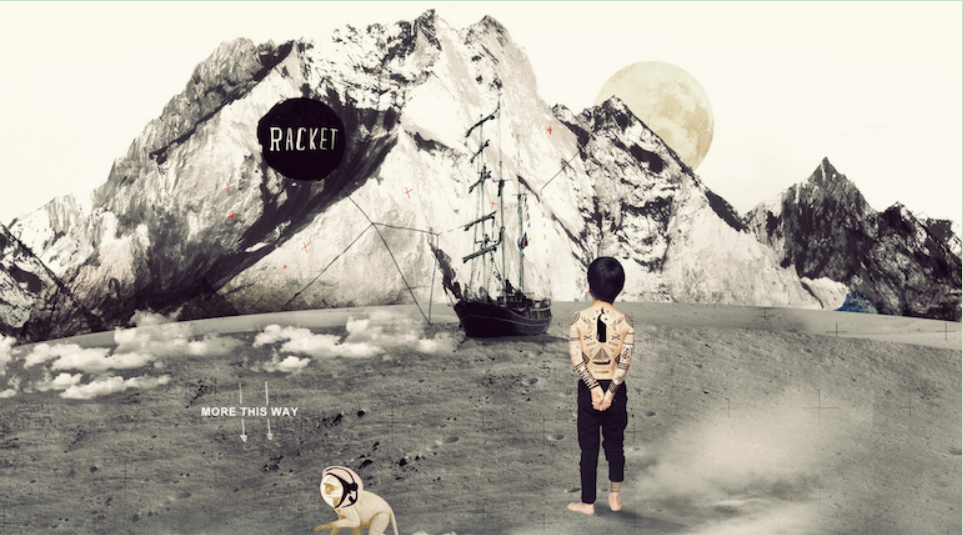
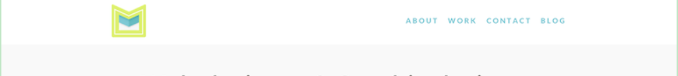
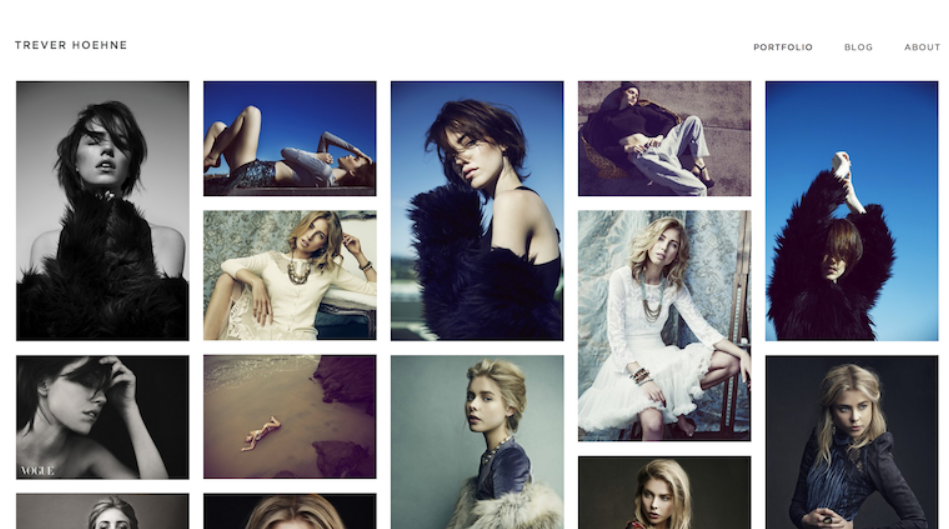
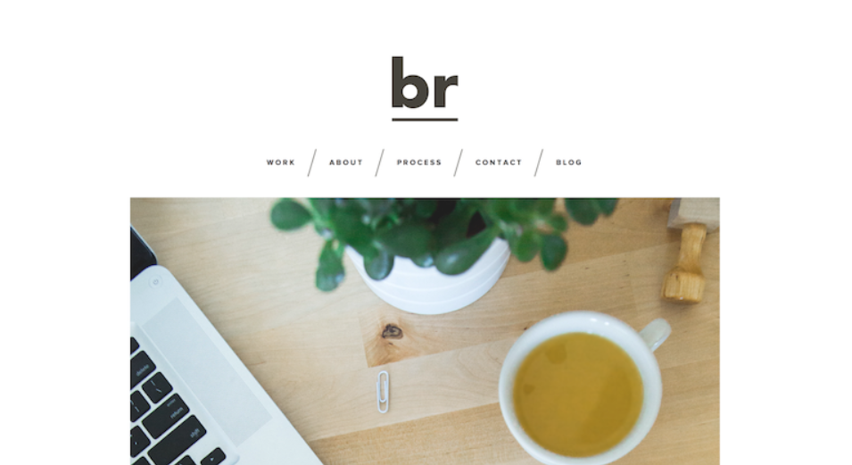

# ==**Blog计划书**==

### **概述**：

这是一个属于我们彼此的网站计划书，制作这个博客的初衷有两点：第一，是想有一个属于我们俩的个人小站，用来记录我们生活的点点滴滴；第二，作为计算机专业刚刚毕业的职场小白，打算以互联网行业谋生的两个人来说，现阶段正是迅速学习上升的阶段，充分利用空余时间提升自身价值；但是由于技术储备不足，现打算从最基础的H5、CSS、JS，构建这个小站,不过还是会使用到脚手架快速搭建页面雏形，后面通过不断的学习和进步，再逐步更新迭代，希望这种以项目驱动学习的方式能够让我们在未来的职业道路上少走些弯路。

### 需求设计：

- 首页
  - 仅用于进入主页前的全屏图像展示

- 主页
  - 动态logo，点击展示彼此信息及描述
  - 图床：展示所有精选图片，Blog动态图片自动展示到最前面
- Blog
  - 发表功能，图文小窗口并排两格
  - 评论功能
- 资源
  - 分享的资料，在线工具
- 关于
  - 声明

### 页面规划：

- 首页

全屏图像渐进式消失进入主页

- 主页

动态logo，点击展示彼此信息及描述

图床展示最新图像

- Blog

图文居中，显示标题

