# 联想G400黑苹果笔记

​		最近由于工作原因在家闲着，于是打算利用家里的闲置笔记本给自己添置一台黑苹果，由于之前装过台式的的黑苹果所以这次更容易上手，不过没关系，黑苹果的核心就是找到与之匹配的efi引导文件，现在网络上已经有大把的教学案例了相信你也可以找到合适自己的引导文件，这里推荐：[黑果小兵](https://blog.daliansky.net/Hackintosh-long-term-maintenance-model-checklist.html)。如果有问题可以下方留言，我会不定时回复消息。

## 1、前期准备

- 查看电脑型号及配置
- 查找匹配的efi文件
- 准备相关工具及材料
- 制作启动优盘
- 安装黑苹果
- 配置自启动

## 2、开始制作

### 2.1、查看电脑型号及配置

- 可以使用娱乐大师或者驱动人生
- 如果不确定自己的电脑是否支持黑苹果安装，可以截图发给黑苹果淘宝客服询问一下便知

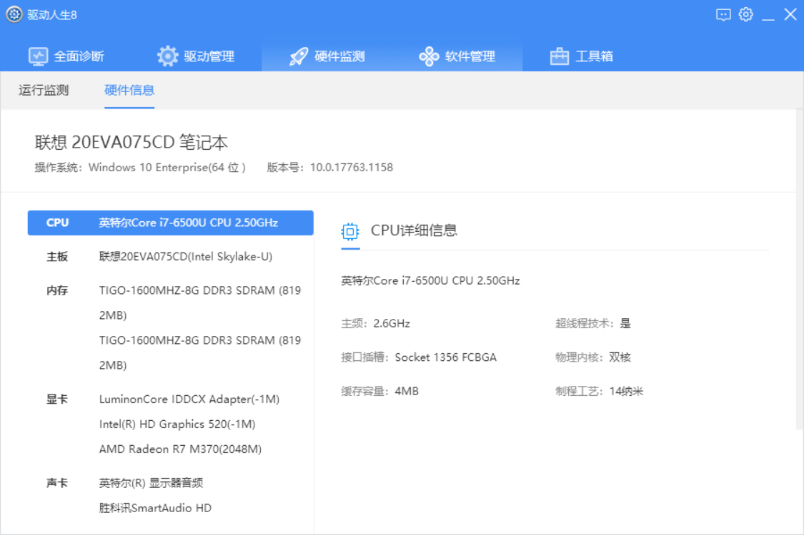

这里截图我就随便放一张了（这台之前装过双系统，以后拿来黑苹果也许会更香）

### 2.2、查找匹配的efi文件

这是上面推荐给大家[黑果小兵](https://blog.daliansky.net/Hackintosh-long-term-maintenance-model-checklist.html)大神的网站，当然你还可以翻一翻[远景论坛](http://bbs.pcbeta.com/)或者[黑苹果社区](https://osx.cx/tag/%E9%BB%91%E8%8B%B9%E6%9E%9C/)，一般只要型号差不多的都会兼容的，如果不行的话，就多试几个，总有可以的，搞黑苹果无非就是爱折腾，享受过程就完了！

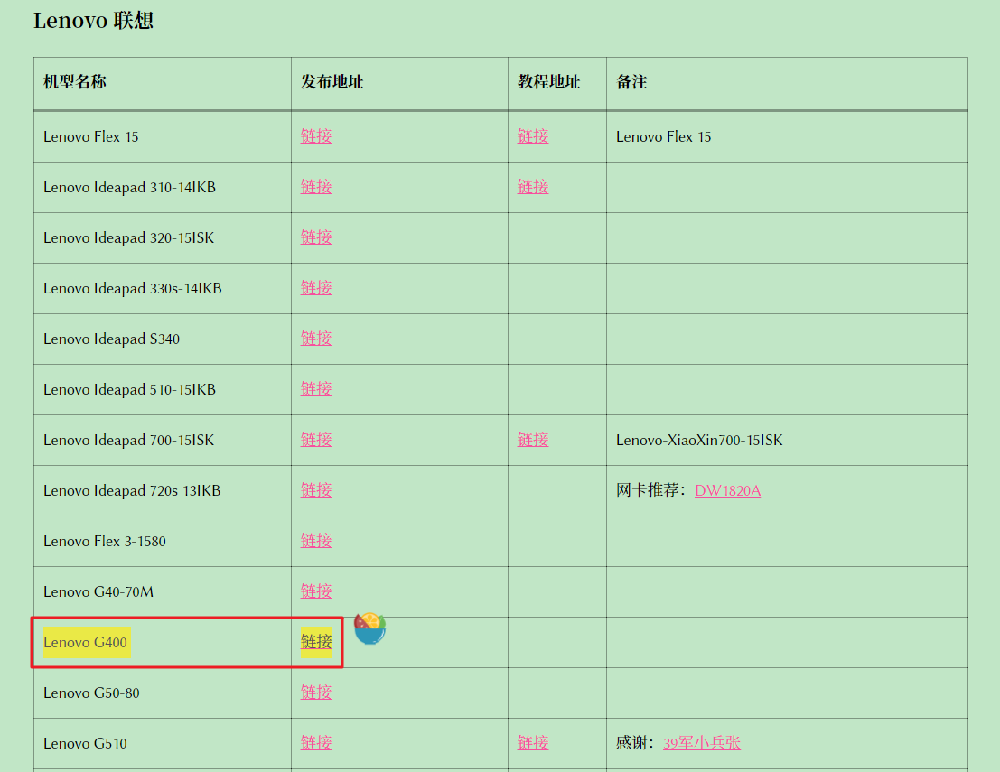

### 2.3、准备相关工具及材料

工具的话我想办法放在不同的平台，毕竟某网盘那吃屎的速度真心然人恶心，我准备的材料，系统镜像愣是搞了一下午，本来个把小时就能吃上黑苹果的，就因为准备材料搞了一天。不过B站有分享SVIP的视频可以过去找一找

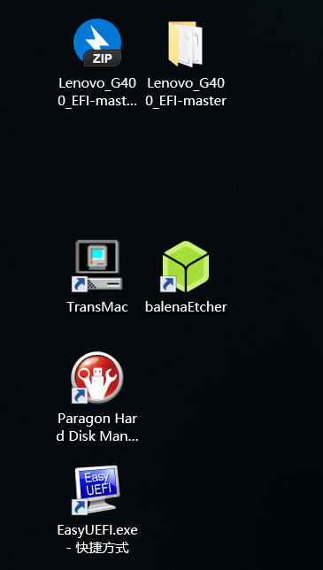

> EFI合集：链接: https://pan.baidu.com/s/15pdHw3_Q-yas-zrvF51POQ 提取码: `728m`

> Etcher：链接: https://pan.baidu.com/s/1CikFI1rXsl_AlJygE802iQ 提取码: `x44r`

> DiskGenins：链接: https://pan.baidu.com/s/1BUFJ8wze96-8cjSp9hBnqA 提取码: `i967`
>
> 镜像下载链接: https://pan.baidu.com/s/1W07eZpfzmKoiQLTKsmxzSA 提取码: `cdqn`

现在有这三个工具就够了，第一个是引导文件，第二个是写盘工具制作启动优盘，第三个是磁盘分区工具

### 2.4、制作启动优盘

制作启动盘需要一个不小于8G的优盘，提前备份资料否则会被格式化，等待一段时间制作完成需要使用磁盘分区工具修改EFI文件。

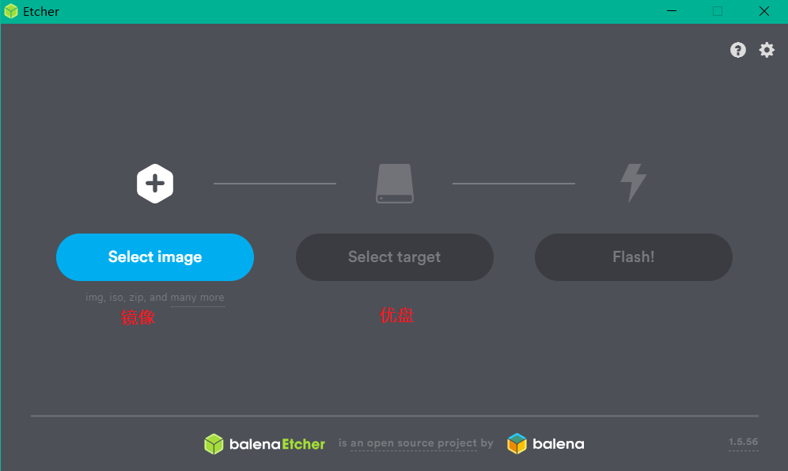

修改EFI，复制下载好的EFI文件夹，在磁盘工具里找到制作好的启动优盘，找到原始的EFI右键删除，把复制的EFI替换进去

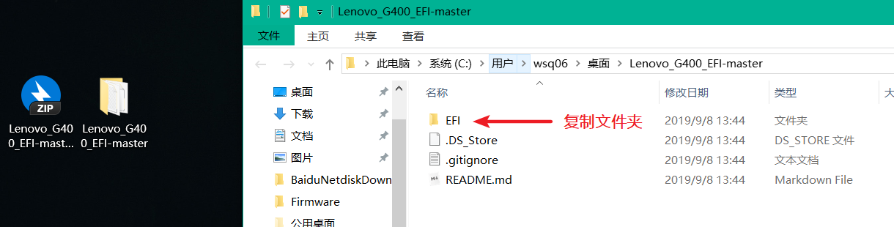

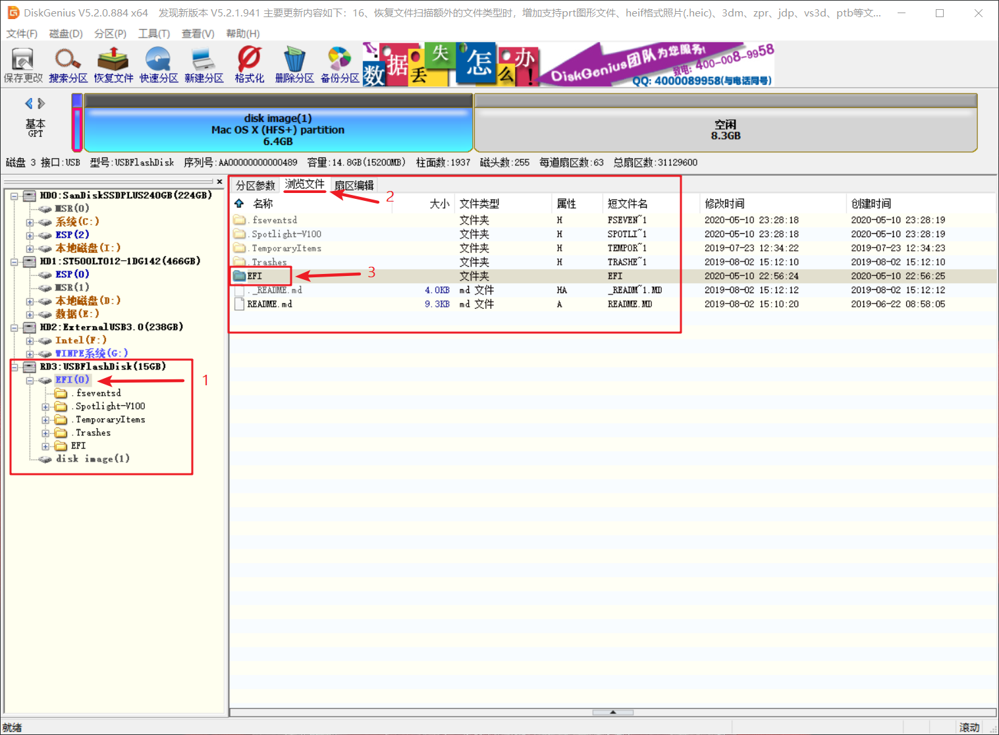

这个时候还要做一件事，就是**需要一块磁盘当做黑苹果的系统盘**，推荐使用固态，最好大一点，我这里使用的128G的固态，**然后抹掉磁盘所有分区，转换分区格式为GUID格式**，到这里准备工作就差不多了。

### 2.5、安装黑苹果

安装黑苹果之前还要对你的电脑主板进行设置，必须开启支出UEFI引导开机，自行百度

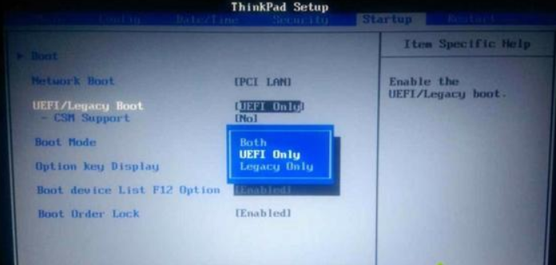

设置好以后插入优盘，开机选择刚刚制作好的那个优盘，如果efi引导匹配的话，就能进入macOS 的恢复模式，

使用磁盘工具抹掉磁盘，选中之前准备的那块磁盘，点击抹掉，格式选择为 `APFS`（Mac OS 扩展日志式也可以，别选加密就好），输入一个名称 (建议英文)

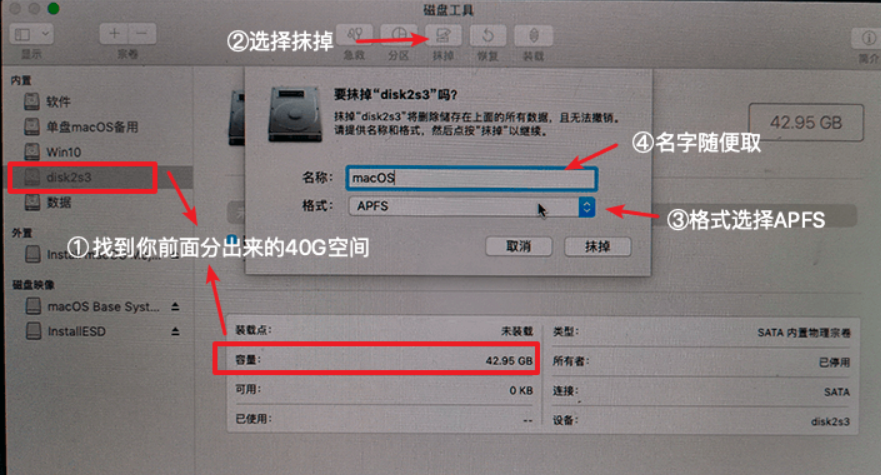

开始安装macOS

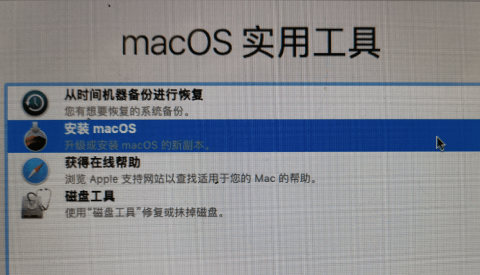

选择你要安装的磁盘等待安装

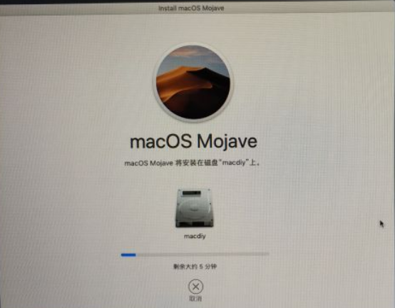

中间会重启两次，选择你上次安装的那个就好

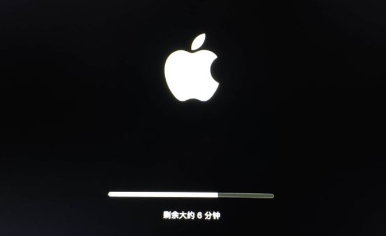

等待完成，就会进入系统初始化，根据自己设置

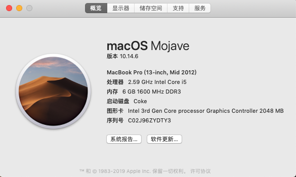

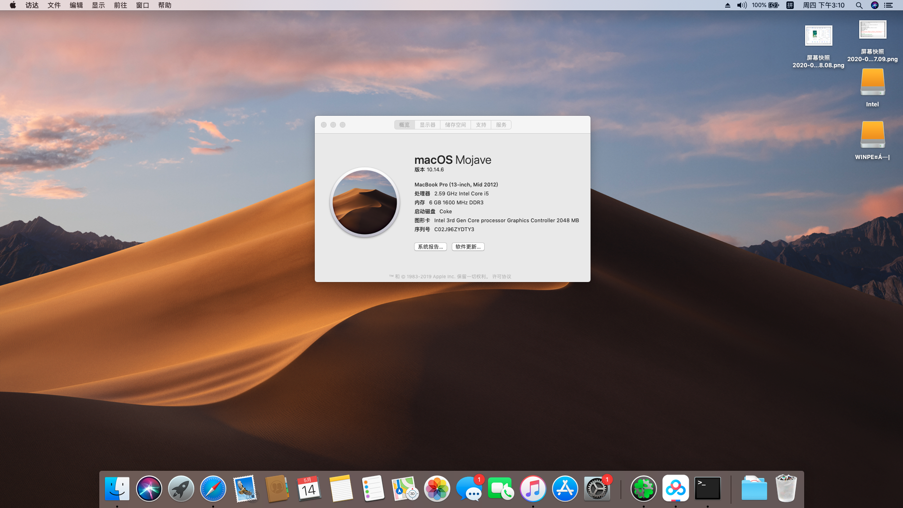

